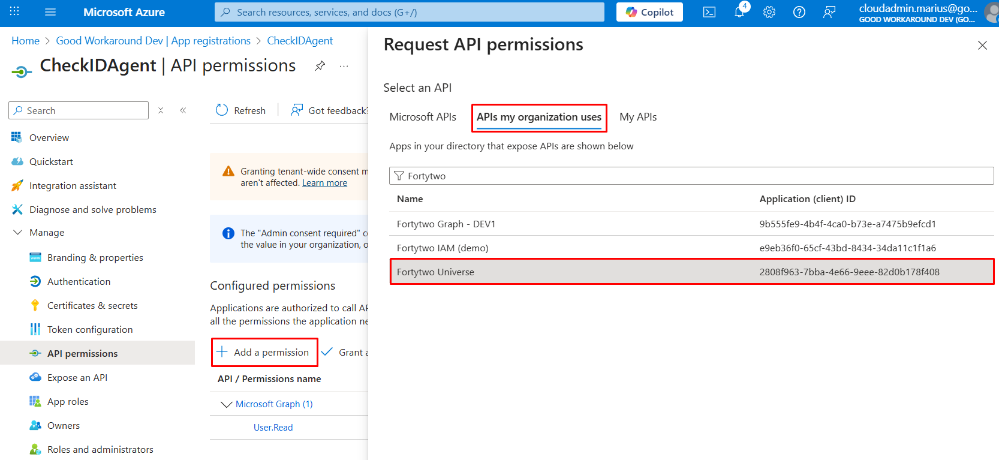

# AD agent installation guide

The ChangeEmail agent module is a simple module made for listening to change requests from Bytt.Email / ChangeEmail by Fortytwo, updating the user account in Active Directory and reporting back the status of the change. There are a few steps required to install the module and run it:

## Requirements

- The agent must be running on a domain joined windows server (We recommend running on the Entra ID Connect or Entra ID Cloud sync server)
- [PowerShell 7.5 or newer installed](https://learn.microsoft.com/en-us/powershell/scripting/install/installing-powershell-on-windows#msi)
- AD PowerShell installed (```Install-WindowsFeature -Name RSAT-AD-Tools -IncludeAllSubFeature```)

## Step 1 - Install PowerShell modules

Run the below as administrator in order to install the required modules from PowerShell Gallery:

```PowerShell
Install-Module Fortytwo.ChangeEmail.Agent -Scope AllUsers
Install-Module EntraIDAccessToken -Scope AllUsers
```

## Step 2 - Configure changeemail requirements

Run the following as administrator:

```PowerShell
New-EventLog -LogName "Application" -Source "changeemail"
$Certificate = New-SelfSignedCertificate -Subject "changeemail" -NotAfter (Get-Date).AddYears(100)
[System.Convert]::ToBase64String($Certificate.Export([System.Security.Cryptography.X509Certificates.X509ContentType]::Cert), "InsertLineBreaks") | Set-Content -Path "changeemail-$($env:COMPUTERNAME).cer"
Write-Host "" "Thumbprint:       $($Certificate.ThumbPrint)" "Certificate file: changeemail-$($env:COMPUTERNAME).cer" "" -Separator "`n"
```

## Step 3 - Consent to Fortytwo Universe (Our API) and create app registration for agent

1. As a global administrator, go to: https://login.microsoftonline.com/common/adminconsent?client_id=2808f963-7bba-4e66-9eee-82d0b178f408

2. In **Entra ID**, go to **App registrations** and click **New registration**

3. Give it a name and create **Register**

4. Note down the **Client ID** and **Tenant ID**:


5. Under **Certificates & secrets** upload the certificate file created in Step 2


6. Under **API permissions**, click **Add a permission**, select **APIs my organization uses** and locate **Fortytwo Universe**



7. Under **Application permissions** check **changeemail.changerequest.readwrite.all** and click *Add permissions**.

8. Click **Grant admin consent**

## Step 4 - Create the run file for the ChangeEmail Agent

Create ```C:\changeemail\run.ps1``` with the following contents:

```PowerShell
# Install and auto update the agent module
Install-Module Fortytwo.ChangeEmail.Agent -Confirm:$false -Force -Verbose -Scope CurrentUser
Import-Module Fortytwo.ChangeEmail.Agent -force

Add-EntraIDClientCertificateAccessTokenProfile `
    -Scope "https://api.fortytwo.io/.default" `
    -Thumbprint "THUMBPRINT_FROM_STEP2" `
    -ClientId "CLIENT_ID_FROM_STEP3" `
    -TenantId "TENANT_ID_FROM_STEP3"

Start-changeemailActiveDirectoryListener -Sleep 60 -Verbose
```

If you are running Entra ID Connect Sync and the script is running on this server, we recommend granting the account that will be running the agent the "ADSyncAdmins" role (local group on the server) and adding the ```RunBlockAfterChange``` parameter to Start-changeemailActiveDirectoryListener, in order to allow it to trigger sync whenever there are email address changes:

```
Start-changeemailActiveDirectoryListener -Sleep 60 -Verbose -RunBlockAfterChange {
    start-sleep 5
    powershell -command 'start-adsyncsynccycle'
}
```

## Step 5 - Try to run the ChangeEmail agent manually

1. Open a PowerShell and run ```cd c:\changeemail ; . c:\changeemail\run.ps1```

At this point, you can test out ChangeEmail and see that requests are received and processed by the agent.

## Step 6 - Run the ChangeEmail agent as a scheduled task

### Create a gMSA for the scheduled task

Run the below PowerShell in order to create a gMSA:

```PowerShell
New-ADServiceAccount -Name "changeemail" -PrincipalsAllowedToRetrieveManagedPassword "SERVERNAME$" -DNSHostname "bytt.email"
```

### Delegate the gMSA the reset password permission in AD

For each OU where the agent should be able to reset passwords, run the following three PowerShell lines (with the correct OU path and domain name):

```PowerShell
dsacls "OU=Users,DC=contoso,DC=com" /I:S /G '"contoso.com\changeemail$:rpwp;mail";user'
dsacls "OU=Users,DC=contoso,DC=com" /I:S /G '"contoso.com\changeemail$:rpwp;userPrincipalName";user'
dsacls "OU=Users,DC=contoso,DC=com" /I:S /G '"contoso.com\changeemail$:rpwp;proxyAddresses";user'
```

### Grant permission to certificate

Run **certlm.msc**, locate the **changeemail** certificate under **Personal** certificates, and **Manage private keys**


Locate the gMSA you created, and grant **Full control**


### Grant permission to Log on as a batch job


### Create scheduled task for the agent

3. Create a scheduled task running as the gMSA that:
    - Runs the action ```pwsh``` with the arguments ```-file c:\changeemail\run.ps1```
    - Trigger at startup
        - Delay 1 minute
        - Repeat every 5 minutes indefinitely
        - Do not stop task if it runs longer than anything
    - Do not run multiple instances
    - Never stop the task if running for a long time

Typical configuration:


