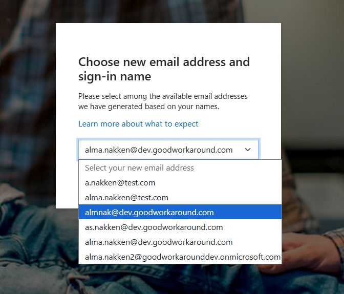
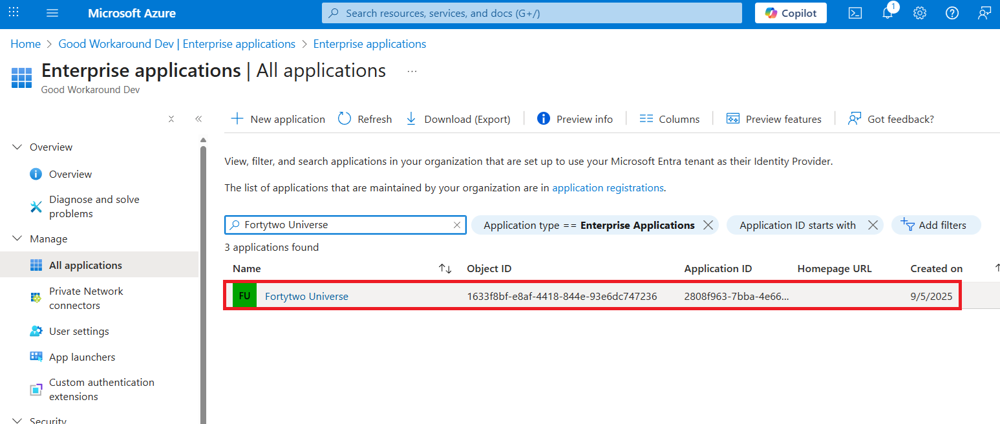
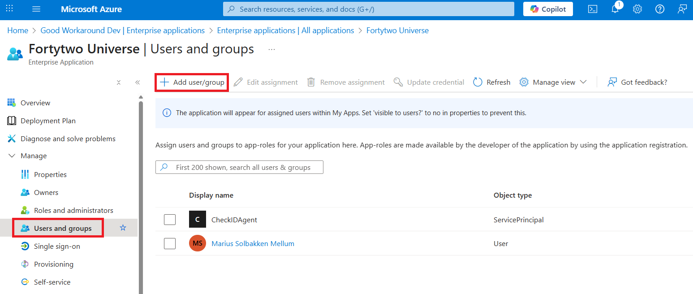
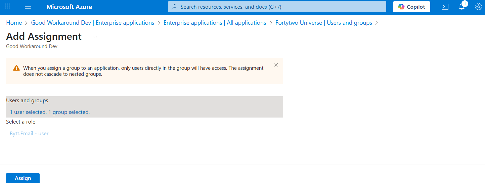
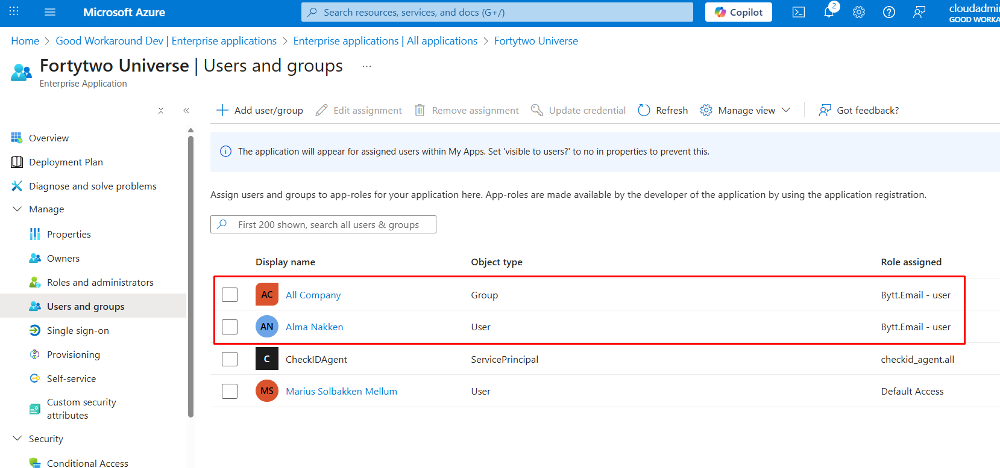

# Bytt.Email

[Bytt.Email](https://bytt.email) is our service for allowing end users to change their own email address and UPN, both in Entra ID and Active Directory.



The service is payed for through Azure Marketplace (Coming soon).

## Consenting access

The following operations must be done as one of the following roles:

- Global Administrator
- Cloud Application Administrator
- Application Administrator

1. Consent to Fortytwo Universe, our API hub:

https://login.microsoftonline.com/common/adminconsent?client_id=2808f963-7bba-4e66-9eee-82d0b178f408
<!-- Development: https://login.microsoftonline.com/common/adminconsent?client_id=c61cb4dd-35bf-4db9-b152-58e223782c11 -->

2. Consent to the Bytt.Email application:

https://login.microsoftonline.com/common/adminconsent?client_id=34ee8edb-d2ff-4ee9-bac3-73b53303e00f
<!-- Development: https://login.microsoftonline.com/common/adminconsent?client_id=5a0b1107-0774-4bd4-a2fd-cf343ce79c56 -->

## Grant users access

Locate the **Fortytwo Universe** app under Entra ID and Enterprise Apps:



Under **Users and groups**, click **Add user/group**.



Assign any relevant user or group of users. These will be allowed to use the Bytt.Email service to change their email.



The assignments should now look like this. Notice that if you utilize other Fortytwo services, these role assignments are also managed here.



## Configure write permissions / fulfillment

> **Note:** It is possible to test the service without granting write permissions, in that case simply skip this section

If you have users in Active Directory synced to Entra ID, you need to [configure the AD agent](./ad-agent.md).

If you have cloud users, you need to [create an Administrative Unit](./au.md) and assign Bytt.Email permissions.

## Configure email patterns

By consenting to Bytt.Email, you know have a new multivalued string attribute named ```extension_34ee8edbd2ff4ee9bac373b53303e00f_patterns``` available for groups in your tenant. In order to override the default email patterns available to your users, you can add users as member of group with this attribute set.

This attribute can be set by using [Graph Explorer](https://developer.microsoft.com/en-us/graph/graph-explorer) and sending a PATCH request to https://graph.microsoft.com/v1.0/groups/OBJECTID-OF-GROUP

```JSON
{
    "extension_34ee8edbd2ff4ee9bac373b53303e00f_patterns": [
        "{firstname1}.{lastname-1}@yourdomain.com",
        "{firstname1}.{firstname2}.{lastname-1}@yourdomain.com",
        "{firstname1}.{lastname-2}.{lastname-1}@yourdomain.com",
        "{firstnamewd1}.{lastnamewd-1}@yourdomain.com",
        "{firstnamewd1}.{firstnamewd2}.{lastnamewd-1}@yourdomain.com",
        "{firstnamewd1}.{lastnamewd-2}.{lastnamewd-1}@yourdomain.com",
        "{firstname1}.{firstname2,1}.{lastname-1}@yourdomain.com",
        "{firstname1}.{lastname-1}2@yourdomain.com"
    ]
}
```

### Placeholders

| Placeholder | Replaced with |
|-|-|
| {firstname1} | First firstname |
| {firstname2} | Second firstname |
| {firstname3} | Third firstname |
| {firstname-1} | Last firstname |
| {firstname-2} | Second last firstname |
| {firstname-3} | Third last firstname |
| {lastname1} | First lastname |
| {lastname2} | Second lastname |
| {lastname3} | Third lastname |
| {lastname-1} | Last lastname |
| {lastname-2} | Second last lastname |
| {lastname-3} | Third last lastname |
| {firstnamewd1} | First firstname, with dashes included |
| {firstnamewd2} | Second firstname, with dashes included |
| {firstnamewd3} | Third firstname, with dashes included |
| {firstnamewd-1} | Last firstname, with dashes included |
| {firstnamewd-2} | Second last firstname, with dashes included |
| {firstnamewd-3} | Third last firstname, with dashes included |
| {lastnamewd1} | First lastname, with dashes included |
| {lastnamewd2} | Second lastname, with dashes included |
| {lastnamewd3} | Third lastname, with dashes included |
| {lastnamewd-1} | Last lastname, with dashes included |
| {lastnamewd-2} | Second last lastname |
| {lastnamewd-3} | Third last lastname |

We also allow for extracing the first *n* characters of the placeholders:

| Placeholder | Replaced with |
|-|-|
| {firstname1,1} | First character of first firstname |
| {lastnamewd-1,3} | First three characters of the last lastname, with dashes included |

> **Note:** The default configuration for Bytt.Email is that the values of the first example is available to your users (if the user is assigned the **Bytt.Email - user** role, but not assigned a group with patterns), with the domain being the current UPN suffix of the user.