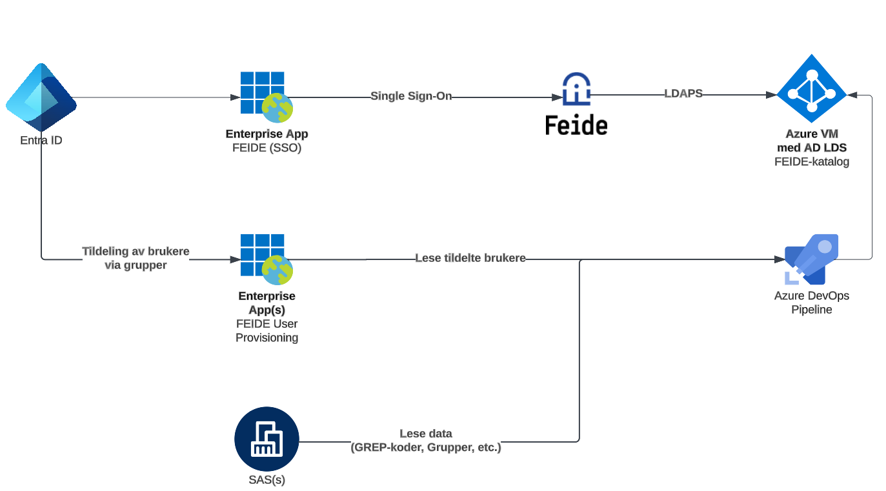
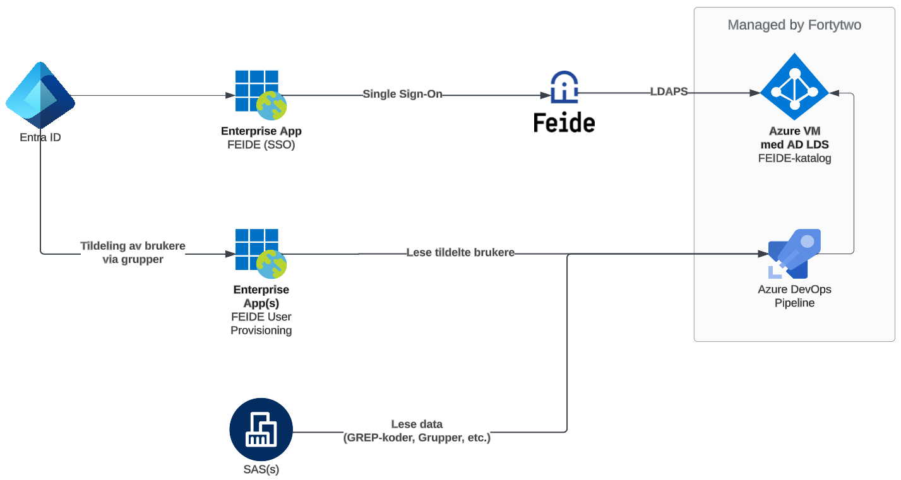

# FEIDE + Microsoft Entra ID

!!! tip "FEIDE-katalog som en tjeneste"
    Amesto Fortytwo tilbyr FEIDE-katalog som en tjeneste, enten kjørende i Azure hos oss eller i Azure hos deg. Vi sørger da for at katalogen alltid er operativ og populert med korrekte data. Ta kontakt med <a href="mailto:hello@amestofortytwo.com">hello@amestofortytwo.com</a> for mer informasjon og pris.

Alle kommuner og fylkeskommuner må tilby sine ansatte og elever en måte å logge på FEIDE på, for å kunne få tilgang til løsninger som kun har integrasjon mot nettop FEIDE for pålogging. FEIDE består i hovedsak av følgende komponenter, hvor begret *Vertsorganisasjon* benyttes om kommunen / fylkeskommunen:

| Komponent | Beskrivelse | Forvaltes av |
|-|-|-|
| FEIDE-plattformen | Sentral løsning som håndterer autentisering | SIKT |
| LDAP-katalog | En LDAP katalog som benyttes av FEIDE for oppslag av informasjon om brukere, som GREP-koder, undervisningsgrupper, personnummer og liknende. | Vertsorganisasjon |
| Tjenester | Tjenester som benytter FEIDE som påloggingstjeneste | Tjenestetilbyder |

For å kunne tilby FEIDE for sine brukere, må en kommune/fylkeskommune etablere en eller flere LDAP-servere med et standardisert schema, som inneholder data i et bestemt format. Disse serverene inneholder store mengder personlig identifiserbar informasjon (PII), og bør sikres på en god måte, ved at den isoleres fra miljøet og etableres som en helt separat løsning i eksempelvis Azure.

!!! success "Designvalg FEIDE.01"
    Serverene som inneholder FEIDE-katalogen etableres i Azure, i et separat virtuelt nettverk med kun åpning fra FEIDE-tjenesten og løsningen for provisjonering av innhold.

    * Sørger for best mulig isolering av tjenesten, for å begrense risiko for angrep

## LDAP

LDAPv3 som protokoll er veldefinert og med FEIDE står man fritt til å velge hvilken LDAP-løsning man måtte ønske, så lenge man benyttes de [påkrevde skjemaene](https://www.feide.no/ldap-skjema-feide). Gode valg av LDAP-servere er Microsoft sin **AD LDS** og **OpenLDAP**.

!!! success "Designvalg FEIDE.02"
    LDAP-katalogen etableres som en instans av AD LDS

    * Trivielt å drifte for windows-administratorer

LDAP-katalogen må være tilgjengelig for at FEIDE-pålogging skal virke, og det bør derfor etableres flere servere med lastbalansering og failover.

!!! success "Designvalg FEIDE.03"
    LDAP-katalogen kjøres fordelt på to windows-baserte virtuelle maskiner, i Azure, i et Availability Set, med lastbalansering.

    * Tilgjengelig hvis en VM skulle gå ned ([99.95% Azure SLA](https://azure.microsoft.com/support/legal/sla/virtual-machines/))

## Provisjonering av innhold

Innholdet i FEIDE-katalogen [inneholder en del attributter](https://docs.feide.no/reference/schema/index.html) som kun bør eksistere i det skoleadministrative systemet og ikke i eksempelvis Active Directory eller Entra ID. Det etableres derfor en løsning som leser tildelte brukere fra en Enterprise App i Entra ID (For scoping av hvilke brukere som skal ha FEIDE-bruker) og slår dette sammen med data fra det skoleadministrative systemet og populerer FEIDE-katalogen med de riktige dataene.

!!! success "Designvalg FEIDE.04"
    Innholdet i LDAP-katalogen provisjoneres ved hjelp av en Azure DevOps Pipeline kjørende med [self hosted agent med fast IP](http://localhost:8000/Self%20Hosted%20Runners/).

    * Enkel feilsøking og overvåkning
    * Direkte integrert mot versjonert kode
    * Muliggjør å begrense hvem som kan koble til FEIDE-katalog på IP

Designet legger opp til at det ikke settes noe passord på brukeren i FEIDE, og at [Single Sign-On mot Entra ID](https://docs.feide.no/home_organizations/feide_login_with_azuread.html) benyttes for pålogging.

!!! success "Designvalg FEIDE.05"
    Brukere i FEIDE-katalogen etableres som disablede brukere uten passord

    * Krever bruk av Single Sign-On via Entra ID
    * Bedrer sikkerheten ved pålogging
    * Fjerner behov for synk av passord fra on-premises AD

## FEIDE som en tjeneste

Vi i Amesto Fortytwo tilbyr FEIDE-katalog som en tjeneste, som innebærer av vi sørger for at:

- Katalogen synkroniseres med skoleadministrativt system
- Katalogen alltid er operativ, sikret og monitorert
- Alt av sertifikater, skjema-oppdatering og liknende håndteres
- Migrering fra eksisterende katalog til ny Amesto Fortytwo managed FEIDE-katalog

Ta kontakt med <a href="mailto:hello@amestofortytwo.com">hello@amestofortytwo.com</a> for mer informasjon og pris.
