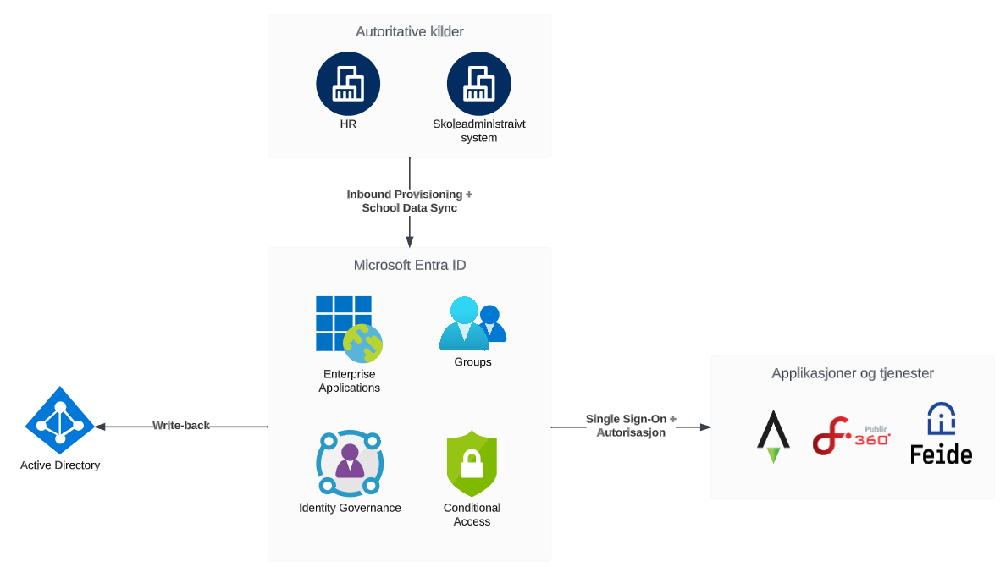

# Norske kommuner og fylkeskommuner

!!! note "Content in Norwegian"
    The content in this subsection is in Norwegian, as it is targeted to Norwegian municipalities

!!! note "Ikke ferdig"
    Denne dokumentasjonen er ikke ferdig, og bør ansees som work in progress

Velkommen til Amesto Fortytwo's referansearkitektur for Identity and Access Management (IAM) / Identity Governance and Administration (IGA) for norske kommuner og fylkeskommuner. Denne siden er utformet som en veiledning og en blueprint som kan benyttes for å styrke og sikre digitale identiteter og tilgang til informasjonssystemer i offentlige enheter og baserer seg på bruk av Microsoft Entra ID som kjernekomponent.

Helt overordnet og oppsummert er arkitekturen lagt opp til å benytte Entra ID fullt ut, med valgfritt Active Directory med brukere og grupper provisjonert via Entra ID. Det er ingen andre IAM-produkter involvert i designet.

I dagens digitale landskap står kommuner og fylkeskommuner overfor stadig økende kompleksitet når det gjelder administrasjon av identiteter og tilgangsstyring. Å balansere behovet for å gi ansatte, elever og innbyggere effektiv tilgang til nødvendige ressurser, samtidig som sikkerheten opprettholdes og uten å bygge opp en enorm teknisk gjeld i form av forskjellige tekniske løsninger, er en utfordrende oppgave. Denne referansearkitekturen tar sikte på å adressere nettopp dette, ved å tilby en strukturert tilnærming til design, implementering og forvaltning av IAM.

Vi inviterer deg til å utforske denne arkitekturen og ta det i bruk som en ressurs i arbeidet med å styrke og forbedre IAM-praksisen for offentlige enheter i Norge.

<!-- Gjennom et grundig sammensatt rammeverk tar denne referansearkitekturen for seg nøkkelkomponenter, beste praksiser og anbefalinger som tar hensyn til både teknologiske og regulatoriske aspekter. Det tar også høyde for behovene til ulike roller og brukergrupper innenfor kommunale og fylkeskommunale organisasjoner, fra administrativt personell til innbyggere som benytter offentlige tjenester.

Ved å implementere en robust IAM-arkitektur kan kommuner og fylkeskommuner effektivisere drift, styrke sikkerhet og samtidig legge til rette for en mer sømløs brukeropplevelse. Gjennom å dele felles retningslinjer og prinsipper kan man også legge grunnlaget for samarbeid og standardisering på tvers av ulike offentlige enheter.

Dette dokumentet er et levende dokument som vil utvikles og oppdateres i tråd med den stadig skiftende teknologiske og regulatoriske virkeligheten. Det er ment som en veileder og et referansepunkt for planlegging, implementering og videreutvikling av IAM-strategier for norske kommuner og fylkeskommuner.

Vi inviterer deg til å utforske dette dokumentet og ta i bruk retningslinjene som en ressurs i arbeidet med å styrke og forbedre IAM-praksisen for offentlige enheter i Norge. -->