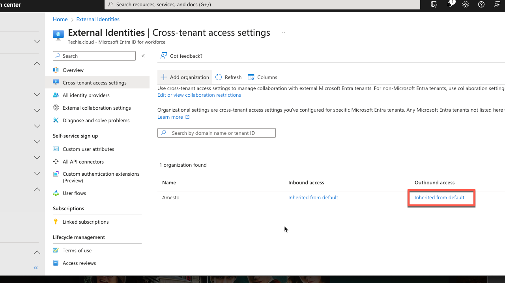
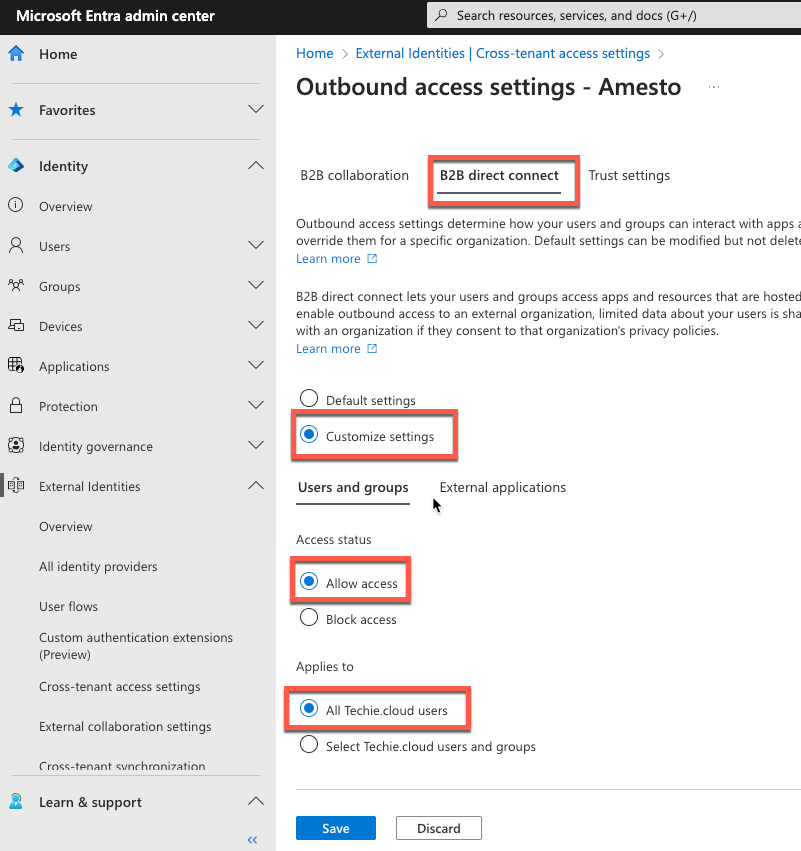
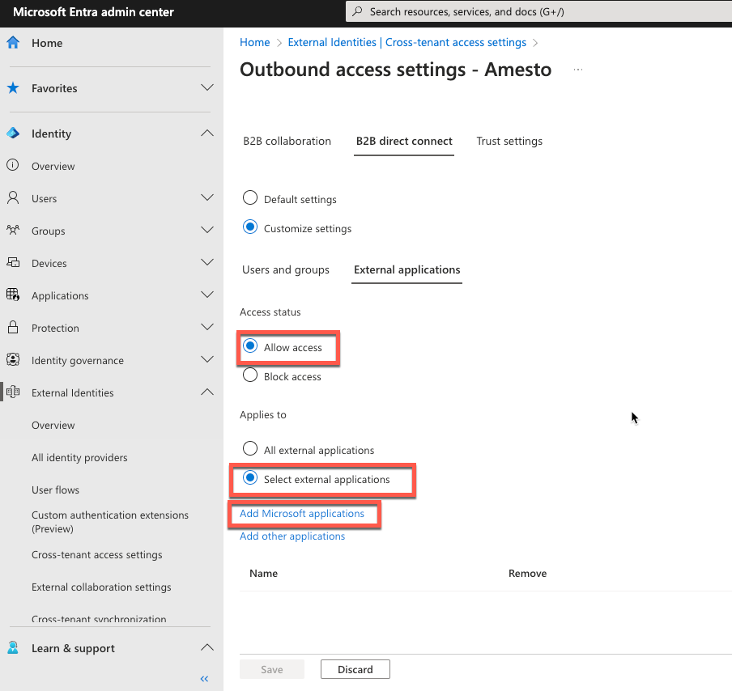
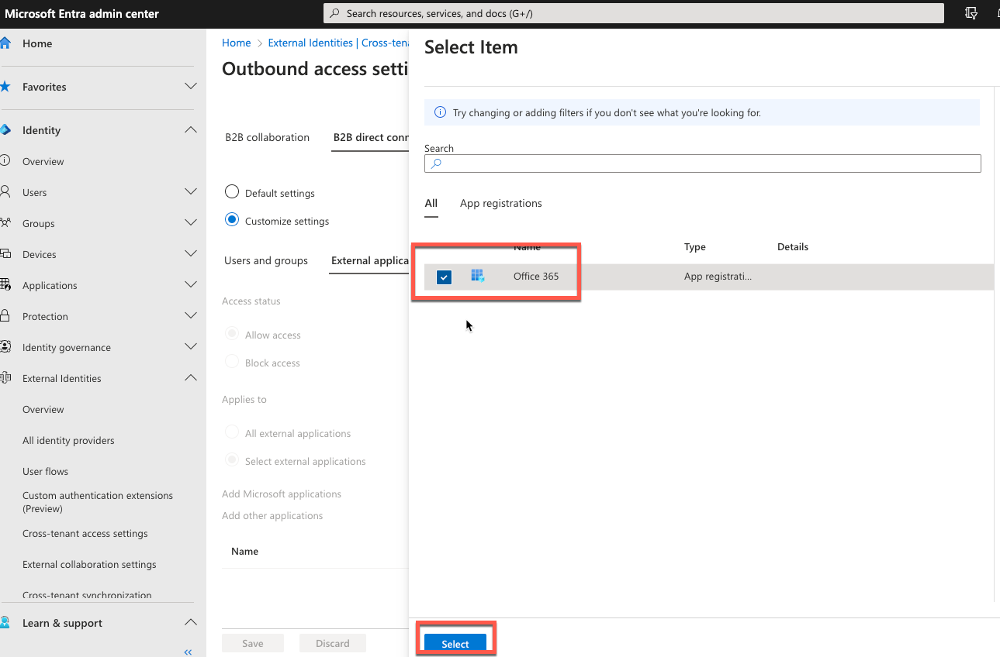
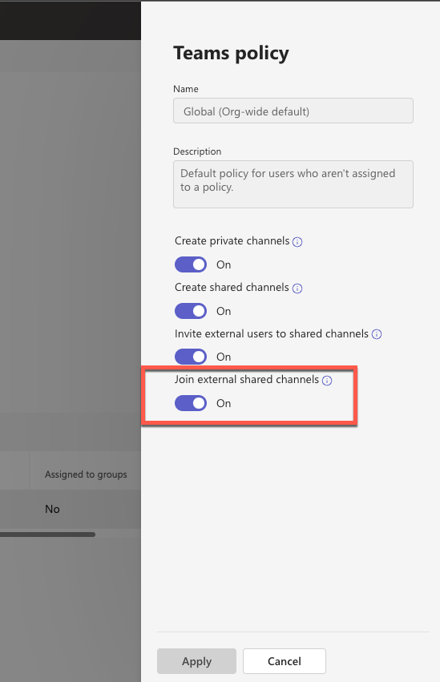

# Shared Teams channel

Hello there! If you have gotten the link to this guide shared with you, it means that Fortytwo have already agreed to set up a shared channel between our organizations, and we've prepared the setup on our side.

This guide is for you to set up and verify the needed configuration in your tenant to be able to join the shared channel.

## Configure cross-tenant access settings in Entra ID

???+ tip "RBAC roles needed"

    User with Security Administrator or Global Administrator role is needed to make these changes in Entra ID.

???+ note "Time to effect"
  
      Changes to cross-tenant access settings may take up to six hours to take effect.

Sign in to [Entra admin center](https://entra.microsoft.com/#home) using your account with the required access.
Under "Identity" in the menu, select "External Identities", and then select "Cross-tenant access settings".

Select the tab "Organizational settings", and then click "Add organization".
On the "Add organization" pane, type the full domain name for our organization "fortytwo.io" and press "Enter".
It should populate the field "Name" with "Fortytwo", and then click the button for "Add".

Our organization should appear in the organizations list. At this point, all access settings for this organization are inherited from your default settings.

### Configure outbound settings

Select the "Outbound access" link for our organization.

On the "B2B direct connect" tab, click the button for "Customize settings".
On the "External users and groups" tab, choose "Allow access" and set "Applies to" to a group or spesific users, or to "All &lt;org.name&gt; users" if you allow all users in your organization to be invited to shared channels.

On the "External applications" tab, choose "Allow access" and "Select external applications". Click "Add Microsoft applications".

Select the "Office 365" application, and then click the button "Select".

Click the button "Save", choose "Yes" to confirm, and close the "Outbound access settings" blade.

## Verify Teams configuration

???+ tip "RBAC roles needed"

    User with Teams Administrator role is needed to make these changes in Teams.

Shared channels is enabled by default in Teams. Follow this procedure to confirm the settings.

### Verify Teams policy

In the [Teams admin center](https://admin.teams.microsoft.com/), expand "Teams", and then select "Teams policies".

Select the policy that applies to the user(s) that should be allowed to be invited to external channels. If you've previously done no customization, only "Global (org wide default)" will be listed. Select "Edit" on the policy.

Make sure that "Join external shared channels" is set to "On". If it is "Off", click the toggle to turn it on, and then click "Apply".

## Completion

You have now completed the configuration needed to join the shared channel. Please give us feedback that is done.
Your users will get invited to the shared channel by our team.

## References

- [Collaborate with external participants in a shared channel (IT Admins)](https://learn.microsoft.com/microsoft-365/solutions/collaborate-teams-direct-connect?view=o365-worldwide)
- [Video demonstration](https://learn.microsoft.com/en-gb/microsoft-365/solutions/collaborate-teams-direct-connect?view=o365-worldwide#video-demonstration)
