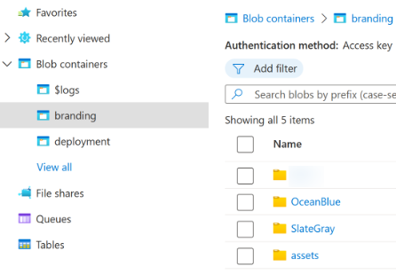
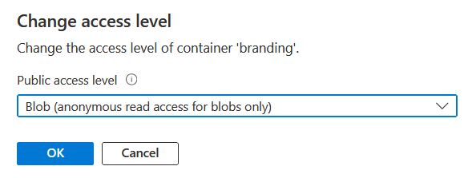
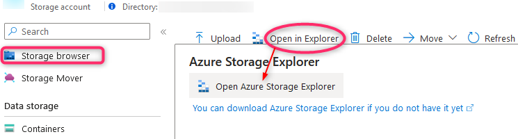

# Custom branding - sign-in pages

## Table of contents

- [Custom branding - sign-in pages](#custom-branding---sign-in-pages)
  - [Table of contents](#table-of-contents)
  - [Introduction](#introduction)
  - [Custom branding](#custom-branding)
    - [Custom branding files](#custom-branding-files)
    - [Maintaining custom branding files](#maintaining-custom-branding-files)
      - [Azure portal](#azure-portal)
      - [Azure Storage Explorer](#azure-storage-explorer)
      - [Azure CLI (Command-Line Interface)](#azure-cli-command-line-interface)
      - [PowerShell script B2C-BlobManagement.ps1](#powershell-script-b2c-blobmanagementps1)
        - [Script pre-requisites](#script-pre-requisites)
        - [Script availability](#script-availability)
      - [Script updates - public repository](#script-updates---public-repository)
        - [Script execution](#script-execution)
        - [Script variables - manually configured section](#script-variables---manually-configured-section)
        - [Script variables - tips and notes](#script-variables---tips-and-notes)

## Introduction

The sign-in pages are made of up html, css and javascript (js) files.  
Left un-configured they are rendered using the Microsoft **classic** theme.

The better and more modern alternative themes, **Slate Gray** and **Ocean Blue**, are available.  
These can quite easily be put to use, see the Microsoft Learn article [branding with custom policies](https://learn.microsoft.com/azure/active-directory-b2c/customize-ui?pivots=b2c-custom-policy).

## Custom branding

In most cases the Microsoft pre-built themes are used for initial setups.  
Even though design and user interface may be part of the early design, usually this work is not prioritized.
As the User Journeys are fully developed the focus turns to user experience.  
The user experience is important both in terms of functionality and visualization, the latter inferring custom branding.

### Custom branding files

The custom branding files are often stored in an Azure storage account in the container **branding**.
The container is protected (the default) authentication method **Access key**.
It is possible to configure authentication method **Azure AD User Account** for the container.



The container is configured with access level **Blob (anonymous read access for blobs only)**.



Each theme folder has html, css and js content divided into separate folders.


### Maintaining custom branding files

There are at least four ways of interacting with an Azure storage account container.
Depending on what operation to be taken, they all vary in their effectiveness.

These four ways are sorted based on accessibility and user interaction vs automation:

#### Azure portal

Using the Azure Portal is the easiest way to access the branding container through the storage account.
User accessing must have requisite privileges based on the configured authentication method.
Using the Azure Portal the container can be access through either the **Container** or the **Storage browser** blade.
The **Storage browser** is the online version of the [Azure Storage Explorer](#azure-storage-explorer).



This works reliably but is not very effective for uploading or downloading many files or a folder structure.

#### Azure Storage Explorer

[Azure Storage Explorer](https://azure.microsoft.com/features/storage-explorer/) is free for download and use.
Can also be downloaded directly from the Azure Portal.

Using this tool maintaining a container (or any storage account content) is made very easy.
The tool is required to be installed locally.
Once installed, resources from any tenant can be accessed through selected method of authentication.
The Azure Storage Explorer is user-friendly but like any user-driven interactive tool, is potentially error prone.

#### Azure CLI (Command-Line Interface)

[Azure CLI](https://learn.microsoft.com/cli/azure/) can be downloaded and installed freely.  
It has a lot smaller footprint than [Azure Storage Explorer](#azure-storage-explorer) and is more suitable for automation.

Azure CLI is [powered by Python](https://www.python.org/success-stories/building-an-open-source-and-cross-platform-azure-cli-with-python/).
Once installed the light-weight command **az** (which is a .cmd file calling python.exe) provides a wide variety of possibilities.


(This is only the first third of the base commands **az** can interact with)

This tools is great for automation and even supports a [**sync**](https://learn.microsoft.com/cli/azure/storage/blob?view=azure-cli-latest#az-storage-blob-sync) functionality (in preview at the time of writing).  
This method (**az storage blob sync** functionality) provides the easiest way to keep files in parity between folders.  
Using **az** for automation is also the most straight-forward as the Azure CLI package is pre-installed on Azure Devops-based hosted agents.

#### PowerShell script B2C-BlobManagement.ps1

The Powershell script B2C-BlobManagement was developed for bridging the gap between the various different tools.

The advantage of this script is that it does not need installation, granted PowerShell script execution is enabled.
The pre-requisite PowerShell modules are checked for at runtime and installed in user context if found missing (**REMEMBER** to check out the [$NoTestPreReqsOverride](#script-variables---tips-and-notes)) TIP!

Using this script it is easy to both implement it in a pipeline as well as running it in authenticated user context.  
It's primary function is to upload files, set content type and set cache control on .js files (because they are prone to frequent updates).

##### Script pre-requisites

The script does require the Powershell modules **Az.Accounts** and **Az.Storage**, which is checked at runtime.

##### Script availability

The script is [available on GitHub](https://github.com/timpeteren/bravotocharlie/blob/main/B2C-BlobManagement.ps1).

#### Script updates - public repository

If later updated, this version will be publicly available from this [GitHub repository](https://github.com/timpeteren/bravotocharlie/blob/main/B2C-BlobManagement.ps1).

##### Script execution

To run the script in a pipeline, the following input parameters must be provided:

```PowerShell
B2C-BlobManagement.ps1 -TenantId tid -Subscription sub -ClientId id -ClientSecret secret -Subscription sub -ResourceGroup rg -StorageAccountName sa -ContainerName container -SourceFolder pathToFolder
```

This is a snippet from the script documentation, first .EXAMPLE, where more information can be found.

For use on the command line, locally, the script requires a lot fewer parameters:

```PowerShell
B2C-BlobManagement.ps1 -EnvPrefix d/t/p -Username myUser@myDomain.com -Upload:$true -Download:$false -SourceFolder C:\GIT\Source
```

##### Script variables - manually configured section

`-EnvPrefix` must be provided as an input parameter when running the script locally.
This parameter will fetch the environment variables for either development, test or production.

>TIP!
>
>When the script is executed locally the `-EnvPrefix` parameter **MUST** be included.
>This is regardless of all other parameters being passed as input parameters on the command line.
>Only when the script is run as part of an automated process and in the context of an app, can this be left out.

This is for uploading files from a local folder to a storage account container (.EXAMPLE number four).
Subscription, resource group and storage accounts must be provided in the script section *Manually configured variables* (see below).

```PowerShell
#region Manually configured variables
# Overrides for default values from param block
$ContainerOverride #= "branding"
$UploadOverride #= $true
$DownloadOverride #= $false
$NoTestPreReqsOverride #= $true

## Container name, folder names and storage account names for various B2C environments
$DestinationFolderD = "C:\GIT\ProjectX\branding dev"
$SourceFolderD = "C:\GIT\ProjectX\branding dev"
$StorageAccountNameD = "storageAccountDev"
$ResourceGroupD = "resourceGroupTest"
$SubscriptionD = "d"

$DestinationFolderT = "C:\GIT\ProjectX\branding test"
$SourceFolderT = "C:\GIT\ProjectX\branding test"
$StorageAccountNameT = "storageAccountTest"
$ResourceGroupT = "resourceGroupTest"
$SubscriptionT = "t"

$DestinationFolderP = "C:\GIT\ProjectX\branding prod"
$SourceFolderP = "C:\GIT\ProjectX\branding prod"
$StorageAccountNameP = "storageAccountProd"
$ResourceGroupP = "resourceGroupProd"
$SubscriptionP = "p"
```

All parameters can be provided on the command line.
However, when running the script locally (frequently) it can be convenient to set persistent environment values.
Values and names for the respective parameters can be provided by an Azure Administrator.

It is a common practice to have three environments, development, test and production (names may vary).
For consistency across environments the same name is used for the Azure Blob Container, `branding`.
This can be overridden using in-script parameter `ContainerOverride` or by providing `-ContainerName` as input an parameter.

- `DestinationFolderD` and `SourceFolderD` are used depending on the operation, download or upload.  
- `StorageACcountNameD` is the name of the Azure Storage Account where the branding container is deployed.  
- `ResourceGroupNameD` is the Azure Resource Group where the Storage Account is deployed.  
- `SubscriptionNameD` is the Azure Subscription where the Resource Group is deployed.

All these parameters can be provided as input parameters when executing the script.

##### Script variables - tips and notes

>TIP!
>
>When running the script multiple times on the same client the `$NoTestPreReqsOverride` can be set to `$true`.
>Alternatively, provide the `-NoTestPreReqs:$true` parameter as an input parameter.
>It is unnecessary to wait for the script to check for installed modules on every execution.

`-Upload:$false` and `-Download:$true` can be provided as input parameters when running the script.
However, they can be omitted when *uploading* files as this is the scripts default behaviour.

As for `-NoTestPreReqs`, the `-Upload` and `-Download` parameters can be set (overridden) in the *BlobManagement* script.
The default behaviour can be changed by providing input parameters or by using in-script overrides `UploadOverride =` and `DownloadOverride =`.

>NOTE!
>
>Be aware that when using any of the in-script overrides, these settings take **precedence** over input parameters.

The script implements *SupportsShouldProcess* and can be run with `-WhatIf` to verify the operation to be triggered.

The script also supports deleting files from a container, using the `-Delete` input parameter.
Its primary use is to delete all content in a storage container, useful for testing of file upload and download.

By *additionally* providing parameter `-DeleteExtensions`, `-DeleteFolders` or `-DeleteFiles`, some granularity is possible.
