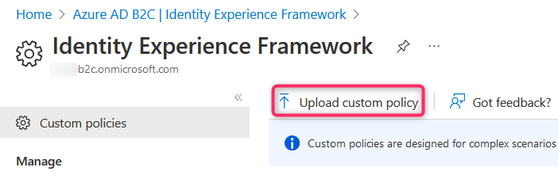

# Identity Experience Framework custom policies

## Table of contents

- [Identity Experience Framework custom policies](#identity-experience-framework-custom-policies)
  - [Table of contents](#table-of-contents)
  - [Introduction](#introduction)
  - [Custom policy files](#custom-policy-files)
  - [Uploading policies to the Identity Experience Framework](#uploading-policies-to-the-identity-experience-framework)
    - [B2C-PolicyManagement.ps1](#b2c-policymanagementps1)
      - [Script pre-requisites](#script-pre-requisites)
      - [Script availability](#script-availability)
        - [Script execution](#script-execution)
        - [Script variables](#script-variables)

## Introduction

Custom policies builds on top of the [Identity Experience Framework (IEF)](./d2-IEF.md#the-identity-experience-framework) and enables the creation of **User Journeys** tailor-made for any organizational need.

Custom policies leverage [XML](./d2-IEF.md#custom-policies) syntax. The advantage is the flexibility this brings, to be able to craft totally custom **User Journeys** within the rules of the schema and the framework. The Identity Experience Framework xml files that make out **User Journeys** are frequently referred to as (custom) [policy files](#custom-policy-files).

## Custom policy files

One or more [custom policy files](./f2-DEV-Custom-policy-files.md#v1-policies) make out a **User Journey**. Custom policy files for a **User Journey** are usually split into a few separate files, based on configuration. This makes them easier to handle and read and simplifies the search for content split into separate files.

When a **User Journey** is triggered, all custom policy files required will be fetched and parsed as one file.
But as this happens *under the hood*, it is easier for the developer to store the code (configuration) in separate files.

A custom policy configuration must have the following sections / files:

- a base file - where all the definitions and references are kept
- a base extensions file - where all **User Journeys** are stored
- multiple execution policy (relying party) files - where token definitions and logging is defined

## Uploading policies to the Identity Experience Framework

There are several ways of uploading policy files to the IEF.
The simplest (and most intuitive) is to use the Azure Portal, open the Azure AD B2C resource then the Identity Experience Framework blade and select **Upload custom policy**.



The same can be achieved programmatically using [PowerShell](#b2c-policymanagementps1) or the REST API calls to Microsoft Graph, where download, list and delete operations also can be triggered.

In the [Azure AD Preview PowerShell module](https://learn.microsoft.com/powershell/module/azuread/?view=azureadps-2.0-preview#trust-framework-policy-management) there are cmdlets for managing the [Trust Framework Policy](https://learn.microsoft.com/azure/active-directory-b2c/trustframeworkpolicy), referring to the framework that custom policies are built on.

By calling the [Microsoft Graph API](https://learn.microsoft.com/graph/api/resources/trustframeworkpolicy?view=graph-rest-beta) it is also possible to upload and manage custom policies, but at the time of writing, only the `/beta` endpoint supports these actions.

### B2C-PolicyManagement.ps1

The reason for the Powershell script B2C-PolicyManagement is to be able to easily upload custom policy files from a local client and get the same result as when uploading policy files through an automated pipeline.

This script requires the Azure AD Preview PowerShell module to be installed.

#### Script pre-requisites

An authenticated session with the B2C tenant using an account with requisite privileges.
Both Connect-AzAccount (recommended, but requires Az.Account PowerShell module) and Connect-AzureAD can be used to establish a session.

#### Script availability

The script is [available on GitHub](https://github.com/timpeteren/bravotocharlie/blob/main/B2C-PolicyManagement.ps1).

##### Script execution

The script can be executed without any input parameters, but the in-script variable [Placeholders](#script-variables) must be configured, or else the script will throw '*... - not a valid placeholder ...*'.

```PowerShell
B2C-PolicyManagement
```

This is a snippet from the script documentation, second .EXAMPLE.  
One or multiple policy files can be added as input parameters.

Use `-DeployFolder` to override the creation of a default **Deploy** folder in the current working directory.

```PowerShell
B2C-PolicyManagement -PolicyFiles .\3-b2c_1a_v2_signupsignin.xml, .\4-b2c_1a_v2_passwordreset.xml -DeployFolder MinDeploy
```

##### Script variables

The `$Placeholders` list variable must be filled out for the script to run successfully.

```PowerShell
$Placeholders = @{
    "PLACEHOLDER_TENANTNAME"                  = ""
    "PLACEHOLDER_TENANTID"                    = ""
    "PLACEHOLDER_BRANDINGBASEURL"             = ""
    "PLACEHOLDER_INSTRUMENTATIONKEY"          = ""
    "PLACEHOLDER_IEF_CLIENTID"                = ""
    "PLACEHOLDER_IEFPROXY_CLIENTID"           = ""
    "PLACEHOLDER_B2C_EXTENSIONS_APP_CLIENTID" = ""
    "PLACEHOLDER_B2C_EXTENSIONS_APP_OBJECTID" = ""
    "PLACEHOLDER_AAD_COMMON_APP_CLIENTID"     = ""
    "PLACEHOLDER_IDPORTEN_CLIENTID"           = ""
    "PLACEHOLDER_HELPERAPI_URL"               = ""
}
```

Values and names for the respective parameters can be provided by a tenant administrator.
