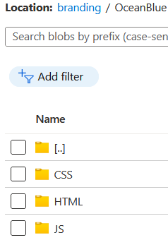

# Automating upload of custom branding and policy files

## Table of contents

- [Automating upload of custom branding and policy files](#automating-upload-of-custom-branding-and-policy-files)
  - [Table of contents](#table-of-contents)
  - [Introduction](#introduction)
  - [Custom branding](#custom-branding)
    - [Custom branding files](#custom-branding-files)
    - [Uploading custom branding files](#uploading-custom-branding-files)
  - [Custom policies](#custom-policies)
    - [Custom policy files](#custom-policy-files)
    - [Uploading custom policies](#uploading-custom-policies)
  - [Establishing a DevOps pipeline](#establishing-a-devops-pipeline)
    - [Azure DevOps pipeline introduction](#azure-devops-pipeline-introduction)
    - [Building an Azure DevOps pipeline](#building-an-azure-devops-pipeline)

## Introduction

Custom branding files and policy files, respectively, make out the user interface and the backend logic.  
While it's easy to develop and manage these files in a source control repository, it quickly becomes significantly more complex when building an automated system for uploading them across multiple environments.

This article will explain the moving pieces that need to go together to build the aforementioned pipeline.

## Custom branding

Custom branding is used to shape a visual representation of the sign-in pages to match other company pages.
This is usually preferred because it gives the user the best possible (and most consistent) experience when signing in.
For more information on custom branding [Custom branding files](./d3-Custom-branding.md#custom-branding-files).

### Custom branding files

The custom branding files are usually stored in an Azure storage account in a container named **branding**.
Here there will be two Microsoft provided themes, **OceanBlue** and **StaleGray**, and at least one company project folder.

Each theme consists of a html, css and js folder, where the respective content can be found in each folder.

### Uploading custom branding files

Uploading and downloading custom branding files to an Azure blob container (the most frequent use-case) can be in several ways.  
Guidance to four different ways can be found at [Custom branding](./d3-Custom-branding.md#maintaining-custom-branding-files).

Downloading files from a blob container is usually done in the context of a user.
This process is close to risk free and can therefore be performed manually.
Also, downloading custom branding files using a pipeline doesn't make much sense.

For uploading files in an automated pipeline there are two options, both are good:

- The Python-based command line tool [**az**](./d3-Custom-branding.md#azure-cli-command-line-interface).
- The PowerShell script [B2C-BlobManagement.ps1](./d3-Custom-branding.md#powershell-script-b2c-blobmanagementps1).

The PowerShell script was created for this specific task and is well-suited for use in both an automated process, as well as run directly in the context of a user (from where the need originated).

How to configure, and utilize, the power of an Azure DevOps pipeline for uploading files to a Azure blob container, see [DevOps pipeline](#establishing-a-devops-pipeline).

## Custom policies

Custom policies can be found in the Identity Experience Framework blade inside the Azure AD B2C service.
Custom policies are used to build **User Journeys**.
See [User experience](./d2-IEF.md#environments) for more detail.

Custom policies consists of xml files that define the logic that runs in the Identity Experience Framework, [see here](https://learn.microsoft.com/samples/azure-samples/active-directory-b2c-advanced-policies/identity-experience-framework-azure-ad/) for links to code samples, training material and more.

### Custom policy files

Read more on custom policies and the [custom policy files](./d4-Custom-policies.md#custom-policy-files) in the Identity Experience Framework.

### Uploading custom policies

The section [Upload policies to the IEF](./d4-Custom-policies.md#uploading-policies-to-the-identity-experience-framework) explains possible ways to manage custom policies.

How to configure and utilize the power of an Azure DevOps pipeline for uploading custom policies to the Identity Experience Framework, see [DevOps pipeline](#establishing-a-devops-pipeline).

## Establishing a DevOps pipeline

### Azure DevOps pipeline introduction

To build a fully automated process using Azure DevOps it is possible to to create and configure a release pipeline.
As pipelines are written in YAML-formatted files it's simple to move a pipeline, and files, and quickly establish it in a different DevOps project.

To ease support for deployment to multiple environments a YAML **template** describes all pipeline stages and the host type.
This template is *extended* (using **extends** action) by YAML files for each environment.
This setup contains environment specific variables to each of their own files.
Depending on the variables and their sensitivity, (usually) all environment specific parameters can be written in the YAML, the exception being deployment principals.
Common settings, such as tenant name, can be stored in the variable group(s) when all environments are deployed to subscriptions in the same tenant.

### Building an Azure DevOps pipeline

Establish a DevOps pipeline (must be performed once for every environment):

 1. Clone, copy, commit and push pipeline files to repository
 1. Create a new pipeline and browse to repository
 1. Configure a pipeline using an existing YAML file
 1. Save pipeline (don't select **Run**)
 1. Create a variable group (**Library** -> **+ Variable group**)
 1. Add service principal app id (**content_deployment_app_registration_clientid**), secret (**content_deployment_app_registration_clientsecret**) and match script names (make sure secret variable is *padlocked*, variable type set to **secret**)
 1. Configure **Pipeline permissions** to limit access to the new pipeline(s)
 1. For Prod environments, consider configuring **Approvals and checks**
 1. Return to **Pipelines** and if necessary, create folder(s) and move pipeline(s)
 1. Open the pipeline and select **Edit** to configure variables
 1. Match *(variable) group* name and configure environment specific values
 1. (Test) **Run** pipeline and watch the results
