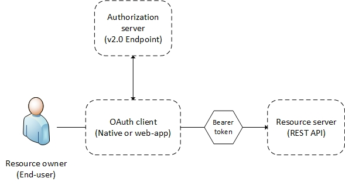
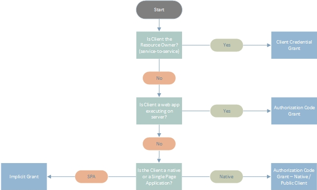

# Authentication and Authorization

## Table of contents

- [Authentication and Authorization](#authentication-and-authorization)
  - [Table of contents](#table-of-contents)
  - [Introduction](#introduction)
  - [The basics](#the-basics)
  - [OAuth 2.0 and OpenID Connect flows](#oauth-20-and-openid-connect-flows)
  - [OpenID Connect](#openid-connect)
  - [Policies](#policies)
  - [Tokens](#tokens)
  - [OAuth 2.0 Grants](#oauth-20-grants)
  - [Which OAuth 2.0 flow should I use](#which-oauth-20-flow-should-i-use)
  - [Debugging OpenID Connect and OAuth 2.0](#debugging-openid-connect-and-oauth-20)

## Introduction

The Microsoft Identity platform supports the authentication protocol standard OAuth 2.0 and the added identity layer OpenID Connect.
OpenID Connect is the modern authentication protocol most commonly used in application integrations, though SAML2 is also supported.

This reference guide will elaborate on authentication methods used in OpenID Connect integrations and provide useful examples on how to authenticate end-users and provide tokens for your consumer (and business) applications.

## The basics

Every application that integrates with the Identity platform must be registered with an app registration.
The application registration process yields a couple of values for the application to be used when initiating an authentication request:

- An **application ID** or **client ID** that uniquely identifies the application
- A **redirect URI** or **package identifier** in which the response of the authentication is returned

The application communicates with the Microsoft Identity platform by sending requests to the v2.0 endpoint:

```http
https://\<tenantName>.b2clogin.com/\<tenantName>.onmicrosoft.com/oauth2/v2.0/authorize
https://\<tenantName>.b2clogin.com/\<tenantName>.onmicrosoft.com/oauth2/v2.0/token
```

## OAuth 2.0 and OpenID Connect flows

In nearly all OAuth and OpenID Connect flows, four parties are involved in the exchange:



- The **authorization server** is the Microsoft Identity platform v2.0 endpoint. It handles anything related to user information and access. It also handles the trust relationships between the parties in a flow. It is responsible for verifying the user's identity, granting and revoking access to resources, and issuing tokens. It is also known as the **identity provider**.

- The **resource owner** is typically the end user. It is the party that owns the data, and it has the power to allow third parties to access that data store or resource.

- The **OAuth client** is your app. It is identified by its application ID. It is usually the party that end users interact with. It also requests tokens from the authorization server. The resource owner must grant the client permission to access the resource.

- The **resource server** is where the resource or data resides. It trusts the **authorization server** to securely authenticate and authorize the OAuth client. It also uses bearer access tokens to ensure that access to a resource can be granted.

## OpenID Connect

OpenID Connect is an authentication protocol, built on top of OAuth 2.0, that can be used to securely sign users into web applications. Using Microsoft's B2C implementation of OpenID Connect, you can outsource sign-up, sign-in, and other identity management experiences in your web applications to User Journeys created in the Identity Experience Framework (IEF).

OpenID Connect extends the OAuth 2.0 authorization protocol for use as an authentication protocol. This allows you to perform single sign-on by using OAuth. It introduces the concept of an **id_token**, which is a security token that allows the client to verify the identity of the user and obtain basic profile information about the user.

The Microsoft Identity platform, in its B2C implementation, extends the standard OpenID Connect protocol to do more than simple authentication and authorization. It introduces the policy parameter, which enables you to use OpenID Connect to add user experiences to your app - such as sign-up, sign-in, and profile management. Here we'll show you how to use OpenID Connect and policies to implement each of these experiences in your web applications. We'll also show you how to get **access_tokens** for accessing web APIs.

## Policies

Custom policies are the most important feature of the service Identity Experience Framework, which extend the standard OAuth 2.0 and OpenID Connect (and SAML) protocols. These policies (User Journeys) enables full customization, providing a lot more functionality than simple authentication and authorization.

Policies fully describe the consumer identity experiences, including sign-up, sign-in and profile editing. They can be executed by using a special query parameter in the HTTP authentication requests.

Multiple policy files create a User Journey, but are not a feature of OAuth 2.0, OpenID Connect, nor SAML protocols, they are exclusive to the Microsoft Identity platform B2C implementation.

User Journeys are defined by configuring [custom policies](https://learn.microsoft.com/azure/active-directory-b2c/user-flow-overview#custom-policies)

## Tokens

The Microsoft Identity platform implementation of OAuth 2.0 and OpenID Connect makes extensive use of bearer tokens, including bearer tokens that are represented as JSON web tokens (JWTs).

A bearer token is a lightweight security token that grants the **Bearer** access to a protected resource. The bearer is any party that can present the token. The Identity platform must first authenticate the party before it can receive a bearer token.

A JWT is a compact, URL-safe means of transferring information between two parties. Information transferred in JWTs are known as claims. These are assertions of information about the bearer and the subject of the token. The claims in JWTs are JSON objects that are encoded and serialized for transmission. JWTs issued are signed but NOT encrypted, so you can debug them using various tools, including <https://jwt.ms>.

Bearer tokens must be transported in a secure channel, such as transport layer security (HTTPS) to be protected from unauthorized parties because they don't have a built-in mechanism for such. If a bearer token is transmitted outside a secure channel, a malicious party can use a man-in-the-middle attack to acquire the token and use it to gain unauthorized access to a protected resource. The same security principles apply when bearer tokens are stored or cached for later use. Always ensure that your app transmits and stores bearer tokens in a secure manner.

For additional bearer token security considerations, see [RFC 6750 Section 5](https://tools.ietf.org/html/rfc6750#section-5).

Further details on the different types of tokens and some of the claims used are available in [this](https://learn.microsoft.com/azure/active-directory-b2c/tokens-overview#token-types) Microsoft Learn article.

## OAuth 2.0 Grants

The OAuth 2.0 specification describes a number of grants, or *methods*, for a client application to acquire an access token, which can be used to authenticate a request to an API endpoint.

The specification describes five grants for acquiring an access token:

- Authorization Code Grant
- Client Credential Grant
- Implicit Grant (rather see [OAuth 2.0 Authorization Code Grant](./e2-OAuth-AuthZ-code-grant.md) which supports [Proof Key for Code Exchange](./e2-OAuth-AuthZ-code-grant.md#5-authorization-code-grant-extension-proof-key-for-code-exchange-pkce) for native apps and single-page apps, for JavaScript SPAs use MSAL.js 2.x)
- Refresh Token Grant (mostly handled by the authentication library without need for further configuration)
- Resource Owner Credential Grant - ROPC (doesn't support *external identities* and is rarely used)

This guide focuses on Authorization Code Grant, Implicit Grant and Client Credentials Grant, as these are the most applicable grants for Identity platform integration scenarios.

## Which OAuth 2.0 flow should I use

The below figure serves as a *map* for selecting the applicable grant type for the given scenario.

>NOTE!
>
>Remember that [Implicit Grant](./e4-OAuth-Implicit-grant.md) is replaced by the [Authorization Code Grant extension Proof Key for Code Exchange (PKCE)](./e2-OAuth-AuthZ-code-grant.md#5-authorization-code-grant-extension-proof-key-for-code-exchange-pkce) to prevent certain attacks and securely perform OAuth exchanges.



Read more detailed information on the different grant flows:

- [OAuth 2.0 Authorization Code Grant](./e2-OAuth-AuthZ-code-grant.md)
- [OAuth 2.0 Implicit Grant](./e4-OAuth-Implicit-grant.md)
- [OAuth 2.0 Client Credentials Grant](./e3-OAuth-Client-credentials-grant.md)

## Debugging OpenID Connect and OAuth 2.0

OAuth 2.0 and OpenID Connect can be troublesome to get working right away. This is something most people experience.

[Debugging OpenID Connect](./e8-Debug-OIDC-and-OAuth.md) lists, and explains how to use, a couple of community tools that may prove useful for debugging purposes.
