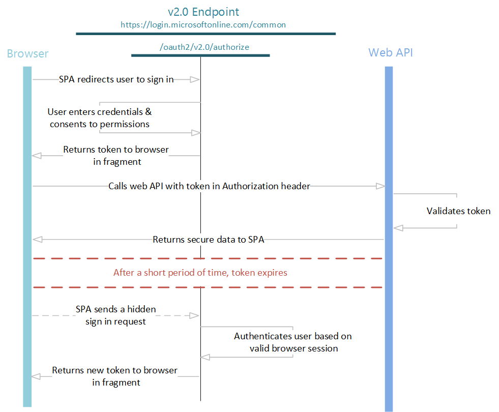

# OAuth 2.0 implicit grant (see authorization code grant)

- [OAuth 2.0 implicit grant (see authorization code grant)](#oauth-20-implicit-grant-see-authorization-code-grant)
  - [Introduction](#introduction)
  - [Proof Key for Code Exchange (PKCE)](#proof-key-for-code-exchange-pkce)
  - [Implicit grant](#implicit-grant)
  - [Send authentication requests](#send-authentication-requests)
    - [Use a policy](#use-a-policy)
  - [Validating the id\_token](#validating-the-id_token)
    - [Get additional access tokens for other resources](#get-additional-access-tokens-for-other-resources)
    - [Error response](#error-response)
  - [Refreshing tokens](#refreshing-tokens)

## Introduction

This article is included as reference to understand how the implicit grant works in case it will be used in test or needs to be implemented for a limited period of time.

Even though the implicit grant flow is available it should be replaced by **Proof Key for Code Exchange for OAuth Public Clients** - [PKCE reference](https://tools.ietf.org/html/rfc7636).

From Microsoft Learn on [the use of implicit flow](https://learn.microsoft.com/azure/active-directory/develop/v2-app-types#authorization-code-flow-vs-implicit-flow):

>For most of the history of OAuth 2.0, the [implicit flow](https://learn.microsoft.com/azure/active-directory/develop/v2-oauth2-implicit-grant-flow) was the recommended way to build single-page apps. With the removal of [third-party cookies](https://learn.microsoft.com/azure/active-directory/develop/reference-third-party-cookies-spas) and [greater attention paid to security concerns around the implicit flow](https://tools.ietf.org/html/draft-ietf-oauth-security-topics-14), we've moved to the authorization code flow for single-page apps.
>
>To ensure compatibility of your app in Safari and other privacy-conscious browsers, we no longer recommend use of the implicit flow and instead recommend the authorization code flow.

## Proof Key for Code Exchange (PKCE)

The Microsoft Identity platform supports Proof Key for Code Exchange (PKCE) for use with both [Single-page apps](https://learn.microsoft.com/azure/active-directory/develop/v2-app-types#single-page-apps-javascript) (JavaScript, MSAL.js 2.x) and mobile / native apps.

>Many modern apps have a single-page app front end written primarily in JavaScript, often with a framework like Angular, React, or Vue.
>
>The Microsoft identity platform endpoint supports these apps by using the OAuth 2.0 [authorization code flow](https://learn.microsoft.com/azure/active-directory/develop/v2-oauth2-auth-code-flow).

JavaScript and other single page apps that run primarily in a browser face a few interesting challenges when it comes to authentication:

- The security characteristics of these apps are significantly different from traditional server-based web applications.
- Many authorization servers & identity providers do not support CORS (Cross-Origin Resource Sharing) requests.
- Full page browser redirects away from the app become particularly invasive to the user experience.

## Implicit grant

>NOTE!
>
>This latter part of document is primarily meant as a reference to better understand what implicit grant is and how it works (and how it doesn't). The implicit grant flow is still used by many applications, which is why the information here can be useful.
>
>For any new application integrations, look to use the [Authorization code grant with PKCE](./e2-OAuth-AuthZ-code-grant.md#5-authorization-code-grant-extension-proof-key-for-code-exchange-pkce).

The OAuth 2.0 implicit grant is described in [section 4.2 of the OAuth 2.0 specification](https://tools.ietf.org/html/rfc6749#section-4.2).

In this flow, the app receives tokens directly from the Identity platform **/authorize** endpoint, without any server-to-server exchanges. All authentication logic and session handling takes place entirely in the JavaScript client, without extra page redirects.

The Microsoft identity platform extends the OAuth 2.0 implicit grant flows to do more than simple authentication and authorization. It introduces the **policy parameter**, which enables you to use OAuth 2.0 to add user experiences to your app, such as sign-up, sign-in, and profile management.

The entire implicit flow is illustrated below:



## Send authentication requests

When your web app needs to authenticate the user and execute a policy, it directs the user to the **/authorize** endpoint. This is the interactive portion of the flow, where the user takes action, depending on the policy, and gets an **id_token** in return from the endpoint.

In this request, the client indicates the permissions that it needs to acquire from the user in the **scope** parameter and the policy to execute in the **p** parameter.

Examples are provided below (line breaks for legibility):

### Use a policy

```xml
GET https://{tenantName}.b2clogin.com/{tenantName}.onmicrosoft.com/oauth2/v2.0/authorize
?client_id={clientId}
&response_mode={response_mode}
&response_type=id_token+token
&redirect_uri={redirectUri}
&scope={scope}
&p=b2c_1a_v1_signupsignin
&state={state}
&nonce={nonce}
```

| Parameter | Required | Description |
| -         | :-:      | -           |
| client_id | Yes | The application ID that the Azure portal assigned to your application |
| response_type | Yes | The response type, which must include **token** for the implicit flow, but normally you also include **id_token** so you can authorize the user |
| redirect_uri | Yes | The **redirect_uri** of your app, where authentication responses can be sent and received by your app. It must exactly match one of the redirect_uris that you registered in the portal, except that it must be URL encoded |
| scope | Yes | A space-separated (URL encoded) list of scopes. You shall always specify **openid** as one of the scope values as this will initiate a OpenID Connect authentication process. If you only specify **openid**, then you will only get a **id_token**. If you in addition to **openid** specify a resource URL or AppID, then you will also get an **access_token** (**Note! You can only specify 1 resource in the scope list. Multiple resources can only be attained by performing separate authorization code flows**). Example shown below grid |
| response_mode | Recommended | The method that should be used to send the resulting token back to your app. It can be one of **query**, **form_post**, or **fragment** |
| state | Highly Recommended | A value included in the request that will also be returned in the token response. It can be a string of any content that you want, but a CSRF (cross-site request forgery) token i recommended. A randomly generated unique value is typically used for preventing cross-site request forgery attacks. The state is also used to encode information about the user's state in the app before the authentication request occurred, such as the page they were on or the policy being executed. You should store the value of the CSRF token in the users' session to be validated when they return |
| p | Yes | The policy that will be executed. It is the name of a policy that is created in your B2C directory. The policy name value should begin with **b2c_1a_** |
| prompt | Optional | The type of user interaction that is required. See below for example how to use this parameter |
| nonce | Yes | A value included in the request (generated by the app) that will be included in the resulting token as a claim. The app can then verify this value to mitigate token replay attacks. The value is typically a randomized, unique string that can be used to identify the origin of the request. Read how to [Generate nonce](./e6-Nonce.md) |

>TIP!
>
>How to ask for an **id_token**, **refresh_token** and **access_token** to an API (the scope parameter MUST be URL encoded) with appID **4e0b562a-64aa-4f66-80a3-0f83bbeb6b48** and permissions (scopes) **read** and **write**:
>
>**openid+offline_access+https%3a%2f%2f87{tenantName}.onmicrosoft.com%2f4e0b562a-64aa-4f66-80a3-0f83bbeb6b4830%2Fread+https%3a%2f%2f87{tenantName}.onmicrosoft.com%2f4e0b562a-64aa-4f66-80a3-0f83bbeb6b4830%2Fwrite**

At this point, the user will be asked to complete the policy workflow. This may involve the user entering their user name and password, signing in with a social identity, signing up for the directory, or any other number of steps, depending on how the policy is defined.

After the user completes the policy, a response is returned to your app at the indicated **redirect_uri**, by using the method that is specified in the **response_mode** parameter. The response will be exactly the same for each of the above cases, independent of the policy that was executed.

The response will be presented in the redirect-url and looks like this:

```json
{
    "token_type": "Bearer",
    "expires_in": "86400",
    "id_token": "eyJ0eXAiOiJKV1QiLCJhbGciOiJSUzI1NiIsImtpZCI6IkktZDdMQy1TQkltdUtZemNNQlg0WjhDYk10dU84YU9mSjJEZWJyTjM0M3cifQ...",
    "state": "state=myState",
    "access_token": "eyJ0eXAiOiJKV1QiLCJhbGciOiJSUzI1NiIsImtpZCI6IkktZDdMQy1TQkltdUtZemNNQlg0WjhDYk10dU84YU9mSjJEZWJyTjM0M3cifQ..."
}
```

## Validating the id_token

Just receiving an **id_token** is not enough to authenticate the user. You must validate the signature of the **id_token** and verify the claims in the token according to the requirements of your app.

The Microsoft Identity platform uses JSON Web Tokens (JWTs) and public key cryptography to sign tokens and verify that they are valid.

See [Validating OpenID Connect and OAuth 2.0 tokens](./e5-Token-validation.md) for best practice on how to validate a token.

### Get additional access tokens for other resources

Even if you already received a token using the **token** response_type, you can use the below method to acquire tokens to additional resources without having to redirect the user to sign in again.

In the normal web app flow, you would do this by making a request to the **/token** endpoint. However, the endpoint does not support CORS requests, so making AJAX calls to get and refresh tokens is out of the question. Instead, you can use the implicit grant in a hidden iframe to get new tokens for other web APIs from the **/authorize** endpoint:

```xml
https://{tenantName}.b2clogin.com/{tenantName}.onmicrosoft.com/oauth2/v2.0/authorize?
client_id=e0c5fe63-acf2-44c5-89b7-b1bbc4b29dc6
&response_type=token
&redirect_uri=https%3A%2F%2Fjwt.ms%2F
&scope=https%3a%2f%2f{tenantName}.onmicrosoft.com%2f9993ca2f-6cc4-4d47-b0ac-c10811ad43e330%2Fuser_impersonation
&response_mode=fragment
&state=arbitrary_data_you_can_receive_in_the_response
&nonce=12345
&prompt=none
&domain_hint=organizations
&login_hint=myuser@mycompany.com
&p=b2c_1a_v1_signupsignin
```

| Parameter | Required | Description |
| -         | :-:      | -           |
| prompt | Yes | For refreshing and getting additional tokens in a hidden iframe, use **prompt=none** to ensure that the iframe does not hang on the sign-in page, and returns immediately. |
| login_hint | Yes | For refreshing and getting tokens in a hidden iframe, you must include the username of >the user in this hint in order to distinguish between multiple sessions the user may have at a given point in time. You can extract the username from a previous sign-in using the **preferred_username** claim. |
| domain_hint | Yes | Can be one of **consumers** or **organizations**. For refreshing and getting tokens in a hidden iframe, you must include the domain_hint in the request. Extract the **tid** claim from the **id_token** of a previous sign-in to determine which value to use. If the **tid** claim value is **9188040d-6c67-4c5b-b112-36a304b66dad**, you should use **domain_hint=consumers**. Otherwise, use **domain_hint=organizations**. |

By setting the **prompt=none** parameter, this request will either succeed or fail immediately and return to your application. A successful response will be sent to your app at the indicated **redirect_uri**, using the method specified in the **response_mode** parameter.

A successful response is returned in the reply_url, and using **response_mode=fragment** would look like this:

```xml
state=myState
&access_token=eyJ0eXAiOiJKV1QiLCJhbGciOiJSUzI1NiIsImtpZCI6IkktZDdMQy1TQkltdUtZemNN...
&token_type=Bearer
&expires_in=86400
```

### Error response

Error responses may also be sent to the **redirect_uri** so the app can handle them appropriately. In the case of **prompt=none**, an expected error will be:

```xml
GET https://jwt.ms/#
error=user_authentication_required
&error_description=the+request+could+not+be+completed+silently
```

If you receive this error in the iframe request, the user must interactively sign in again to retrieve a new token. You can choose to handle this case in whatever way makes sense for your application.

## Refreshing tokens

>IMPORTANT!
>
>Do not mistake *refreshing tokens* for the [OAuth refresh token grant](https://datatracker.ietf.org/doc/html/rfc6749#section-1.5).
>
>The implicit grant does [NOT provide refresh_tokens](https://learn.microsoft.com/azure/active-directory/develop/v2-oauth2-implicit-grant-flow#refreshing-tokens). It is possible to [*refresh tokens* using the implicit flow](https://learn.microsoft.com/azure/active-directory-b2c/implicit-flow-single-page-application#refresh-tokens), but it's not recommended for security, application, compatibility and user experience reasons.

Both **id_tokens** and **access_tokens** expires after a short period of time, so your app must be prepared to refresh these tokens periodically. To refresh either type of token, perform the same hidden iframe request from above using the **prompt=none** parameter to control the behaviour. To receive a new **id_token**, be sure to use **response_type=id_token** and **scope=openid**, as well as a **nonce** parameter.
