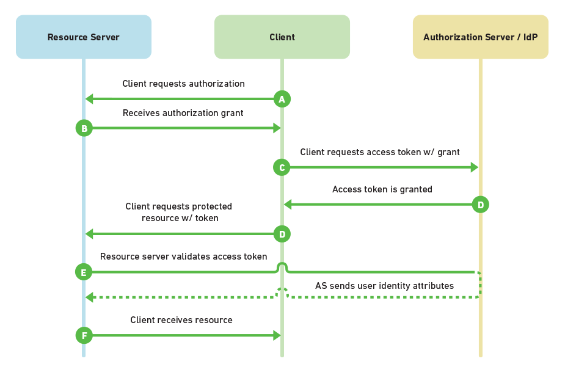

# Security Assertion Markup Language 2.0 (SAML)

- [Security Assertion Markup Language 2.0 (SAML)](#security-assertion-markup-language-20-saml)
  - [Introduction](#introduction)
  - [The basics](#the-basics)
  - [Token and claims](#token-and-claims)
  - [Identity Experience Framework SAML integration](#identity-experience-framework-saml-integration)

## Introduction

Quote from [SAML 2.0 Wikipedia post](https://en.wikipedia.org/wiki/SAML_2.0):

>SAML is a standard for exchanging authentication and authorization data between security domains.
>
>SAML 2.0 is an XML-based protocol that uses security tokens containing assertions to pass information about a principal (usually an end user) between a SAML authority, named an Identity Provider, and a SAML consumer, named a Service Provider.
>
>SAML 2.0 enables web-based, cross-domain single sign-on (SSO), which helps reduce the administrative overhead of distributing multiple authentication tokens to the user.

## The basics

Every application that uses the Identity Platform must be associated with an application registered in the B2C directory to be able to service users. Regardless of what protocol used to communicate, the developed app must use these settings from it's dedicated B2C application registration to exchange information:

- An **Application ID** or **Client ID** that uniquely identifies the application
- A **Redirect URI** or **package identifier** in which the response of the authentication is returned

Once the application is configured with the settings provided by the app registration, the users are ready to sign in, which will trigger the following flow:

Source: [Choosing an SSO Strategy: SAML vs OAuth2](https://www.mutuallyhuman.com/blog/2013/05/09/choosing-an-sso-strategy-saml-vs-oauth2/)

As illustrated and explained in [Authentication and Authorization](./e1-AuthN-and-AuthZ.md), nearly all OAuth 2.0 and OpenID Connect flows involve four parties. The same goes for SAML. Though, the naming of the involved parties differs slightly. SAML names first:

- The **Service Provider** is the system you are trying to access. OAuth refers to this as the **Resource Server**
- The **Client** is how you are interacting with the **Service Provider**, for example through a web application using a web browser
- The **Identity Provider** in SAML is referred to as the **Authorization Server**  and is the Identity Platform v2.0 endpoint (but  **identity provider** is also commonly used). It is responsible for verifying the user's identity
- The **Resource Owner** (referred to as **User** on the flow chart) is typically the end user. It is the party that owns the data

## Token and claims

The result of a user sign in flow will result in a verified token with the configured amount of claims / statements regarding the user. In a given scenario this would happen:

1. A client requests a SAML token from a security token service, authenticating to that security token service by using valid credentials
1. The security token service issues a SAML token to the client. The SAML token is signed with a certificate associated with the security token service and contains a proof key encrypted for the target service
1. The client also receives a copy of the proof key. The client then presents the SAML token to the application service (the relying party) and signs the message with that proof key
1. The signature over the SAML token tells the relying party that the security token service issued the token. The message signature created with the proof key tells the relying party that the token was issued to the client

Microsoft's [SAML Tokens and Claims](https://learn.microsoft.com/dotnet/framework/wcf/feature-details/saml-tokens-and-claims) article explains how it fits within the [Windows Communication Foundation](https://learn.microsoft.com/dotnet/framework/wcf/feature-details/) (WCF). However, the implementation of SAML should not differ depending on where the protocol is being used. The principals stay the same.

## Identity Experience Framework SAML integration

This [Microsoft docs page](https://learn.microsoft.com/azure/active-directory-b2c/connect-with-saml-service-providers) explains how to integrate with SAML and act as an Identity provider.

On the same page you will find guides how to integrate the Identity Experience Framework as a Service Provider (SP) using SAML when either [Active Directory Federation Services](https://learn.microsoft.com/azure/active-directory-b2c/identity-provider-adfs2016-custom) (ADFS) running on Windows Server 2016) or [Salesforce](https://learn.microsoft.com/azure/active-directory-b2c/identity-provider-salesforce-custom) acts as the identity provider.
