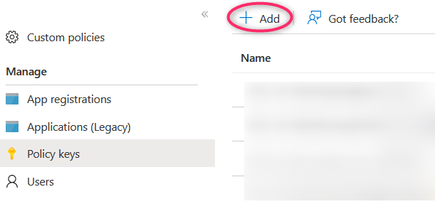
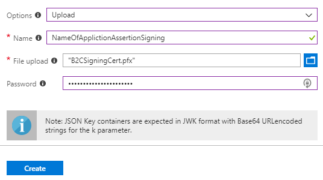
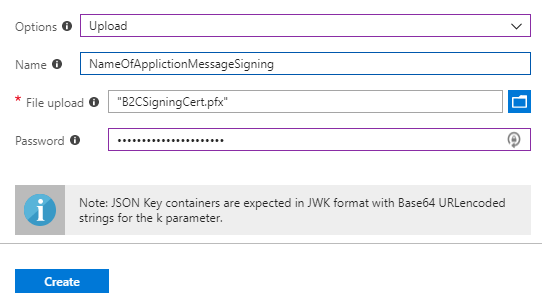

# Azure AD B2C: Integrate SAML based applications

- [Azure AD B2C: Integrate SAML based applications](#azure-ad-b2c-integrate-saml-based-applications)
  - [Introduction](#introduction)
  - [The two scenarios](#the-two-scenarios)
    - [Identity Experience Framework as a SAML **Service provider** (SP)](#identity-experience-framework-as-a-saml-service-provider-sp)
    - [Identity Experience Framework as a SAML **Identity provider** (IdP)](#identity-experience-framework-as-a-saml-identity-provider-idp)
  - [Configure Identity Experience Framework as a SAML Identity provider](#configure-identity-experience-framework-as-a-saml-identity-provider)
    - [Create self-signed certificate](#create-self-signed-certificate)
    - [Use an existing certificate signed by a trusted certificate authority](#use-an-existing-certificate-signed-by-a-trusted-certificate-authority)
    - [Upload the certificate(s) to the Identity Experience Framework](#upload-the-certificates-to-the-identity-experience-framework)
    - [Claims provider](#claims-provider)
    - [Technical profile](#technical-profile)
      - [SAML Token Issuer](#saml-token-issuer)
      - [Metadata](#metadata)
      - [CryptographicKeys](#cryptographickeys)
    - [User Journey](#user-journey)
      - [SAML Sign In User Journey](#saml-sign-in-user-journey)
    - [Execution Policy](#execution-policy)
      - [SAML relying party](#saml-relying-party)
  - [SAML Service Provider (SP) configuration](#saml-service-provider-sp-configuration)
    - [SAML SP metadata](#saml-sp-metadata)
    - [SAML SP issuer](#saml-sp-issuer)
    - [SAML URL / SAML Endpoint / Login URL](#saml-url--saml-endpoint--login-url)

## Introduction

The [Identity Experience Framework](./a-CIAM-IEF-introduction.md#identity-framework-experience-customizable-and-scalable) can easily be extended to allow external identity provider authentication. Using [Security Assertion Markup Language 2.0](./e9a-SAML.md) protocol it is possible to integrate with SAML-based applications using **custom policies**.

## The two scenarios

Support for the SAML protocol allows us to connect to applications in two ways. The main difference is where the authentication responsibilities lie. This also dictates where the identity store is located. In either scenario, using the [Identity Experience Framework](./a-CIAM-IEF-introduction.md#identity-framework-experience-customizable-and-scalable), we can move authentication away from the applications.

### Identity Experience Framework as a SAML **Service provider** (SP)

Microsoft Docs provides some examples on the configuration of the IEF as a SAML Service Provider (SP):

- [ADFS as SAML identity provider](https://learn.microsoft.com/azure/active-directory-b2c/active-directory-b2c-custom-setup-adfs2016-idp)
- [Salesforce as a SAML identity provider](https://learn.microsoft.com/azure/active-directory-b2c/active-directory-b2c-setup-sf-app-custom)

This enables us to integrate a SAML based external identity provider (IdP) with the IEF. Here it assumes the **Service provider** role.

A user is working in an application integrated with the Identity Platform. The user wants to sign in and is then redirected to the platform sign in page. On this page it is possible to authenticate using the SAML integrated IdP, either ADFS or Salesforce (or any other SAML based IdP). From the application perspective the Identity Platform / Identity Experience Framework is the provider of the authentication service, but what the application doesn't know, is that the IEF may have support for multiple SAML based external IdPs.

Upon successful authentication the user is redirected back to the application and signed in.

### Identity Experience Framework as a SAML **Identity provider** (IdP)

The second scenario takes place when IEF is assigned the SAML compliant **Identity Provider** role.

A user is working in an application that is connected to the Identity Platform using the SAML protocol. When initiating a login the user is redirected to the sign in page and prompted for credentials. Because IEF is configured to operate as the IdP we can also enable the sign up flow and allow the user to create an account.

Upon successful authentication, or a completed sign up flow, the user is returned to the application and signed in.

Configuring the Identity Experience Framework as an IdP gives us the added benefit of centralizing user management.

## Configure Identity Experience Framework as a SAML Identity provider

### Create self-signed certificate

Using Powershell we create (by self-signing) a certificate that is placed in the **CurrentUser\Personal\Certificates** store and exported to the directory where the script is stored. The certificate and it's private key is stored in an encrypted PKCS #12 container saved as a password protected **.PFX** file.

>[PKCS #12](https://en.wikipedia.org/wiki/PKCS_12#Relationship_to_PFX_file_format) is extended from Microsoft PFX file format. In cryptography, PKCS #12 defines an archive file format for storing many cryptography objects as a single file. It is **commonly used to bundle a private key with its X.509 certificate** or to bundle all the members of a chain of trust.

```powershell
$tenantName = "{tenantName}.onmicrosoft.com"
$certStore = "Cert:\CurrentUser\My" # "Cert:\LocalMachine\My"
$certName = "IEFClientCert.pfx"
$pwdText = "IEFClientCertPassword"

$pfxCertFile = if ($PSCommandPath -eq "") {$certName} else {($PSCommandPath | Split-Path -Parent) + "\" + $certName}
$pwd = ConvertTo-SecureString -String $pwdText -Force -AsPlainText
$signingCert = New-SelfSignedCertificate -CertStoreLocation $certStore -DnsName "$tenantName" -Subject "IEF SAML Signing Cert" -HashAlgorithm SHA256 -KeySpec Signature -KeyLength 2048 -FriendlyName "IEF SAML Signing Cert" -NotAfter (get-date).AddYears(10)
Export-PfxCertificate -Cert $signingCert -FilePath $pfxCertFile -Password $pwd
Remove-Item -Path $certStore\$($signingCert.thumbprint)
```

### Use an existing certificate signed by a trusted certificate authority

We assume the certificate exists in either the user (*CurrentUser*) or computer (*LocalMachine*) certificate store. Modify script to match the appropriate store. We also need the thumbprint of the certificate which can be found by listing the certificate.

```powershell
Get-ChildItem Cert:\CurrentUser\My
# or
Get-ChildItem Cert:\LocalMachine\My
```

```powershell
Get-ChildItem Cert:\CurrentUser\My

PSParentPath: Microsoft.PowerShell.Security\Certificate::CurrentUser\My

Thumbprint                                Subject
----------                                -------
D26F7EB6E190A557468C20BEA6D78226F4669229  CN=IEF SAML Signing Cert
```

```powershell
$thumbprint = ""
$certStore = "Cert:\CurrentUser\My" # "Cert:\LocalMachine\My"
$certName = "IEFSigningCert.pfx"
$pwdText = "IEFSigningCertPassword"

$pwd = ConvertTo-SecureString -String $pwdText -Force -AsPlainText
$pfxCertFile = if ($PSCommandPath -eq "") {$certName} else {($PSCommandPath | Split-Path -Parent) + "\" + $certName}
Export-PfxCertificate -Cert ($certStore + "\" + $thumbprint) -FilePath $pfxCertFile -Password $pwd
```

### Upload the certificate(s) to the Identity Experience Framework

>SAML uses both an **assertion signing** and a **message signing** certificate. We could have uploaded two different certificates, but do not want to add unnecessary complexity so we reuse the same certificate in both containers.

- In your B2C tenant, go to **Azure AD B2C > Identity Experience Framework > Policy Keys**



1. Select **+ Add**
2. Select **Options > Upload**
3. Enter a **Name** (for example **NameOfApplicationAssertionSigning**). The prefix **B2C_1A_** is automatically added to the name of the key container
4. **Upload** the certificate using the upload file control
5. Enter the **certificate's password**
6. Select **Create**



- Repeat the process for the message signing certificate.



- Verify that the keys now exists in the **Policy Keys** list.

### Claims provider

Open the b2c_1a_v1_base policy.

Find the section with **ClaimsProviders** or **Custom ClaimsProviders** and locate the following claims provider:

```xml
<ClaimsProvider>
    <DisplayName>Token Issuer</DisplayName>
    <TechnicalProfiles>

    ...
    ..
    .

    </TechnicalProfiles>
</ClaimsProvider>
```

This is the claims provider for the default **Token Issuer**.

### Technical profile

#### SAML Token Issuer

Inside the **<ClaimsProvider\>** add the following **<TechnicalProfile\>** right after the one with **Id="JwtIssuer"**.

```xml
<!-- Custom SAML Token Issuer -->
<TechnicalProfile Id="Saml2AssertionIssuer">
    <DisplayName>Token Issuer</DisplayName>
    <Protocol Name="None" />
    <OutputTokenFormat>SAML2</OutputTokenFormat>
    <Metadata>
        <Item Key="IssuerUri">https://{tenantName}.b2clogin.com/te/{tenantName}.onmicrosoft.com/B2C_1A_saml_application</Item>
    </Metadata>
    <CryptographicKeys>

        <!-- Custom SAML certificate container references -->
        <Key Id="SamlAssertionSigning" StorageReferenceId="B2C_1A_NameOfApplicationAssertionSigning" />
        <Key Id="SamlMessageSigning" StorageReferenceId="B2C_1A_NameOfApplicationMessageSigning" />

    </CryptographicKeys>
    <InputClaims />
    <OutputClaims />
    <UseTechnicalProfileForSessionManagement ReferenceId="SM-Saml" />
</TechnicalProfile>
```

```xml
<TechnicalProfile Id="SM-Saml">
    <DisplayName>Session Management Provider</DisplayName>
    <Protocol Name="Proprietary" Handler="Web.TPEngine.SSO.SamlSSOSessionProvider, Web.TPEngine, Version=1.0.0.0, Culture=neutral, PublicKeyToken=null" />
</TechnicalProfile>

```

#### Metadata

Change the following in the **<Metadata\>** tag:

| Metadata  | Value | Comment |
| -         | -     | -       |
| IssuerUri | https:// | Change tenantName and modify the SAML execution policy name (b2c_1a_*) |

#### CryptographicKeys

Change the following in the **<CryptographicKeys\>** tag:

| CryptoGraphicKey  | Value | Comment |
| -                 | -     | -       |
| SamlAssertionSigning | StorageReferenceId= B2C_1A_AssertionSign | Name of the B2C policy key container for the uploaded SAML **assertion signing** certificate. |
| SamlMessageSigning  | StorageReferenceId= B2C_1A_MessageSign | Name of B2C the policy key container for the uploaded SAML **message signing** certificate. |

### User Journey

#### SAML Sign In User Journey

Now the Trust Policy Framework is ready to issue SAML tokens. Create a User Journey that will issue SAML tokens. Copy an existing User Journey, either a **sign up sign in** policy or a **sign in** policy.

1. Open the **base_extensions** policy file containing the User Journeys.
1. Copy and paste the example below to the policy file, adjust the journey to your own specific needs.
1. Change **UserJourney Id="SamlApplicationSignIn"** to the name best suited to the User Journey.
1. Make sure **CpimIssuerTechnicalProfileReferenceId="Saml2AssertionIssuer"** is matching **<TechnicalProfile Id="Saml2AssertionIssuer"\>** from the [SAML token issuer](#saml-token-issuer) section.

```xml
<UserJourney Id="SamlApplicationSignIn">
    <PreserveOriginalAssertion>false</PreserveOriginalAssertion>

    <OrchestrationSteps>
    <OrchestrationStep Order="1" Type="ClaimsProviderSelection" ContentDefinitionReferenceId="api.idpselections">
        <ClaimsProviderSelections>
        <ClaimsProviderSelection TargetClaimsExchangeId="FacebookExchange" />
        <ClaimsProviderSelection TargetClaimsExchangeId="GoogleExchange" />
        <ClaimsProviderSelection TargetClaimsExchangeId="AADExchange" />
        <ClaimsProviderSelection TargetClaimsExchangeId="LocalAccountSigninEmailExchange" />
        </ClaimsProviderSelections>
    </OrchestrationStep>

    <OrchestrationStep Order="2" Type="ClaimsExchange">
        <ClaimsExchanges>
        <ClaimsExchange Id="FacebookExchange" TechnicalProfileReferenceId="Facebook-OAUTH" />
        <ClaimsExchange Id="GoogleExchange" TechnicalProfileReferenceId="Google-OAUTH" />
        <ClaimsExchange Id="AADExchange" TechnicalProfileReferenceId="AAD-OIDC" />
        <ClaimsExchange Id="LocalAccountSigninEmailExchange" TechnicalProfileReferenceId="SelfAsserted-LocalAccountSignin-Email" />
        </ClaimsExchanges>
    </OrchestrationStep>

    <OrchestrationStep Order="3" Type="ClaimsExchange">
        <Preconditions>
        <Precondition Type="ClaimEquals" ExecuteActionsIf="true">
            <Value>authenticationSource</Value>
            <Value>localAccountAuthentication</Value>
            <Action>SkipThisOrchestrationStep</Action>
        </Precondition>
        </Preconditions>
        <ClaimsExchanges>
        <ClaimsExchange Id="AADUserReadWithAlternativeSecurityId" TechnicalProfileReferenceId="AAD-UserReadUsingAlternativeSecurityId" />
        </ClaimsExchanges>
    </OrchestrationStep>

    <OrchestrationStep Order="4" Type="SendClaims" CpimIssuerTechnicalProfileReferenceId="Saml2AssertionIssuer" />
    </OrchestrationSteps>
    <ClientDefinition ReferenceId="DefaultWeb" />

</UserJourney>
```

### Execution Policy

#### SAML relying party

Create your execution policy and use the following example to create your relying party.

```xml
<RelyingParty>
    <DefaultUserJourney ReferenceId="SamlApplicationSignIn" />
    
    <TechnicalProfile Id="PolicyProfile">
    <DisplayName>SAML application sign in policy profile</DisplayName>
    <Protocol Name="SAML2" />
    
        <Metadata>
        <Item Key="PartnerEntity">https://url_to_sp_metadata</Item>
        <Item Key="KeyEncryptionMethod">Rsa15</Item>
        <Item Key="DataEncryptionMethod">Aes256</Item>
        <Item Key="XmlSignatureAlgorithm">Sha256</Item>
        </Metadata>
    
        <!-- SAML does not support the input claims in authentication requests -->
        <InputClaims />
    
        <OutputClaims>
        <OutputClaim ClaimTypeReferenceId="objectId" PartnerClaimType="oid" />
        <OutputClaim ClaimTypeReferenceId="displayName" />
        <OutputClaim ClaimTypeReferenceId="userPrincipalName" />
        </OutputClaims>
    
        <SubjectNamingInfo ClaimType="oid" />
    
    </TechnicalProfile>
</RelyingParty>
```

Change the following in the **<RelyingParty\>** tag:

| Metadata  | Value | Comment |
| -         | -     | -       |
| DefaultUserJourney | ReferenceId="SamlApplicationSignIn" | Change SamlApplicationSignIn to match UserJourney Id from [SAML SignIn UserJourney](#saml-sign-in-user-journey) section. |

Change the following in the **<Metadata\>** tag:

| Metadata  | Value | Comment |
|     -     |   -   |   -     |
| PartnerEntity | https://   | Change PartnerEntity to resolve the Service Provider (SP) metadata document. If the SP does not have a metadata URL the metadata must be added in the **Metadata** tag |
| KeyEncryptionMethod   | Rsa15   | This is the default value. |
| DataEncryptionMethod  | Aes256  | This is the default value. |
| XmlSignatureAlgorithm | Sha256  | This is the default value. |

In the **<OutputClaims\>** tag we configure the claims we wish include in the SAML token:

| Metadata  | Value | Comment |
| -         | -     | -       |
| OutputClaim  | objectId | **PartnerClaimType="oid"** maps the locally defined **objectId** claim to the **oid** claim in the SAML token. |
| OutputClaim  | displayName | Optional. |
| OutputClaim  | userPrincpalName | Optional. |

 Examples of commonly used user claims:  **givenName**, **surname**, **email**, **identityProvider**.

The **<SubjectNamingInfo\>** tag sets the claim that uniquely identifies the user in the SAML token, which is the **oid** claim:

| Metadata  | Value | Comment |
| -         | -     | -       |
| SubjectNamingInfo  | oid  | Do not modify. Value is mapped to that of the **objectId** claim by configuring **OutputClaim ClaimTypeReferenceId="objectId" PartnerClaimType="oid"**. This claim is required as it is the unique identifier of the user in the B2C Azure AD. |

>If a case arises where the user unique identifier claim changes, rather look to modify the **OutputClaim ClaimTypeReferenceId="objectId" PartnerClaimType="oid"** and not the **SubjectNamingInfo ClaimType="oid"**.

## SAML Service Provider (SP) configuration

These are the URLs / endpoints that might be required on the SAML SP side. If the SP cannot get the certificate(s) from metadata, you will need to export the public part of the certificate(s), and provide this to the SP manually.

>TIP!
>
>When using a custom domain, {tenantName}.b2clogin.com can be replaced with the domain name.

### SAML SP metadata

```html
https://{tenantName}.b2clogin.com/te/{tenantName}.onmicrosoft.com/B2C_1A_v1_SAML_SignIn/Samlp/metadata
```

### SAML SP issuer

```html
https://{tenantName}.b2clogin.com/te/{tenantName}.onmicrosoft.com/B2C_1A_v1_SAML_SignIn
```

### SAML URL / SAML Endpoint / Login URL

```html
https://{tenantName}.b2clogin.com/te/{tenantName}.onmicrosoft.com/B2C_1A_v1_SAML_SignIn/Samlp/sso/login
```
