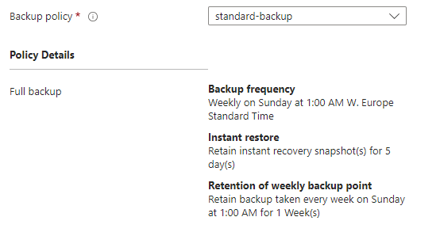

# Backup

There is a weekly schedule for backup of the virtual machine, and the backup is stored in a Recovery Services Vault. The backup is stored for 4 weeks.
In addition there is a instant restore snapshot of the virtual machine, and the snapshot is stored for 5 days.

The Recovery Services Vault is placed in the same resource group as the virtual machine, and the backup is stored in the same region as the virtual machine.
The softdelete is enabled on the Recovery Services Vault, and the retention is set to 14 days.