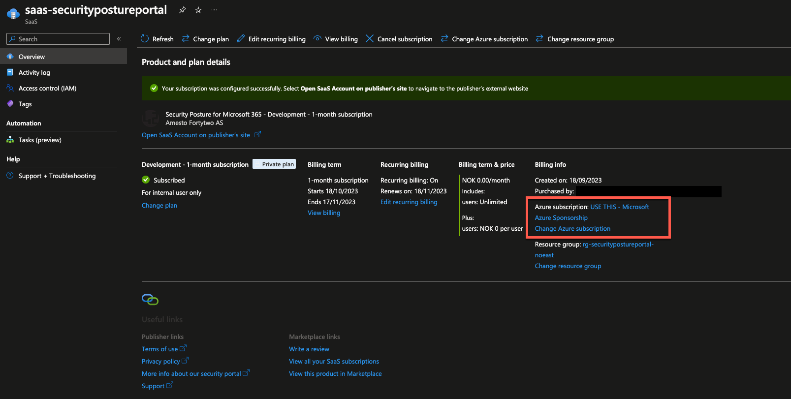

# Change the SaaS subscription

!!! note

    From April 2024 the name of the portal changed from "Security Posture Portal" to "Fortify Portal". It´s the same product.

## Change the billing subscription

To change the billing subscription of the Portal is very easy and are done through your Azure portal. Follow the steps below to change at any point.

1. Go to the [Azure portal](https://portal.azure.com/#home).
2. In the global search box at the top of the page, enter SaaS and then under Services, select SaaS. [Shortcut here](https://portal.azure.com/#view/HubsExtension/BrowseResourceBlade/resourceType/Microsoft.SaaS%2Fresources)

3. Find the SaaS offering named ```Security Posture for Microsoft 365``` and click it.
4. Choose "Change Azure Subscription" on the SaaS app and follow the screen instructions.



## Change the billing recurrence

To change the billing recurrence of the Portal.

Choose "Edit recurring billing" on the SaaS app and follow the screen instructions.


## References

- [SaaS subscription lifecycle management](https://learn.microsoft.com/en-us/marketplace/saas-subscription-lifecycle-management)

!!! note

    If you have any issues contact us on support@fortytwo.io
