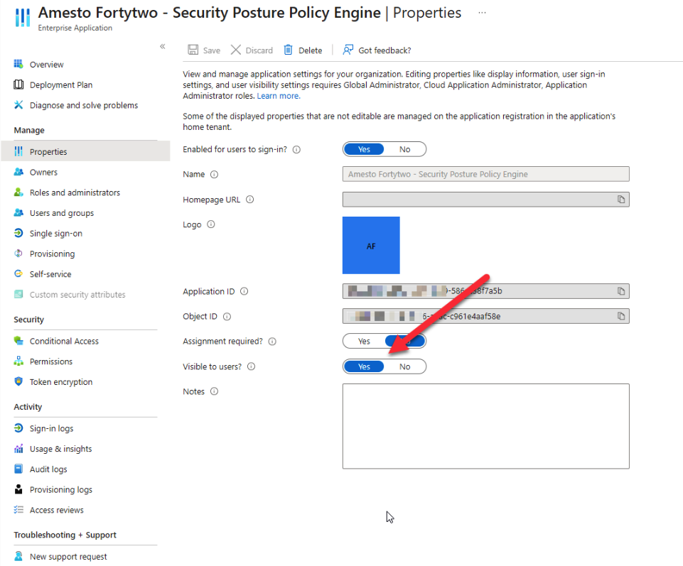

# Enterprise applications installed in your tenant

As part of onboarding to use our portal Fortytwo install two Enterprise applications in your tenant. The following page document how and what they are used for.

## Fortytwo Portal app

To enable seamless single sign-on access to the portal for you and fellow users within your organization, the prerequisite is this application. This dedicated app serves as the cornerstone of authentication for the portal and facilitates all role assignments.

It's important to note that this application itself does not possess any access privileges within your tenant.

The following roles are available in the app.

| Role  | Description   |
|-------------- | -------------- |
| Security Posture Operator    | Provides access to the security posture feature in the portal, with the ability to accept risks     |
| Security Posture Admin    | Currently same as Security Posture Operator, but in the future, more administrative tasks will be available to this role. Give youself this role.     |
| Security Posture Reader    | Provides a read only access to the security posture feature in the portal     |

## Fortytwo - Security Posture Polic Engine app

This is the primary application responsible for retrieving and processing all configuration data. It interacts with the following systems through the Microsoft Graph API, utilizing **READ** permissions.

!!! warning "NB"

    The application do not have _any_ write or any other permissions able to alter and/or do anything in your tenant.

The application requires a large set of read consents for reading from the Microsoft Graph, and Global Reader for accesing Microsoft Teams and Microsoft Exchange.

### Hide app from users

It could be a good idea to hide this app from users as this is not used by any user.

