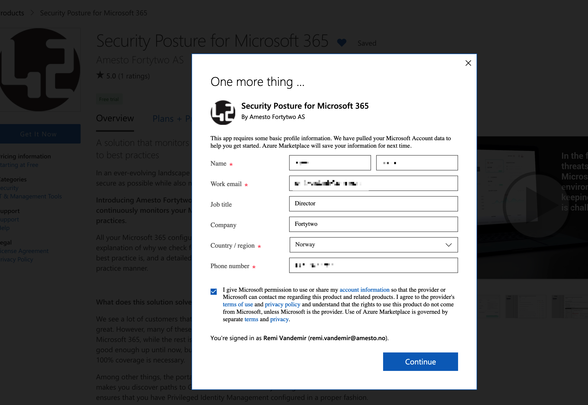
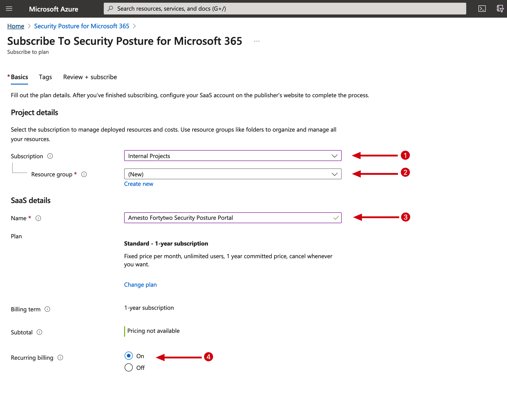
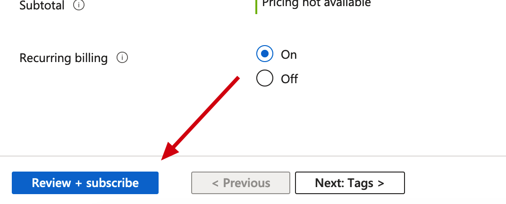
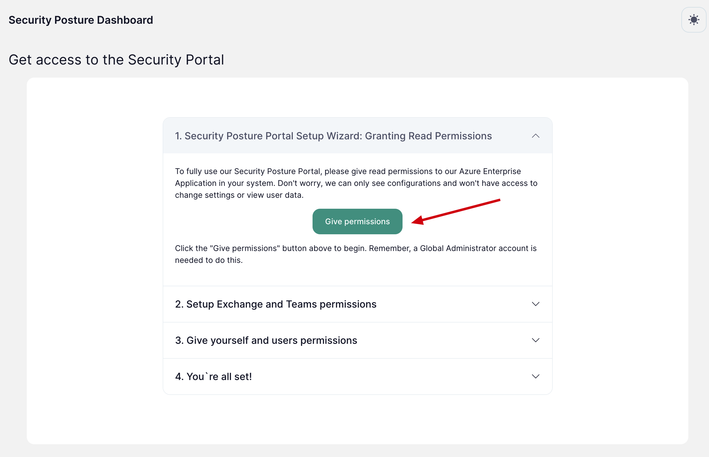

# Getting started

This is an detailed description of how to setup our Security Posture Portal from Azure Marketplace. The steps are pritty much easy to understand but we have documented every step here in this guide.

## Setup through Azure Marketplace

### Install the app from Azure marketplace

1. Go to our [Azure Marketplace Product page](https://azuremarketplace.microsoft.com/en-us/marketplace/apps/amestofortytwoas1653635920536.securityposture-2023?tab=Overview)
2. Click ``Get it now``

3. Fill out contact details and click ``Continue``

4. You are now taken to the Azure portal. Choose ``Standard`` on the Plan dropdown and click ``Subscribe``

5. Now take the appropiate actions on the following:

### Configure your Azure environment

!!! note

    To be able to add the Security Posture Portal to your tenant you need at least ``Contributor`` access 

1. Configure your tenant environment.
    - Choose which Azure subscription you would like to add the app to.
    - Choose which Resource group the app should live in. Choose "New" if you dont have any.
    - Give the app an appropiate name ``Amesto Fortytwo Security Posture Portal``
    - Choose ``On`` on Recurring billing.

2. When you are ready click ``Review + subscribe`` to start the setup of the portal.

3. The setup will take a couple of minutes. When its done you will be asked to ``Go to the publisher site to finish setup``. You are now being redirected to our onboarding page

### Run through our onboarding wizard

1. Approve/Consent our Single Signon Application. This is to that you can access the portal with your own Microsoft 365 account.

2. Give our enterprise app ``Amesto Fortytwo Portal`` read permissions to your tenant.

!!! info
    This app is required for us to read the configuration in your tenant.
    Our app only has Read permissions for configurations elements and we will not every be able to reads any of your users data.

3. Setup Exchange and Teams permissions
Follow the guide on the onboarding steps.
4. Give yourself and users permissions
Follow the guide on the onboarding steps.
5. Navigate to the portal
Follow the guide on the onboarding steps.

!!! note

    If you have any issues contact us on assistance@amestofortytwo.com 
