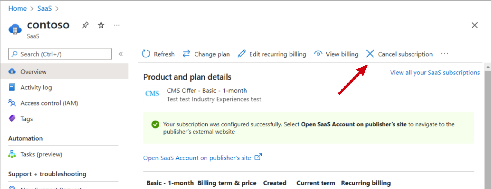

# How to cancel subscription of the Security Posture Portal

To cancel your subscription of the portal is very easy and are done through your Azure portal. Follow the steps below to cancel at any point.

1. Go to the [Azure portal](https://portal.azure.com/#home).

2. In the global search box at the top of the page, enter SaaS and then under Services, select SaaS. [Shortcut here](https://portal.azure.com/#view/HubsExtension/BrowseResourceBlade/resourceType/Microsoft.SaaS%2Fresources)


3. Find the SaaS offering named ```Security Posture for Microsoft 365``` and click it.

4. Choose "Cancel Subscription" on the SaaS app and follow the screen instructions.



!!! note

    If you have any issues contact us on assistance@amestofortytwo.com .
