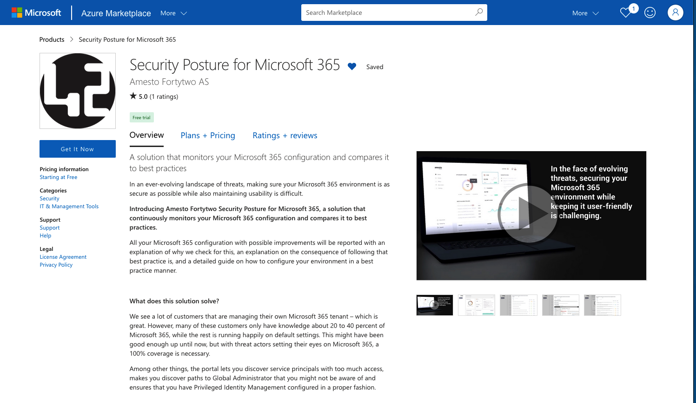

# Amesto Fortytwo Security Posture portal for Microsoft 365

## Intro

[More commercial information can be read here](https://www.amestofortytwo.com/portal-by-fortytwo)

A solution that monitors your Microsoft 365 configuration and compares it to best practices.

In an ever-evolving landscape of threats, making sure your Microsoft 365 environment is as secure as possible while also maintaining usability is difficult.

Introducing Amesto Fortytwo Security Posture for Microsoft 365, a solution that continuously monitors your Microsoft 365 configuration and compares it to best practices.

All your Microsoft 365 configuration with possible improvements will be reported with an explanation of why we check for this, an explanation on the consequence of following that best practice is, and a detailed guide on how to configure your environment in a best practice manner.

## What does this solution solve?

We see a lot of customers that are managing their own Microsoft 365 tenant – which is great. However, many of these customers only have knowledge about 20 to 40 percent of Microsoft 365, while the rest is running happily on default settings. This might have been good enough up until now, but with threat actors setting their eyes on Microsoft 365, a 100% coverage is necessary.

Among other things, the portal lets you discover service principals with too much access, makes you discover paths to Global Administrator that you might not be aware of and ensures that you have Privileged Identity Management configured in a proper fashion.

### Can you see my company data?

No. We can only see your Microsoft 365 configuration, and do not have any access to company documents or other data.

### Can you be breached and used as an attack vector into my tenant?

Not really. We only have read access to your Microsoft 365 configuration.

### Isn’t this just Secure Score and recommendations in the Azure Portal?

No. While Secure Score is great, it is very limited and only checks a few very basic things. It does not check for holes in your conditional access policies, not for the use of SPF/DMARC/DKIM in your environment, not for policies for user app consent, or the other hundreds of checks in this portal.

## Azure Marketplace

The portal is available through [Microsoft Azure Marketplace](https://azuremarketplace.microsoft.com/en-us/marketplace/apps/amestofortytwoas1653635920536.securityposture-2023?tab=Overview)

## Public Roadmap

Our portal is under continuous development and we regularly update our [Public Roadmap](https://github.com/orgs/amestofortytwo/projects/12), which can be found here. If you have any suggestions, ideas, or feedback, we would greatly appreciate hearing from you. Please reach out to us at [Assistance email](mailto:assistance@amestofortytwo.com).
