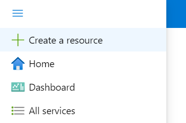

# Step 1 - Configuring the Virtual Machine Scale Set manually

**Note:** If you do not want to handle the creation of the VMSS manually, you can use our [other methods](./step1-manual.md) instead.

Start by going to the Azure Portal and click **+Create a resource**. 

Search for **Virtual Machine Scale Set**, click on the result and click **Create**

### Basics

- **Project details**
    - **Subscription** - A subscription you have contributor access to
        - **Resource group** - A new or existing resource group
- **Scale set details**
    - **Virtual machine scale set name** - The name of the scale set itself. Cannot be changed after deployment, but everything is stateless, so you can simply deploy a new scale set if needed.
    - **Region** - The region where you want your runners to be located
    - **Availability zone** - Configure to None in order to allow for a cluster with few running instances
- **Orchestration**
    - **Orchestration mode** - Configure to **Uniform**, as we will be running only a single image and runner type
    - **Security type** - Standard is the only supported for our image currently
- **Instance details**
    - **Image** - Locate the Amesto Fortytwo **Self Hosted Runner for Azure DevOps** image and select whether you want an Ubuntu or Windows based runner:

    

    - **Run with Azure Spot discount** - Only select this if you know how to handle spot, and if your pipelines can tolerate evictions
    - **Size** - Choose the virtual machine size you want to run the runners as
- **Administrator account**
    - Configure an administrator account for you virtual machines

### Spot

Skip configuring **Spot** unless you chose to **Run with Azure spot discount**.

### Disks

Leave **Disks** as default and go to the next page.

### Networking

On the **Networking** page, you can choose between creating a new network or reuse an existing one. You can easily connect to a virtual network that is peered into a Azure Landing Zones solution and use private endpoints and stuff. Please be aware that the runners require internet connectivity in order to reach Azure DevOps.

- **Load balancing options** - Choose **None**, as Azure DevOps takes care of this

The default settings will work just fine in most cases:

### Scaling

For scaling, Azure DevOps will take care of everything. However, you should configure **Initial instance count** to **0**, as we need to configure the VMSS for Azure DevOps connectivity before creating our instances.

### Management, Health, Advanced and Tags

No need to configure any of this. Just click next and complete the deployment of VMSS.

### Final configuration

After successfully creating the VMSS instance, click **Go to resource**

Under **Upgrade policy**, switch from manual to **Automatic**.

[Continue to step 2 - Configuring the virtual machine scale set for auto registration](./step2.md)