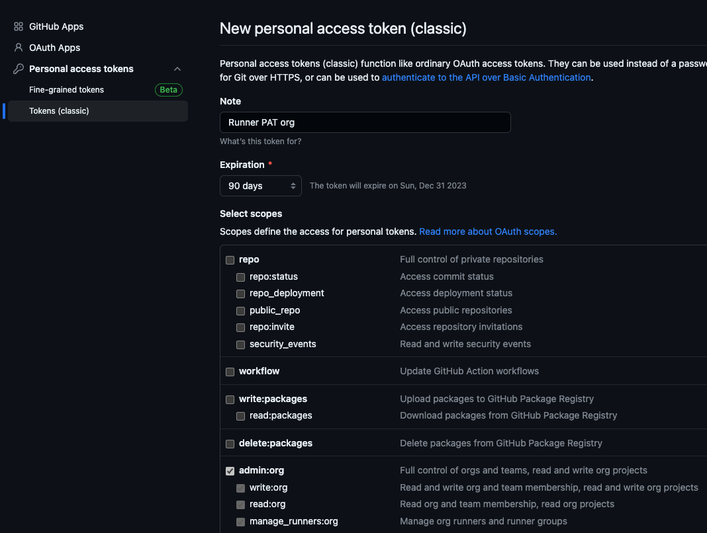
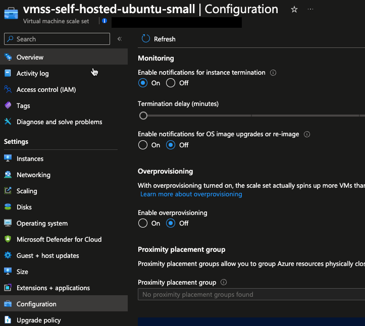
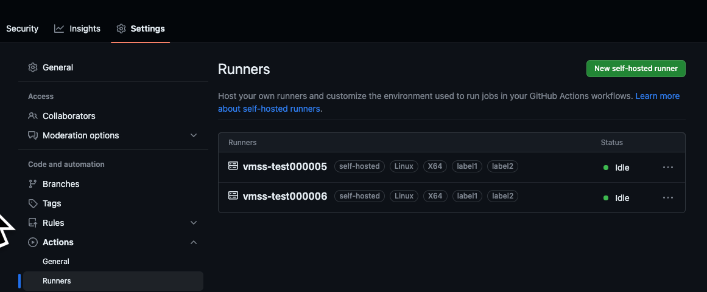

# Step 2 - Configuring the virtual machine scale set for auto registration

Now the the VMSS is up and running, we are ready to configure the Github runner.

## Get a PAT from Github for either repo or organization

If you are registering the runners for a private repo, the PAT needs to have access to "repo". If you are registering the runners for an organization, the PAT needs to have access to "admin:org".
To register a PAT, go to "Settings" -> "Developer settings" -> "Personal access tokens" -> "Tokens (classic) and click "Generate new token".

### Organization runners



### Organization runners on private repo


### Personal repository runners


## For Ubuntu Self-hosted Runners

To configure the VMSS to auto-register, use the below new method. The legacy way is just mentioned for reference.

### Configure the VMSS to auto register (New)

Run the following with az-cli to configure an extension on the VMSS that will auto register the runner with Github. Replace the variables with your correct information.

```bash
VMSS=vmss-test-noeast   # Name of the VMSS.
RG=rg-test-noeast       # Resource group for the VMSS.
PAT=ghp_xxx             # The PAT generated in the previous steps.
SCOPE=amesfortytwo      # -s: Can be spesified as either the organization, the owner/repository, or enterprises/enterprisename.
USER=runner             # -u: Username for the runner created on the VMSS.
LABEL=label1,label2     # (Optional) -l: Comma separated list of labels for the runner.
RGROUP=test             # (Optional) -r: Runner Group.
az vmss extension set --vmss-name $VMSS --name customScript --resource-group $RG \
    --version 2.1 --publisher Microsoft.Azure.Extensions \
    --protected-settings "{\"fileUris\": [\"https://raw.githubusercontent.com/amestofortytwo/terraform-azurerm-selfhostedrunnervmss/main/scripts/script.sh\"],\"commandToExecute\": \"RUNNER_CFG_PAT=$PAT bash script.sh -s $SCOPE -u $USER -l $LABEL -r $RGROUP -f\"}"
```

Scale up the VMSS to at least 1 instance. This can be done in the Azure Portal or with az-cli. Currently you would need to manually scale the number of instances of the VMSS to the number you want.


### Configure the VMSS to auto register (Legacy way)

Run the following with az-cli to configure an extension on the VMSS that will auto register the runner with Github. Replace the variables with your correct information.

```bash
VMSS=vmss-test-noeast   # Name of the VMSS.
RG=rg-test-noeast       # Resource group for the VMSS.
PAT=ghp_xxx             # The PAT generated in the previous steps.
SCOPE=amesfortytwo      # Can be spesified as either the organization or the owner/repository.
USER=runner             # Username for the runner created on the VMSS.
LABEL=label1,label2     # Comma separated list of labels for the runner.
RGROUP=test             # Runner Group. Optional and can be left out/blank.
az vmss extension set --vmss-name $VMSS --name customScript --resource-group $RG \
    --version 2.1 --publisher Microsoft.Azure.Extensions \
    --protected-settings "{\"fileUris\": [\"https://raw.githubusercontent.com/amestofortytwo/terraform-azurerm-selfhostedrunnervmss/main/scripts/script.sh\"],\"commandToExecute\": \"bash script.sh $SCOPE $PAT $USER $LABEL $RGROUP\"}"
```

Scale up the VMSS to at least 1 instance. This can be done in the Azure Portal or with az-cli. Currently you would need to manually scale the number of instances of the VMSS to the number you want.


## For Windows Self-hosted Runners

TODO! Sorry, I haven't had time to test this yet.

## Advanced configuration examples for the VMSS

### Offboard Github runner upon termination events/scale-down

If you the Github runner instance to offboard itself from Github upon termination events/scale-down, you will need to enable termination notifications on the VMSS. This can be done with the following in the portal:



Also the Terraform module has a variable for this:

```hcl
  enable_termination_notifications = true
```

## Verify that the runner is registered

After the previous has been done, you should be able to verify within the organization or the repository that the runner is registered.



[Continue to step 3 - Testing the self hosted runner](./step3.md)


