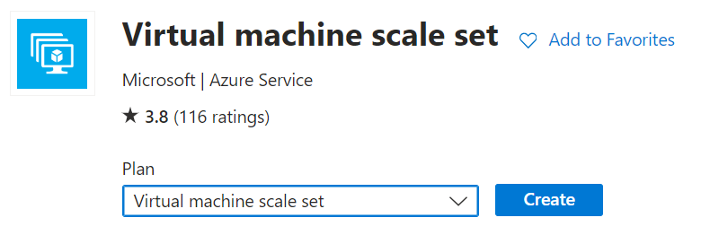
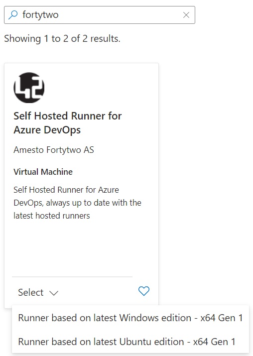
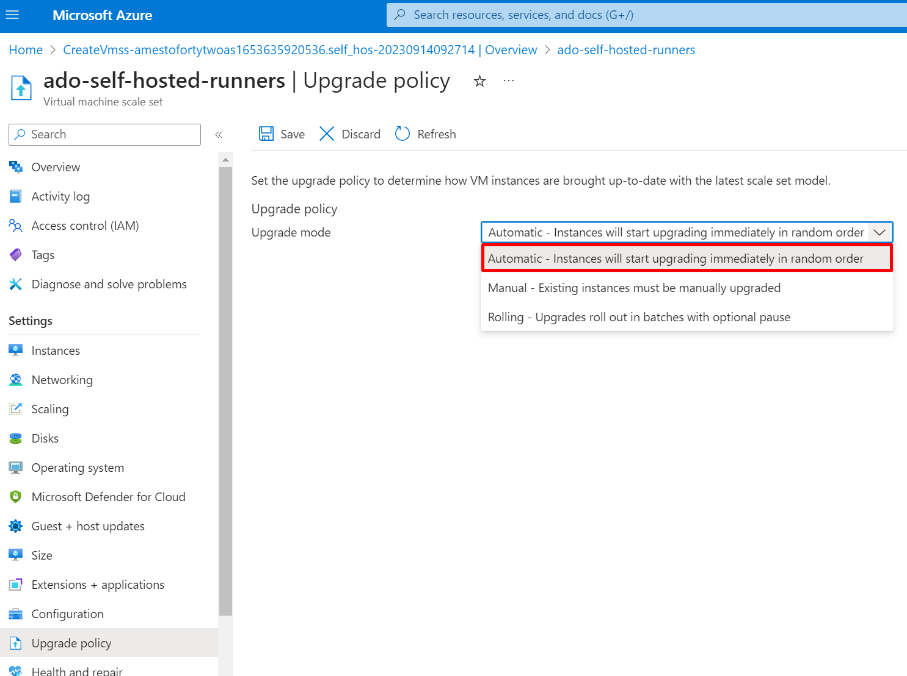
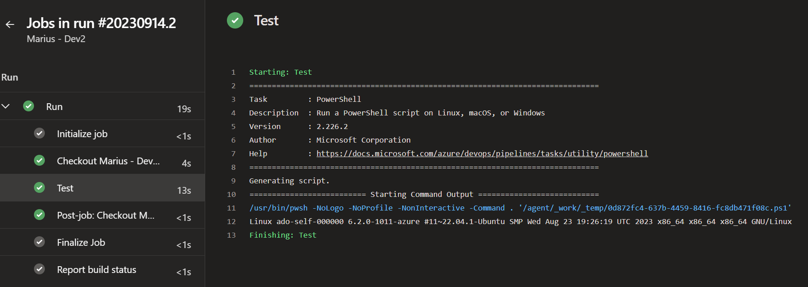

# Configuring Azure DevOps self hosted runners using VMSS

This documentation shows you how to configure an Azure Virtual Machine Scale Set (VMSS) with the latest Amesto Fortytwo Self Hosted Runner image, and connecting the VMSS to Azure DevOps. Using a VMSS in Azure DevOps gives you the ability to automatically increase and decrease the number of active runners dynamically based on pipeline demand. A VMSS will always create instances based on the latest image we hvae published, so you will never need to worry about updates.

## Step 1 - Configuring the Virtual Machine Scale Set

**Note:** If you do not want to handle the creation of the VMSS manually, you can use our [Azure Managed Application](./azuredevops-managedapp.md) instead.

Start by going to the Azure Portal and click **+Create a resource**. 


Search for **Virtual Machine Scale Set**, click on the result and click **Create**



### Basics

- **Project details**
    - **Subscription** - A subscription you have contributor access to
        - **Resource group** - A new or existing resource group
- **Scale set details**
    - **Virtual machine scale set name** - The name of the scale set itself. Cannot be changed after deployment, but everything is stateless, so you can simply deploy a new scale set if needed.
    - **Region** - The region where you want your runners to be located
    - **Availability zone** - Configure to None in order to allow for a cluster with few running instances
- **Orchestration**
    - **Orchestration mode** - Configure to **Uniform**, as we will be running only a single image and runner type
    - **Security type** - Standard is the only supported for our image currently
- **Instance details**
    - **Image** - Locate the Amesto Fortytwo **Self Hosted Runner for Azure DevOps** image and select whether you want a Ubuntu or Windows based runner:

    

    - **Run with Azure Spot discount** - Only select this if you know how to handle spot, and if your pipelines can tolerate evictions
    - **Size** - Choose the virtual machine size you want to run the runners as
- **Administrator account**
    - Configure an administrator account for you virtual machines


### Spot

Skip configuring **Spot** unless you chose to **Run with Azure spot discount**.

### Disks

Leave **Disks** as default and go to the next page.

### Networking

On the **Networking** page, you can choose between creating a new network or reuse an existing one. You can easily connect to a virtual network that is peered into a Azure Landing Zones solution and use private endpoints and stuff. Please be aware that the runners require internet connectivity in order to reach Azure DevOps.

- **Load balancing options** - Choose **None**, as Azure DevOps takes care of this

The default settings will work just fine in most cases:


### Scaling

For scaling, Azure DevOps will take care of everything. However, you should configure **Initial instance count** to **0**, as we need to configure the VMSS for Azure DevOps connectivity before creating our instances.


### Management, Health, Advanced and Tags

No need to configure any of this. Just click next and complete the deployment of VMSS.


### Final configuration

After successfully creating the VMSS instance, click **Go to resource**


Under **Upgrade policy**, switch from manual to **Automatic**.



## Step 2 - Configuring the Azure DevOps Agent Pool

Now the the VMSS is up and running, we are ready to configure the Azure DevOps side of things. 

On the organization level (not while in a project), go to **Organization settings**

Find **Agent pools** and click **Add pools**


Select **Azure virtual machine scale set**


Find you VMSS and name your pool:


Configure your preferred **Pool options**. We recommend having at least 1 agent on standby, though if cost is an issue, you can set it to 0 (you will have longer wait times for your first run due to provisioning the instance)


Click **Create**.

You should now be ready to use the VMSS as runners. After configuring the DevOps side of things, you should see the following extension added to your VMSS:


## Step 3 - Example of using the self hosted runners

The following is an example pipeline using the pool we just created:

```yaml
stages:
  - stage: run
    displayName: Run
    jobs:
      - job: run
        displayName: Run
        pool: SelfHostedRunnerUbuntu # Name of your VMSS pool
        steps:
          - task: PowerShell@2
            name: Test
            displayName: "Test"
            inputs:
              targetType: inline
              pwsh: true
              script: uname -a
```

After running the pipeline, you should see that an agent has come online:


And from the VMSS side of things, we can see that an instance has been created:


And of course, we can see that the pipeline is working just fine:



That's it, you now have an agent pool in Azure DevOps, that will automatically be updated whenever the Microsoft Hosted Runners are updated (through our image). Have fun!