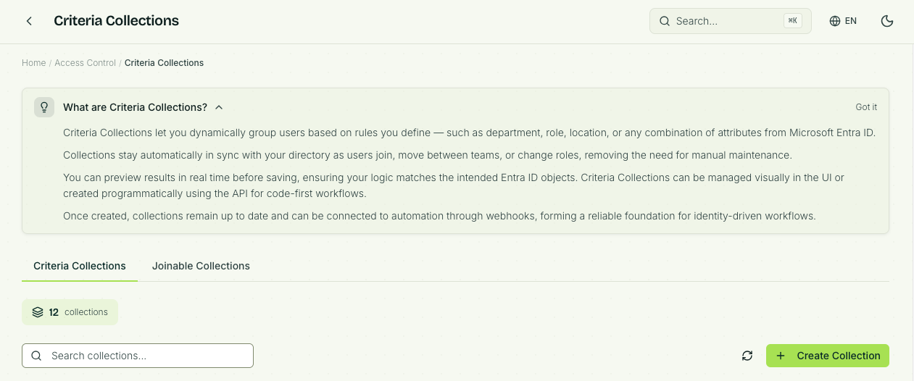
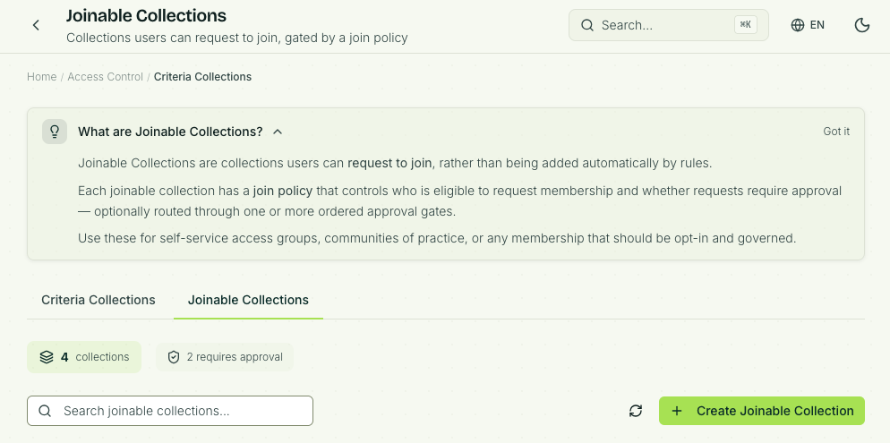

# Collections

## Introduction

Collections is a logical grouping of objects. Collection membership is evaluated using either one of two approaches, or a combination of both:

* Criteria
* Request to join (joinable)
* Criteria and request to join

**Criteria** uses filter conditions and will hold members based on data attributes available to the Identity Universe IAM Core.

**Request to join** is a manual flow and performed by the user or their manager. If the manager requests access for a direct report the "request on behalf of" flow is triggered.

There are two types of collections in the Identity Universe:

* [Criteria collections](#criteria-collections)
* [Joinable collections](#joinable-collections)

## Criteria collections

Criteria collections are configured using conditions and will hold members based on data attributes. As long as the criteria is valid the object will stay a member of the collection. When the matching criteria no longer is valid the object will automatically be removed from the collection.

A criteria could be `identityLastname equals Taylor` or `relationshipType equals Contractor`.

Criteria collection is an important building block for the Identity Universe state-driven model.

## Joinable collections

There are two types of joinable collections:

* Open to join
* Requires approval (most used)

To attain membership in a joinable collection the user must request access. Collections that the user is eligible to join is configured using scoping (filtering) settings.

If the collection is *open to join* the user is automatically added to the collection.

When a collection is configured with an approval gate the approval flow is triggered. An approver could be members of a collection, one or more identities or "manager". For "manager" the closest manager will be able to approve. This is usually the manager the user reports to, or the manager of the organisational unit the user is member of.

Both collection types *open to join* and *requires approval* require the user to be *in scope* in order to see them and request to join. To be *in scope* the user must be a member of a collection, for example a criteria collection which contains users with `relationshipType equals employee`. The criteria collection is then applied as a filter to enable anyone with a relationshipType (position in this case) **employee** to request access to the said collection.

## Working with collections

You can work with the [Identity Universe collections blade](https://universe.fortytwo.io/access/collections), the [PowerShell module - coming soon](./powershell-module.md) or [the API - also coming soon](./api.md) (if you prefer).