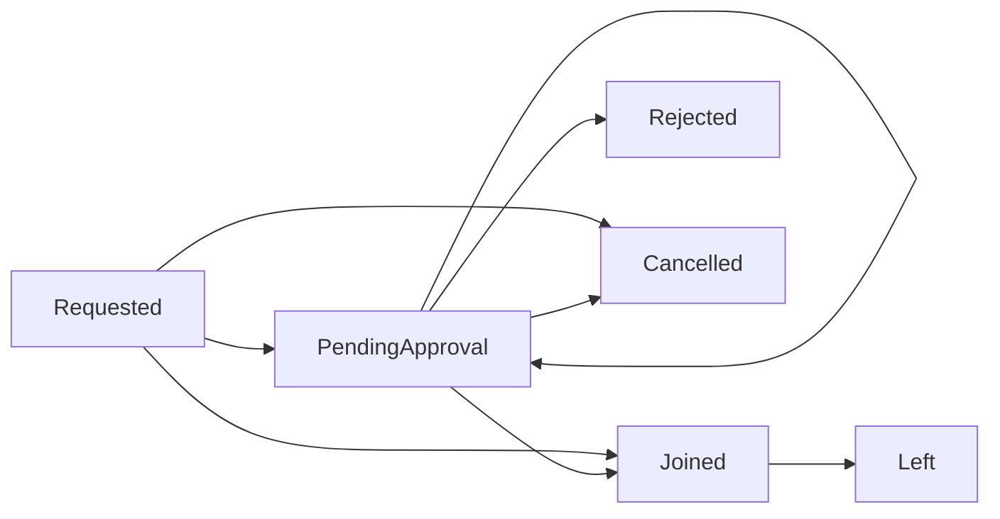

# Joinable collections reference

A [joinable collection](./index.md#joinable-collections) is one people ask to be in, rather than one they match into. This page documents the join policy that controls who may ask and who approves, and the lifecycle a request goes through.

## The join policy

Every joinable collection has a `joinPolicy`:

```json
{
  "approvalRequired": true,
  "approvalGates": [
    { "order": 1, "type": "Collection", "approvers": ["1ee874ac-6c2c-4990-8fd6-e80fbc0b4e33"] },
    { "order": 2, "type": "Manager", "approvers": [] }
  ],
  "joinableBy": {
    "collectionIds": ["4fd301f8-0409-4856-bc3d-7f0102231f7a"]
  }
}
```

| Property | Type | Description |
|-|-|-|
| `approvalRequired` | bool | Whether requests need approving. Required. |
| `approvalGates` | array | The approval steps, in order. At least one is required when `approvalRequired` is true. |
| `joinableBy` | object | Who is eligible to request. Omit for everyone. |

With `approvalRequired` set to `false` the collection is **open to join** — a request is granted immediately and the person becomes a member, and any gates are ignored.

## Who may request

`joinableBy` scopes the collection to people who are already members of other collections:

```json
"joinableBy": { "collectionIds": ["4fd301f8-0409-4856-bc3d-7f0102231f7a"] }
```

Being in **at least one** of the listed collections makes someone eligible. If `joinableBy` is omitted, or its `collectionIds` is empty, everyone is eligible.

This is what makes the pattern in the [introduction](./index.md#joinable-collections) work: a [criteria collection](./criteria.md) of everyone whose `relationshipType` is `Employee` becomes the scope, so only employees see the collection and can ask to join it.

## Approval gates

When approval is required, each gate is one step that must be passed. Gates run in ascending `order`, and each must be approved before the next begins.

| Property | Type | Description |
|-|-|-|
| `order` | int | Must be greater than zero, and unique within the policy. |
| `type` | string | `Identity`, `Collection` or `Manager`. |
| `approvers` | array | Who approves, interpreted according to `type`. |

| `type` | `approvers` holds | Who can approve |
|-|-|-|
| `Identity` | Identity ids | Any of the named people |
| `Collection` | Collection ids | Anyone who is a member of one of those collections |
| `Manager` | Nothing — leave it empty | The requester's own manager, resolved at approval time |

`Manager` gates find the manager through the relationship the request was made for, falling back to the manager of that relationship's org unit. Because the manager is resolved per request rather than configured, `approvers` is left empty. **A policy may contain at most one `Manager` gate.**

Two gates — first anyone in a named approver collection, then the requester's own manager — is the arrangement in the example at the top of this page.

### Validation

The policy is rejected with a clear message if:

- `approvalRequired` is true and there are no gates
- two gates share an `order`, or an `order` is not greater than zero
- there is more than one `Manager` gate
- a gate's `type` is not one of the three values
- an `Identity` or `Collection` gate has no approvers, or a `Collection` gate's approvers are not valid ids

## The request lifecycle



| Status | Meaning |
|-|-|
| `Requested` | Submitted. Where every request starts. |
| `PendingApproval` | Waiting at a gate. A request sits here once per gate. |
| `Approved` | Recorded in the history each time a gate passes. |
| `Rejected` | Turned down at a gate. |
| `Cancelled` | Withdrawn before a decision. |
| `Joined` | A member. |
| `Left` | Was a member and is no longer. |

An open-to-join collection takes a request straight from `Requested` to `Joined`. Otherwise the request enters `PendingApproval` at the first gate; approving a gate that is not the last returns it to `PendingApproval` at the next one, and approving the last makes the person a member.

Who may do what:

- **Approve or reject** — only someone who satisfies the gate the request is currently waiting at.
- **Leave** — only the member themselves, and only once `Joined`.
- **Cancel** — the requester, or the manager who submitted on their behalf, and only while the request is still `Requested` or `PendingApproval`.

Every request carries a `lifecycle`: an append-only list of what happened, each entry recording the status, who acted and when. It is the audit trail for how someone came to have access.

## Requesting on behalf of someone

A manager can submit a request for one of their direct reports. The request records the **subject** as the requester, not the manager who filed it, so it appears in the subject's own lists and follows the same gates as if they had asked themselves.

The manager relationship is checked at submission, through the report's relationship or the org unit's manager, and the request is refused if the caller is not actually their manager.

## Members

Membership on a joinable collection is per relationship, not just per person:

```json
"memberIds": [
  { "objectId": "d42a1f3f-4a1b-42e5-bb04-63536796ec70", "relationshipId": "8c1e..." }
]
```

Someone holding two positions can be a member for one of them and not the other, which matters when a collection grants something tied to a particular job rather than to the person.

!!! note "This differs from criteria collections"
    A [criteria collection](./criteria.md) returns `memberIds` as plain identifiers. Only joinable collections pair the object with a relationship.

Administrators can add and remove members directly, bypassing the request flow entirely — useful for seeding a new collection with people who already have the access it represents. In PowerShell that is `Import-JoinableCollectionMemberBatch`, which takes **IAM Core identity ids**, not Entra object ids.
