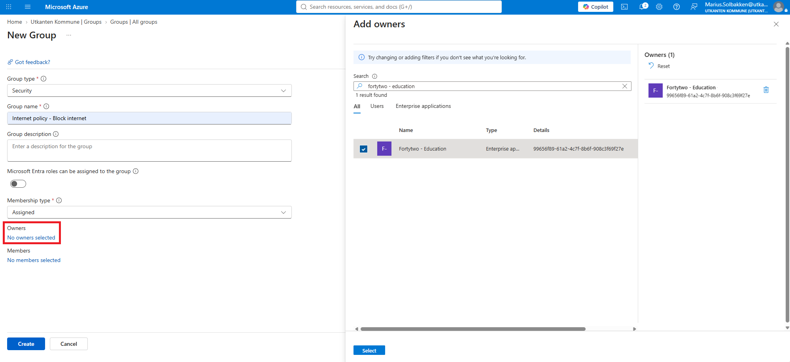
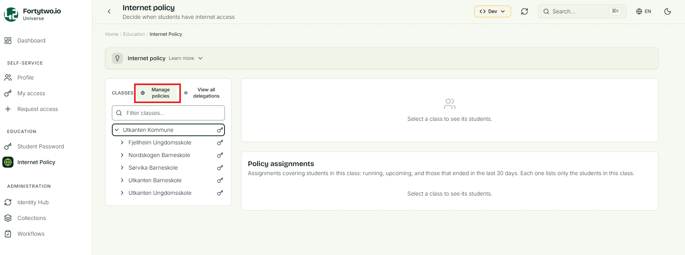
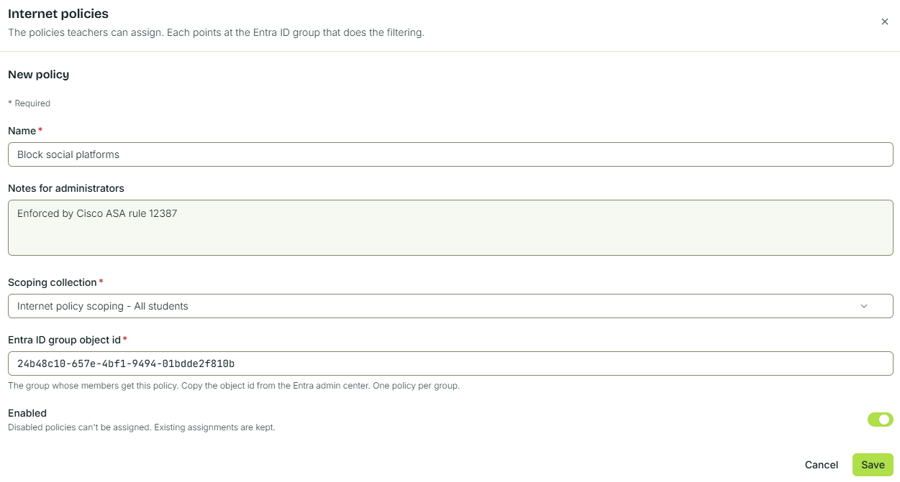

# Create policy definition

Creating a new policy definition requires you to complete the following steps, detailed in the sections below.

1. Create a target group in Entra ID
2. Create a scoping collection, to define which students can be targeted by a certain policy
3. Create the policy definition

## Step 1 - Create a group in Entra ID

In **Entra ID**, create **New group** with a name that makes sense to you.

Make sure to set the **Owner** to the **Fortytwo - Education** enterprise application. This grants us access to manage the group memberships.



## Step 2 - Create a scoping collection

A scoping collection is used to define which students can be targeted by a certain policy. This means that you can target certain policies to **All students at School X**, **All students** or **All students in 8th grade**.

Please check out the [collections documentation](../../collections/index.md) for details on defining collections.

The below definition is often used, for targeting all students by finding all identities that have the relationship subtype of _student_:

```JSON
{
  "objectType": "Identity",
  "name": "All students",
  "description": "All students",
  "condition": {
    "groupOperator": "AND",
    "conditions": [
      {
        "id": "relationshipSubType",
        "field": "relationshipSubType",
        "operator": "Equals",
        "value": "student"
      }
    ]
  },
  "metadata": { "tags": ["internet policy"] }
}
```

## Step 3 - Create policy definition

To create a new policy definition, make sure you are signed in as an [Education Administrator](../../getting-started/iam-admins/index.md) and go to the **Internet policy** feature in the [Universe portal](https://universe.fortytwo.io/education/internet-policy) and find **Manage policies**:



Give the policy a name, which is visible to end users, choose the scoping collection you created in step 2, and paste the ObjectID of the Entra ID group that the policy will add and remove students to/from.

