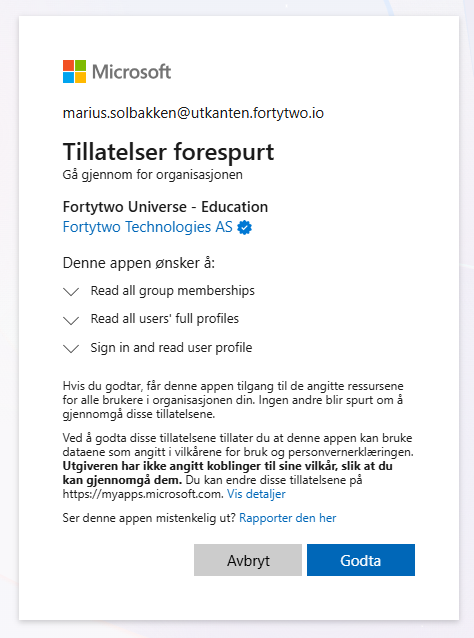

# Internet policy

The internet policy feature enables teacher and other delegated personell to assign internet policies to students, either as one-time assignments ("From December 1st to December 3rd") or recurring assignments ("Every monday and tuesday between 8 and 11")". Each policy is always connected to an Entra ID security group, where different network equipment or services like  [Global Secure Access](https://learn.microsoft.com/en-us/entra/global-secure-access/) are responsible for the network level enforcement.

## Enabling the feature

In order to enable the feature, the following is needed:

1. Admin consent to allow the service access to the tenant
2. Define a policy

### Admin consent

In order for the service to access your tenant, consent to the following application:

https://login.microsoftonline.com/common/adminconsent?client_id=a4cde9df-633f-42e9-882b-9f3bd3f23979

This will request access to read users and group members, but no write access. Instead, write access will be granted on a per policy group basis, to ensure we follow the principle of least privilege.

### Defining a new policy

Following [this guide](./define-policy.md) to define a new policy.