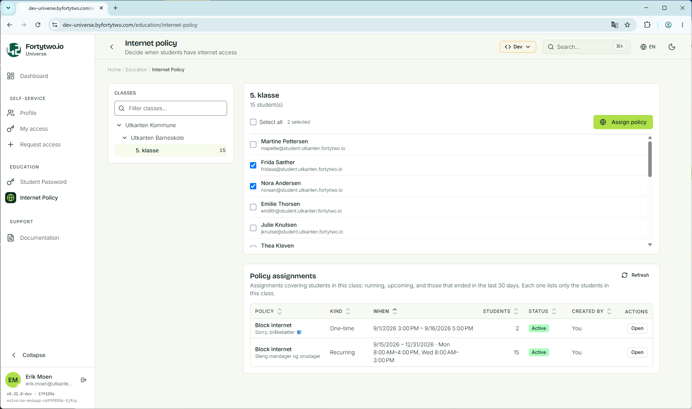
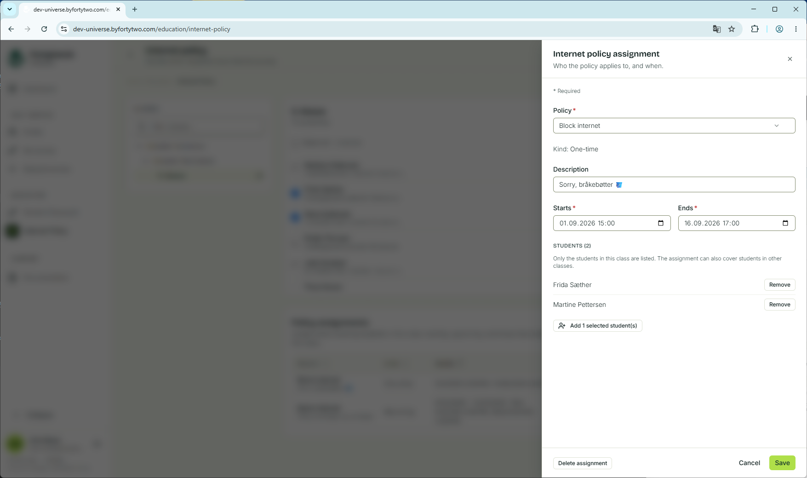
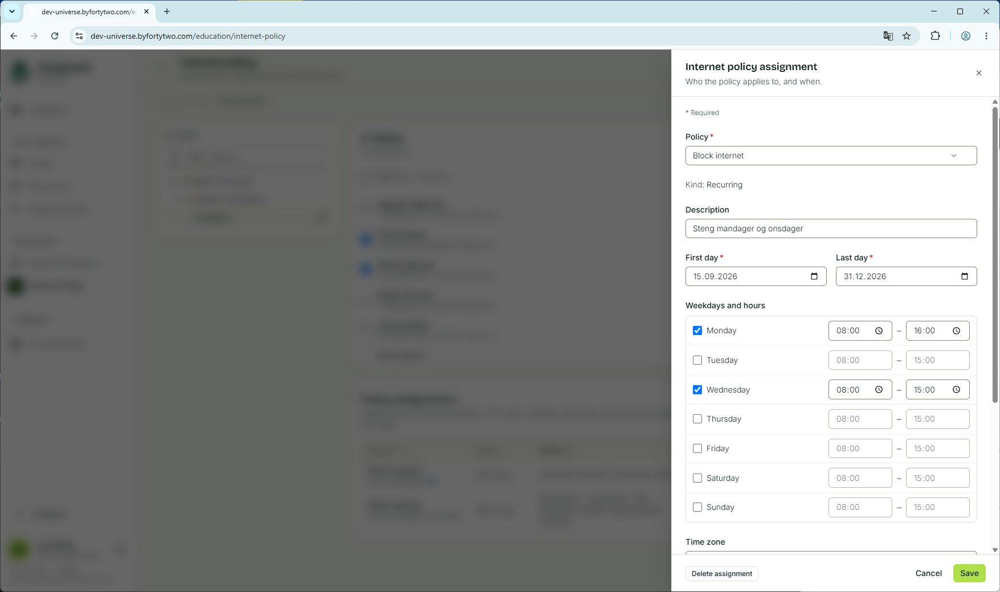

# Internet policy

The internet policy feature enables teachers and other delegated personell to assign internet policies to students, either as one-time assignments ("From December 1st to December 3rd") or recurring assignments ("Every monday and tuesday between 8 and 11")". Each policy is always connected to an Entra ID security group, where different network equipment or services like  [Global Secure Access](https://learn.microsoft.com/en-us/entra/global-secure-access/) are responsible for the network level enforcement.

## Screenshots

### Class overview

The class list is shown based on the signed in user's access, either through being a teacher or getting delegated access to any of the organizational units.

### One-time policy assignment

A one-time policy can be assigned to students, where the assignment has a start and end time. This is useful for both short one-off assignment, such as for exams, and more permanent assignments, like blocking social media for the school year.

A recurring policy assignment is useful when you have the need for things like blocking YouTube every monday between 8 AM and 3 PM.

## Enabling the feature

In order to enable the feature, the following is needed:

1. Admin consent to allow the service access to the tenant
2. Create a policy definition

### Admin consent

In order for the service to access your tenant, [consent to this application](https://login.microsoftonline.com/common/adminconsent?client_id=a4cde9df-633f-42e9-882b-9f3bd3f23979)

This will request access to read users and group members, but no write access. Instead, write access will be granted on a per policy group basis, to ensure we follow the principle of least privilege.

### Defining your first policy definition

Following [this guide](./create-policy-definition.md) to create a new policy definition.