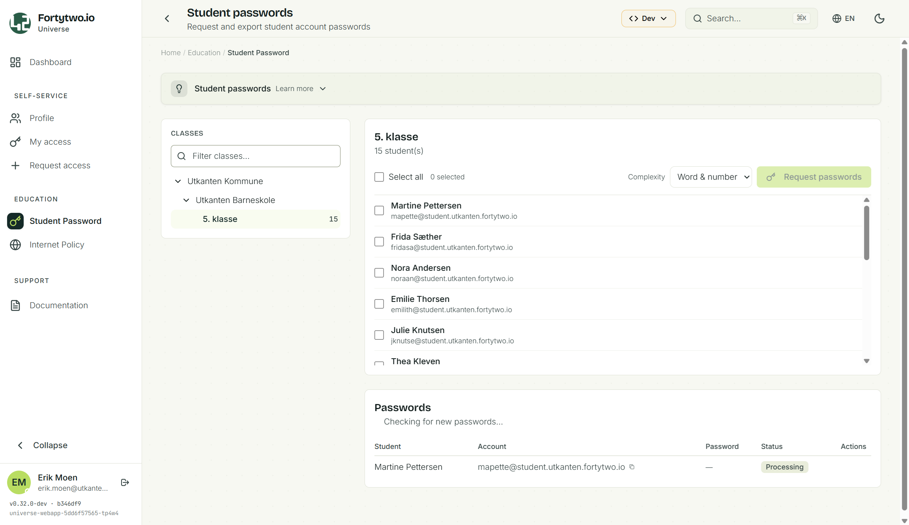
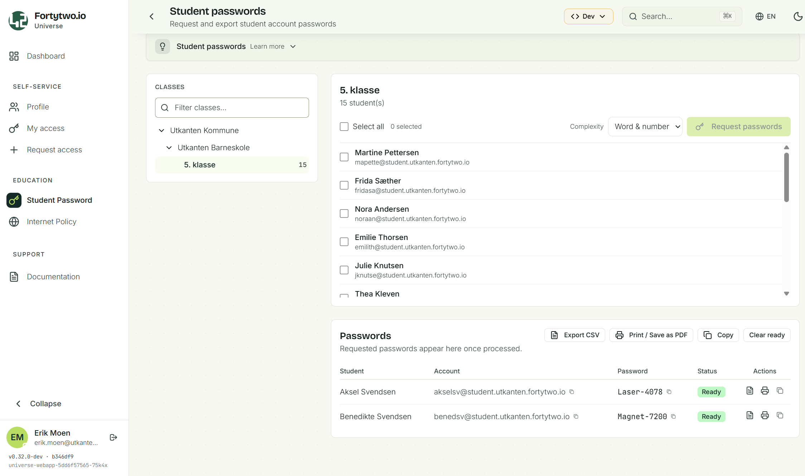

# Student password

The student password feature enables teachers and other delegated personell to set a new password for student accounts, both as a first time password and forgotten password scenario. The solution has [an agent module](https://www.powershellgallery.com/packages/Fortytwo.IAM.Education.StudentPasswordAgent) that is able to set passwords in AD, and also support cloud only users in Entra ID.

## Screenshots

## Installation

If you have cloud only students, you needs to follow the [cloud only installation guide](installation-cloud-only.md).

If you have students with AD accounts, you need to follow the [Active Directory agent installation guide](./installation-ad.md).

If you have a mix, you follow both. 🚀