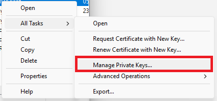
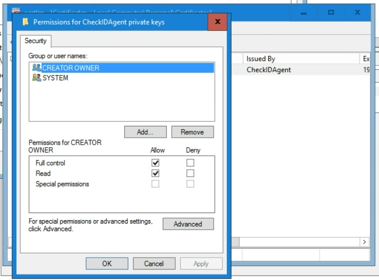
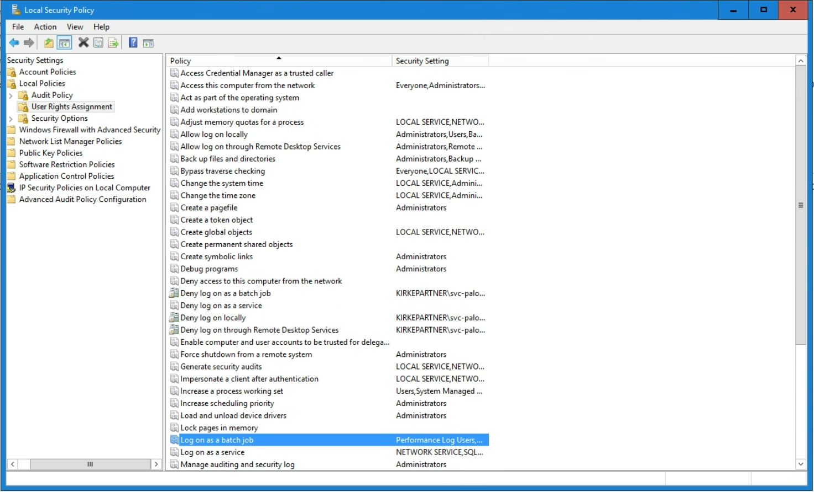
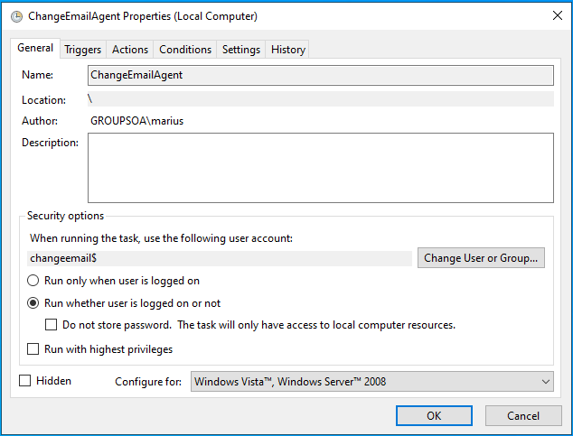
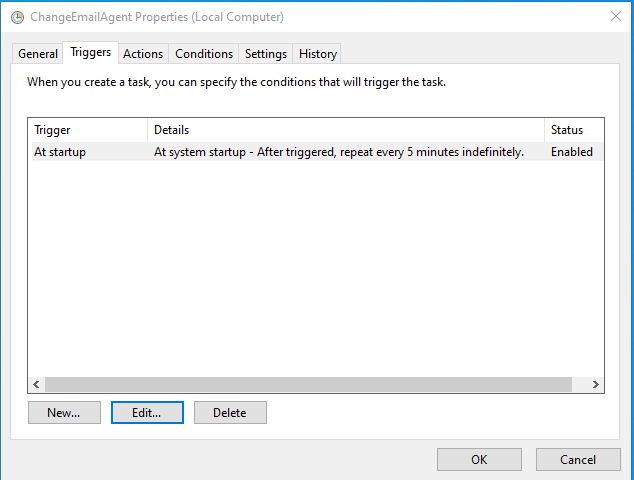
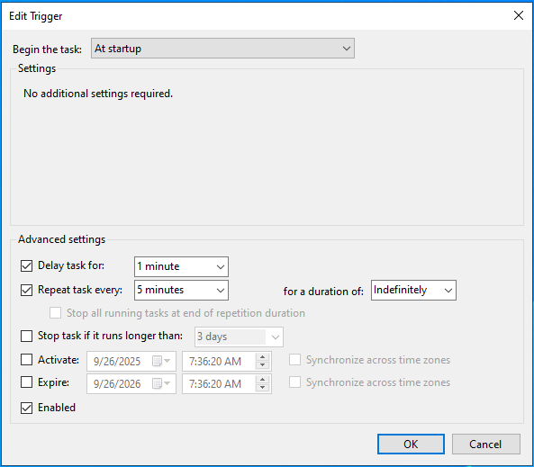
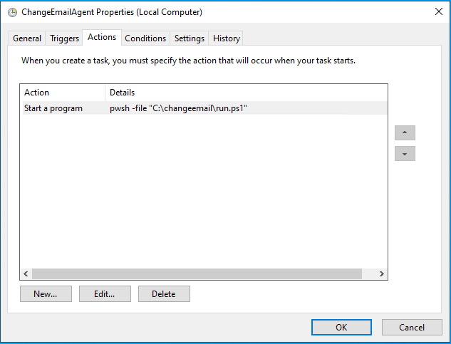
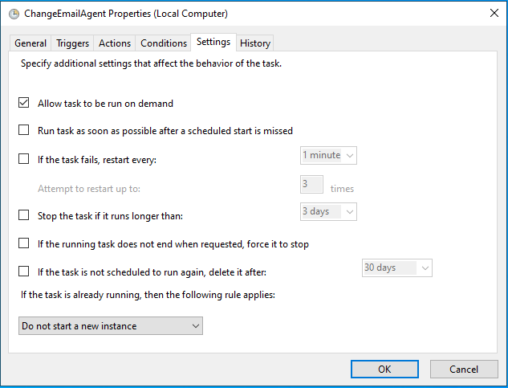

# Installation - Active Directory

If you have student accounts in Active Directory, this is the guide for you, as you will need to install the [agent module](https://www.powershellgallery.com/packages/Fortytwo.IAM.Education.StudentPasswordAgent) and run it.

## Server requirements

- The agent must be running on a domain joined windows server (You can run the agent on the Entra ID Connect or Entra ID Cloud sync server)
- [PowerShell 7.6](https://learn.microsoft.com/en-us/powershell/scripting/install/install-powershell-on-windows?view=powershell-7.6#msi)
- AD PowerShell installed (```Install-WindowsFeature -Name RSAT-AD-Tools -IncludeAllSubFeature```)

## Step 1 - Create app registration for agent

> **Note:** If the server is on Azure, you should not create an app registration, but instead use a managed service identity

1. If you have not already consented to Fortytwo Universe, go to: https://login.microsoftonline.com/common/adminconsent?client_id=2808f963-7bba-4e66-9eee-82d0b178f408

2. Run the following in PowerShell on the server **as administrator**

```PowerShell
$Certificate = New-SelfSignedCertificate -Subject "studentpasswordagent" -NotAfter (Get-Date).AddYears(100)
[System.Convert]::ToBase64String($Certificate.Export([System.Security.Cryptography.X509Certificates.X509ContentType]::Cert), "InsertLineBreaks") | Set-Content -Path "studentpasswordagent-$($env:COMPUTERNAME).cer"
Write-Host "" "Thumbprint:       $($Certificate.ThumbPrint)" "Certificate file: studentpasswordagent-$($env:COMPUTERNAME).cer" "" -Separator "`n"
```

2. In **Entra ID**, go to **App registrations** and click **New registration**

3. Give it a name and create **Register**

4. Note down the **Client ID** and **Tenant ID**:


5. Under **Certificates & secrets** upload the certificate file created above


6. Under **API permissions**, click **Add a permission**, select **APIs my organization uses** and locate **Fortytwo Universe**


7. Under **Application permissions** check **education.studentpasswordrequest.process.all** and click *Add permissions**.

8. Click **Grant admin consent**

## Step 2 - Create the run file for the agent

Create ```C:\studentpasswordagent\run.ps1``` with the following contents:

```PowerShell
# Can be enabled for debugging: 
# Start-Transcript -OutputDirectory "C:\education\studentpassword\transcripts" -Append

# Install / update module
Install-Module Fortytwo.IAM.Education.StudentPasswordAgent -Force -Scope CurrentUser

# Authenticate to the Universe API
Add-EntraIDClientCertificateAccessTokenProfile `
    -Scope "https://api.fortytwo.io/.default" `
    -Thumbprint "THUMBPRINT_FROM_STEP2" `
    -ClientId "CLIENT_ID_FROM_STEP2" `
    -TenantId "TENANT_ID_FROM_STEP2"

Connect-StudentPasswordAgent -AccessTokenProfile "default"

# Run the agent
Invoke-StudentPasswordAgent -PollingInterval 3 -Verbose # -IdentityAttribute "msDs-cloudExtensionAttribute19"
```

## Step 3 - Try to run the student password agent manually

1. Open a PowerShell and run ```cd c:/studentpasswordagent ; . ./run.ps1```

At this point, you can test out setting a student password and see that requests are received and processed by the agent.

## Step 4 - Run the student password agent as a scheduled task

### Create a gMSA for the scheduled task

Run the below PowerShell in order to create a gMSA:

```PowerShell
# SERVERNAME should be replaced with the actual name of the server, with a $ on the end (as an example: SERVER01$)
New-ADServiceAccount -Name "studentpasswordagent" -PrincipalsAllowedToRetrieveManagedPassword "SERVERNAME$" -DNSHostname "fortytwo.io"
```

### Delegate the gMSA permissions to three attributes in AD

For each OU where the agent should be able to set passwords, run the following (with the correct OU path and domain name):

```PowerShell
dsacls "OU=Users,DC=contoso,DC=com" /I:S /G "contoso.com\studentpasswordagent$:CA;Reset Password"
dsacls "OU=Users,DC=contoso,DC=com" /I:S /G "contoso.com\studentpasswordagent$:rpwp;pwdLastSet"
dsacls "OU=Sales,DC=contoso,DC=com" /I:S /G "contoso.com\studentpasswordagent$:rpwp;lockoutTime"
```

### Grant permission to certificate

Run **certlm.msc**, locate the **studentpasswordagent** certificate under **Personal** certificates, and **Manage private keys**



Locate the gMSA you created, and grant **Full control**



### Grant permission to Log on as a batch job



### Create scheduled task for the agent

3. Create a scheduled task running as the gMSA that:
    - Runs the action ```pwsh``` with the arguments ```-file c:\studentpasswordagent\run.ps1```
    - Trigger at startup
        - Delay 1 minute
        - Repeat every 5 minutes indefinitely (in order to restart the agent if it fails)
        - Do not stop task if it runs longer than anything
    - Do not run multiple instances
    - Never stop the task if running for a long time

Typical configuration:











Having trouble with adding the task as a gMSA? Create the task running as your own user acocunt first, and update the task using PowerShell:

```PowerShell
$task = Get-ScheduledTask -TaskName "studentpasswordagent"
 
$principal = New-ScheduledTaskPrincipal -UserId "contoso.com\studentpasswordagent$" -LogonType ServiceAccount
 
$task.Principal = $principal
Set-ScheduledTask -InputObject $task
```
