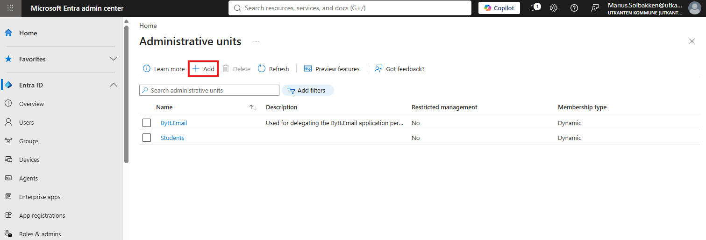
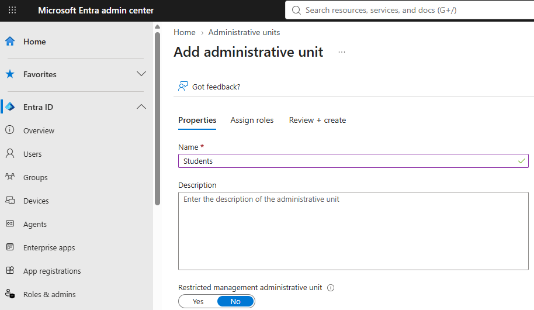
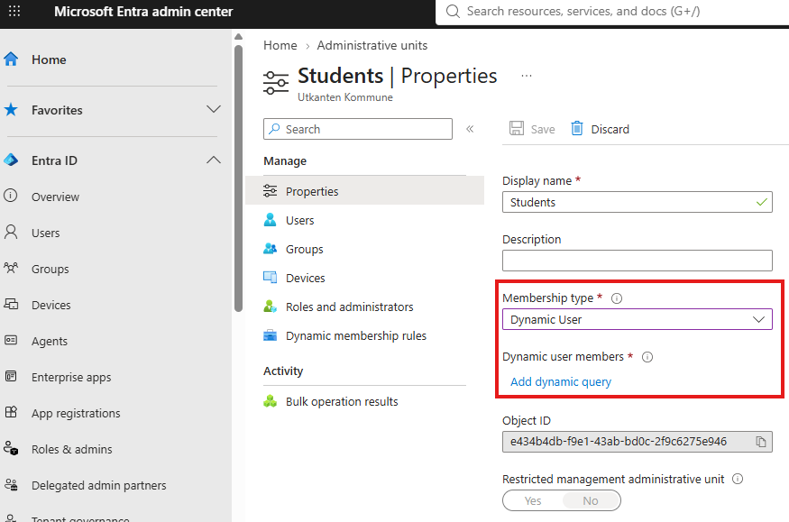
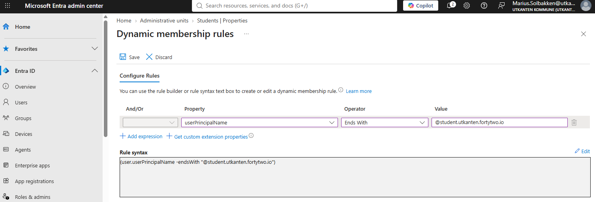
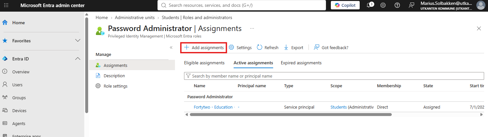

# Installation - Cloud only students

## Consenting access to Entra ID

If you have cloud only students, you need to [consent to this application](https://login.microsoftonline.com/common/adminconsent?client_id=a4cde9df-633f-42e9-882b-9f3bd3f23979) in order to grant _read_ access. Next, in order to follow the principle of least privilege, we need to create an administrative init (AU) with all student accounts and grant the consented application the **Password administrator role** on the AU only, in order for the service to be able to set passwords.

## Create administrative unit

In the [Entra portal](https://entra.microsoft.com/#view/Microsoft_AAD_IAM/AdminUnitManagementBlade), search for **Administrative unit** and click **+ Add**:

Give the AU a name, and click through all creation steps without assigning roles (You cannot grant a service principal access during this phase, for some reason):

Now, click on the AU you just created and update the membership type to **Dynamic user**:

Define a criteria that matches your students:

Last, under **Roles and administrators**, locate **Password administrator** and click **+Add assignment**:

Grant the **Fortytwo - Education** enterprise application permanent active access.