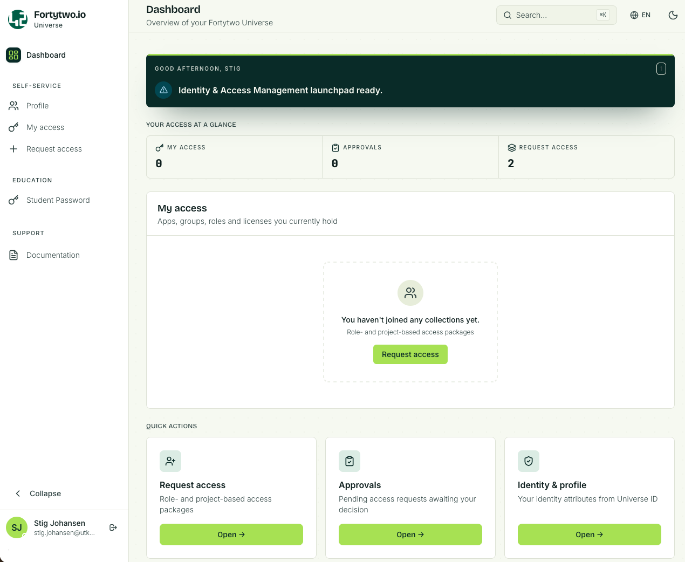
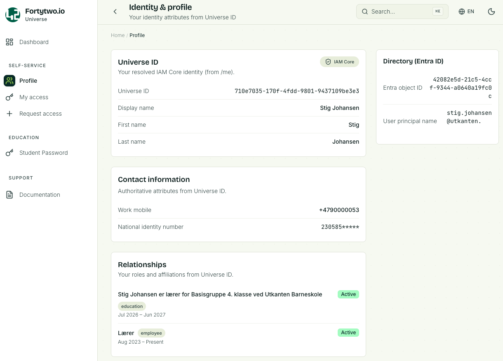
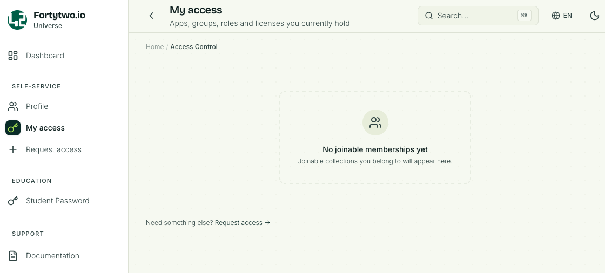
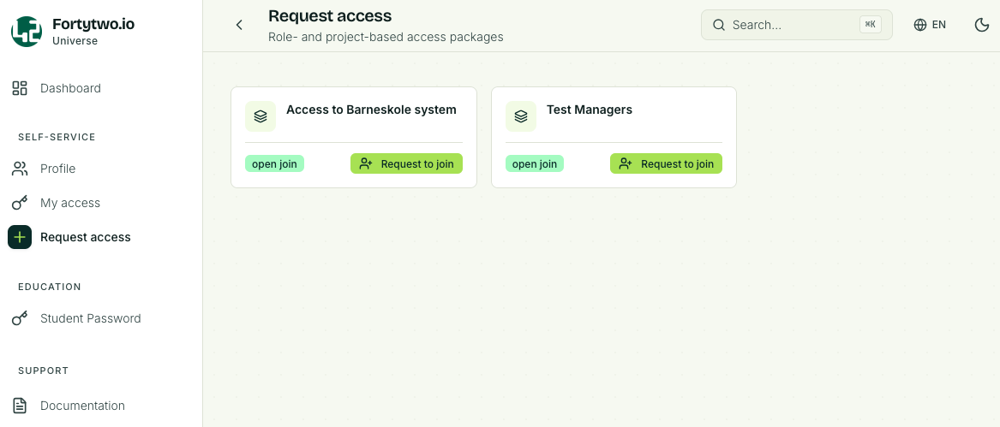
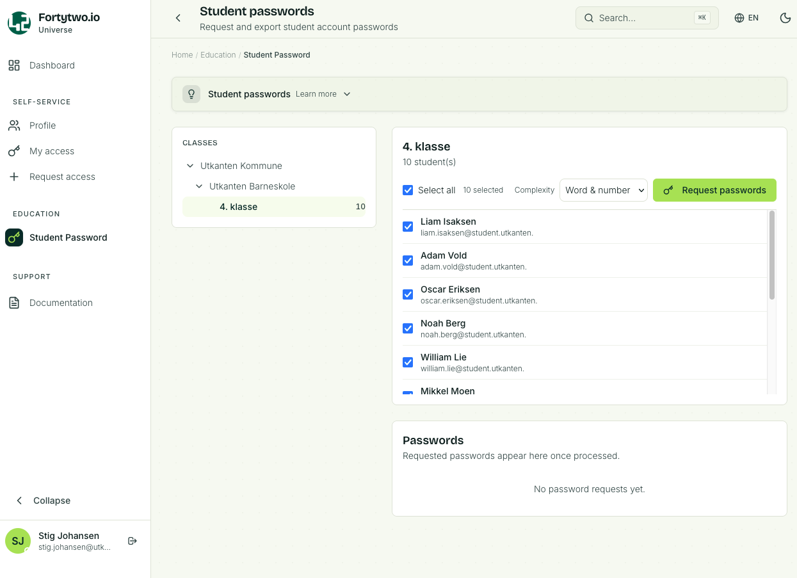
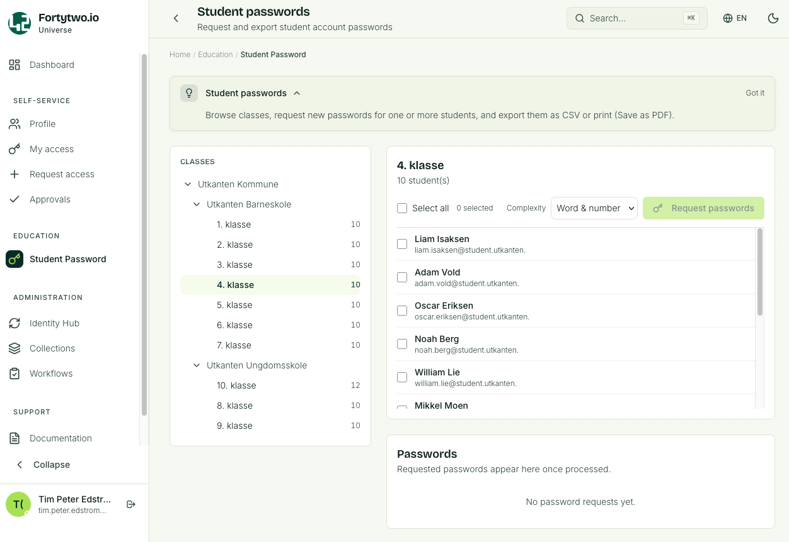
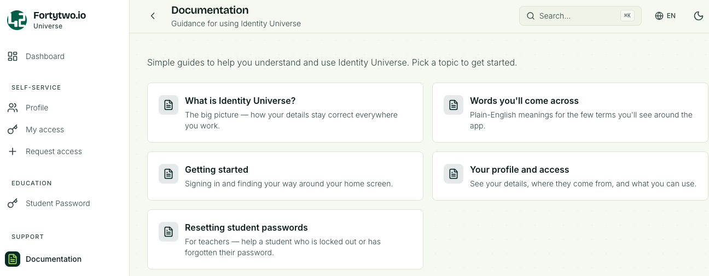

# Getting started

## Fortytwo Universe URL

Go here to access Fortytwo Universe: [https://universe.fortytwo.io](https://universe.fortytwo.io)

### Admin consent - user consent

We recommend using "admin consent" for Identity Universe. This can be achieved by a Global Admin to use the following link and accept the consent on behalf of the organisation: [Admin consent Fortytwo Universe]([2808f963-7bba-4e66-9eee-82d0b178f408](https://login.microsoftonline.com/common/adminconsent?client_id=2808f963-7bba-4e66-9eee-82d0b178f408))
Admin consent may already be provided if the [IAM Core get started](../iam-core/get-started.md) guide has been carried out.

If admin consent is **not** provided user consent will be requested for each user signing in for the first time.

<!--  -->

### Dashboard

When you sign in you will see the Dashboard

### Profile

The **Profile** page shows information about your user.

### My access

**My access** will list collections you are a member of.

### Request access

The **Request access** page will list all collections you can request to join.

### Student password

The **Student password** page will list the class, one or several, that you are responsible for.

If you are a teacher and you have a class of students the class and students will be listed. You will be able reset the password for a single student, or multiple.

The same goes for support personnel, usually local IT support, that have been delegated permissions to reset password password for a selection of students.

If you are an administrator you will be able to see **all** registered schools and classes, but you will not be able to reset password.

### Documentation

The **Documentation page** will contain be the place to go for user guides and explanations on how to navigate the Fortytwo Universe. This section will keep growing as features are added.

### Identity Universe IAM administrator

For Identity Universe IAM administrators we refer to the [IAM admins section](./iam-admins/iam-admins.md).