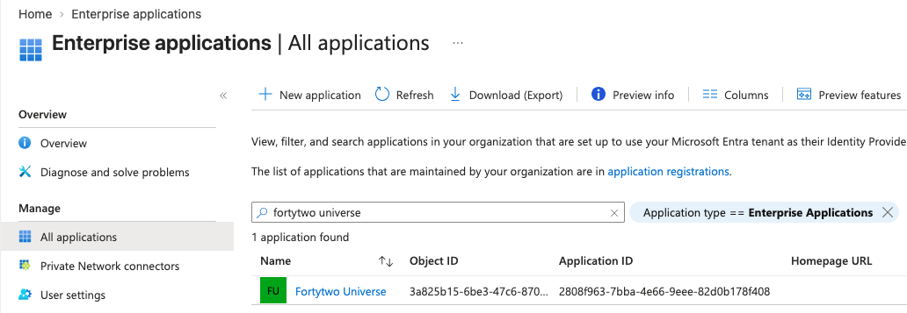
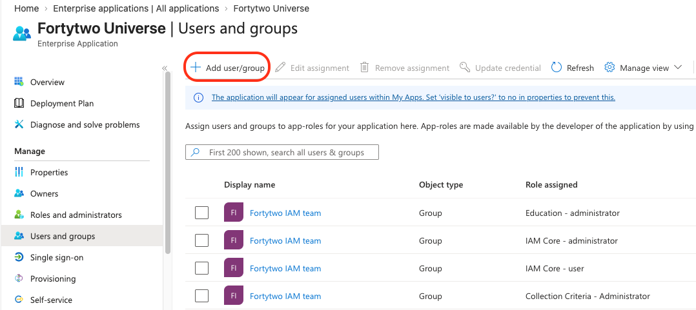
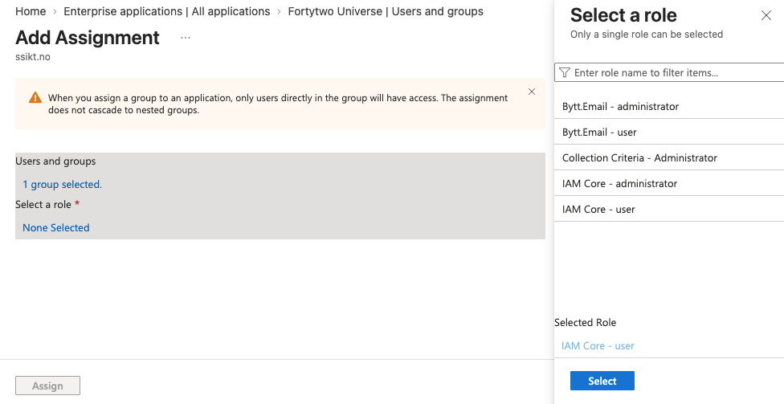
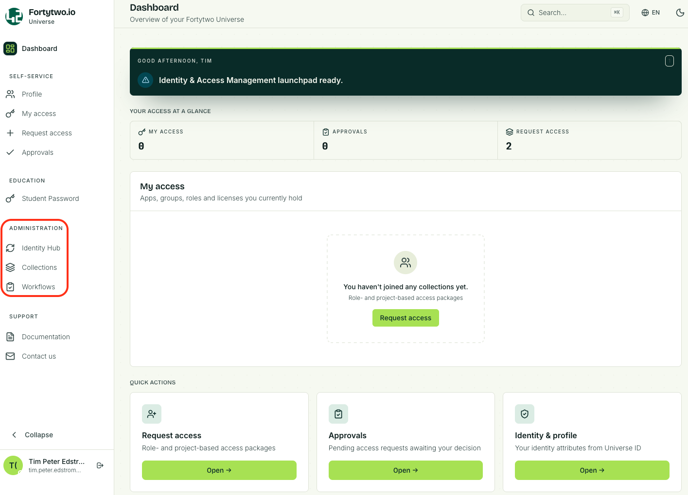

# Fortytwo Universe IAM Administrator

## User assignments

To assign IAM Administrator access a user or group must be assigned both the **IAM Core - user** and **IAM Core - administrator** roles in the **Fortytwo Universe** enterprise application.
To work with Collections the role **Collection Criteria - Administrator** must also be assigned.

We recommend using Entra security groups for assigning these roles to make access management easier.

1. Find the **Fortytwo Universe** enterprise application

    

1. In **User and groups** choose **Add user/group**

    

1. Click **User and groups** and select a group and choose **Select**. Then click **Select a role** and **Select**. To add the permission click **Assign**. To assign multiple roles repeat the process for the same group and add additional permission.
   
    

## Administration

When assigned the IAM Core Administrator role the **Administration blade** becomes accessible.

The Administration blade enables insight into the core of Identity Universe.

* Identity Hub holds the IAM core data, connector data and sync rules
* Collections is where criteria collections and joinable collections are maintained
* Workflows is where automatic flows can be configured. Workflows work with collections, based on members entering or leaving a collection, and can trigger webhooks.