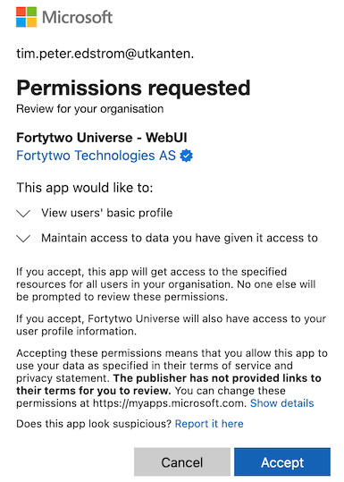
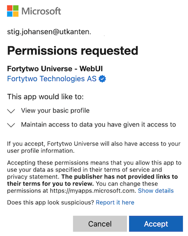

# Getting started

## Fortytwo Identity Universe

Go here to access Fortytwo Identity Universe: [https://universe.fortytwo.io](https://universe.fortytwo.io)

### Admin consent - user consent

We recommend performing "admin consent" to enable all Entra ID users to access the Identity Universe. This can be achieved by a Global Admin by following and accepting the Microsoft admin consent flow for Identity Universe on behalf of the organisation: [https://login.microsoftonline.com/common/adminconsent?client_id=d5151be7-b1d6-411d-88f1-b1da1350211f](https://login.microsoftonline.com/common/adminconsent?client_id=d5151be7-b1d6-411d-88f1-b1da1350211f)

This is what admin consent looks like:

If admin consent is **not** in place each person must grant (user) consent when signing in for the first time.

This is what user consent looks like:

### Dashboard

When you sign in you will see the Dashboard.

### Profile

The **Profile** page shows information about your user.

### My access

**My access** will list collections you are a member of. Here you also find a link to **Request access**.

### Request access

The **Request access** page will list all collections you can request to join.

### Student password

The **Student password** page will list the class, one or several, that you are responsible for.

If you are a teacher and you have a class of students the class and students will be listed. You will be able reset the password for a single student, or multiple.

The same applies for support personnel, usually local IT support, that have been delegated reset password permissions for a selection of students.

If you are an administrator you will be able to see **all** registered schools and classes, but you will not be able to reset passwords (trying to do so will display an error).

### Documentation

The **Documentation page** will contain be the place to go for user guides and explanations on how to navigate the Identity Universe. This section will keep growing as features are added.

### Identity Universe IAM administrator

For Identity Universe IAM administrators we refer to the [IAM admins section](./iam-admins/index.md#administration).