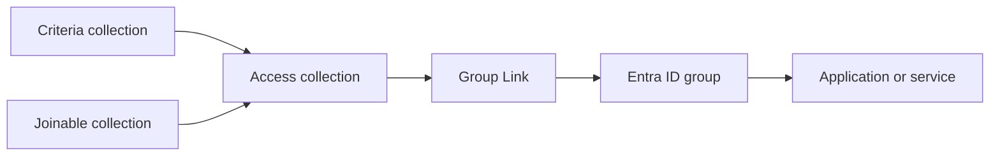

# Group Link

Group Link connects an Identity Universe collection to a Microsoft Entra ID group, and keeps the group's membership aligned with the collection.

The collection decides who should be a member. Group Link makes the Entra ID group say the same thing, so applications and services that already read Entra ID groups — for access control, licensing, or role assignment — get their answer from the collection without knowing anything about Identity Universe.

This page describes how a link behaves. For how to compose the collections behind it, see [Group Link design guidance](../collections/group-link.md). For the endpoints, see [the API](./api.md).

## The link

A link is one collection and one Entra ID group:

| | |
|-|-|
| `collectionId` | The source collection. Its members are the desired membership. |
| `entraGroupId` | The target group, given as its Entra ID object id. |
| `state` | `Enabled` or `Disabled`. A disabled link is left alone — no sweep, no reconciliation. |
| `lastSyncedAt` / `lastSyncOutcome` | When the group was last aligned, and whether it worked. |

An Entra ID group can be the target of **one** link. A second link to the same group is refused with `409 Conflict`, because two collections claiming the same group would take turns undoing each other.

A collection can feed several groups.

## When a link synchronizes

Three things produce a full [sync job](./api.md#sync-jobs) — a comparison of the whole collection against the whole group:

| Trigger | Job type |
|-|-|
| The link is created | `LinkCreated` — queued automatically, so a new link does not sit idle until something else happens |
| Someone asks for one | `ManualSync` |
| The periodic sweep | `ScheduledSweep` — every enabled link, hourly |

Each of those can be read back afterwards: what it added, what it removed, what it skipped, and why it failed if it did.

Alongside them, **a person joining or leaving the collection is written to the group straight away**, as a single membership change rather than a full comparison. That is what makes a link feel immediate; it produces no sync job, because there is nothing to compare. The hourly sweep is what catches everything the single writes could not — a failed write, a change made while the link was disabled, or a direct edit to the group in Entra ID.

Do not design a process around an exact propagation time. Validate the three layers separately — membership in the collection, membership in the group, and effective access in the target application — because a delay in any one of them looks the same from the far end.

## Membership changes made directly in Entra ID

The collection is authoritative. A member added directly to the linked group, without being in the collection, is removed again at the next alignment; a member removed directly is added back.

This is the point of the link rather than a limitation of it, but it means direct group edits are not a way to grant or revoke access. Make the change in the collection model instead — see [exceptions and migration membership](../collections/group-link.md#reconciliation-of-direct-changes).

## Members without an Entra ID account

A collection can hold people who have no Entra ID account to place in the group — someone not yet provisioned, or an identity that never gets one.

They are reported, not refused: the sync counts them as `skipped` and places everyone else. **While that count is above zero, no member is removed.** Somebody who could not be resolved may already be in the group, where nothing distinguishes them from a member who has left, and the safe reading of an ambiguous member is to leave them alone.

So a link that reports skips will add but never remove. If removals matter, resolve why those members have no account.

## Groups that cannot be linked

The group is checked when the link is created, and a group that cannot be written is refused there rather than failing silently later:

| Refused | Why |
|-|-|
| Dynamic membership groups | Membership comes from a rule. Entra ID refuses every membership write against them. |
| Distribution lists | Mail-enabled without being security-enabled. The membership belongs to Exchange. |
| Groups Identity Universe cannot write | The group does not exist, or the service has no write access to it. |
| Groups already linked | One link per group. |

Groups synchronized from on-premises Active Directory are written in Active Directory, not in Entra ID, so they are not a suitable target either.

Group Link manages **membership only**. Owners, name, description, licences, role assignments, expiration, access reviews and lifecycle policies are not touched and need their own owner.

## Before linking an existing group

An existing group usually has members who got there some other way. Before enabling a link against it, decide whether that membership should be replaced, represented in the collection model, or preserved outside the link — and retire any other automation that writes the same group.

[Preview](./api.md#preview) answers this without changing anything: it returns exactly who would be added and who would be removed. Read the removals first. On a production group, that list is the risk.

The full checklist is in the [design guidance](../collections/group-link.md#validation-before-enabling-group-link).

## Working with Group Link

Group Link is managed through [the API](./api.md). There is no PowerShell module for it.
