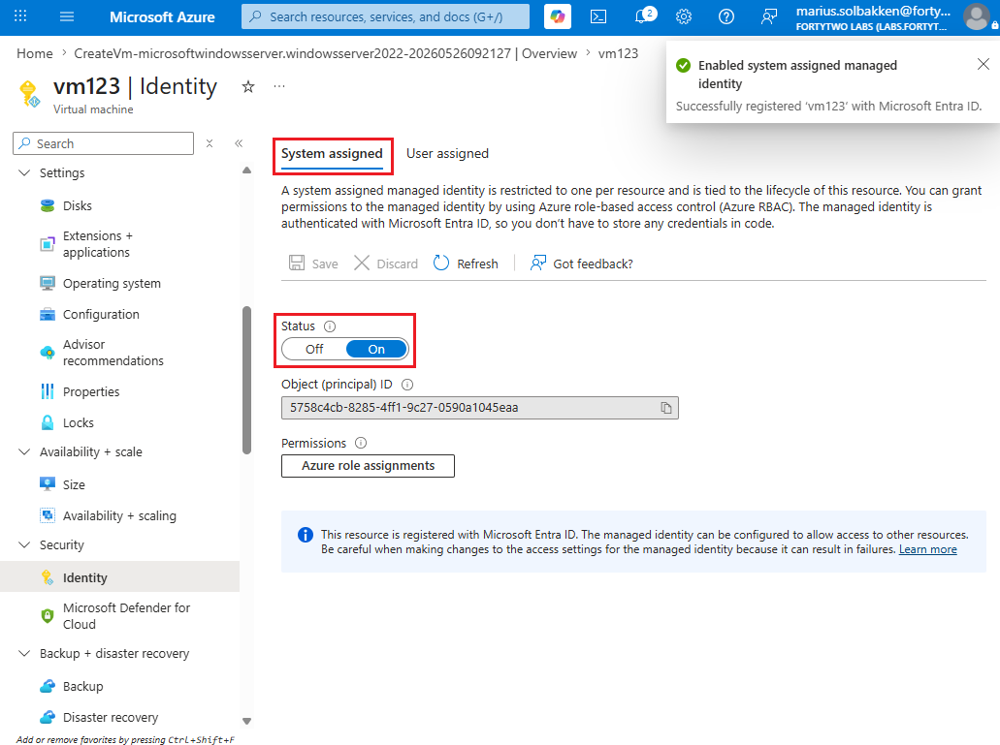
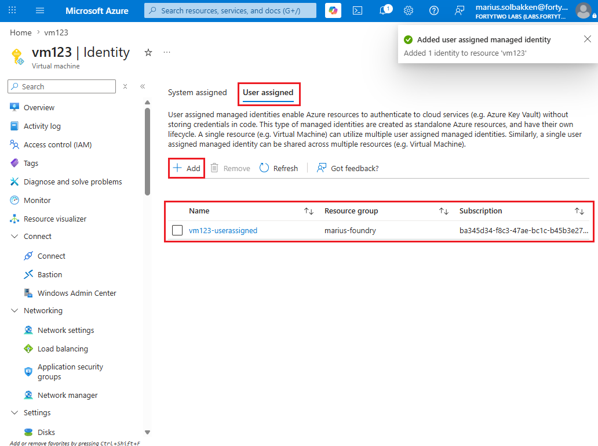
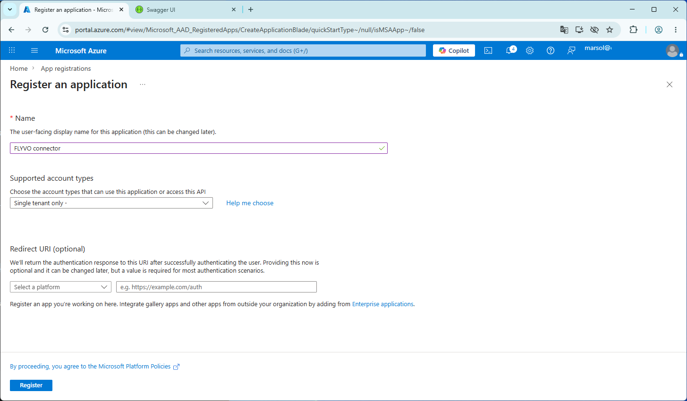
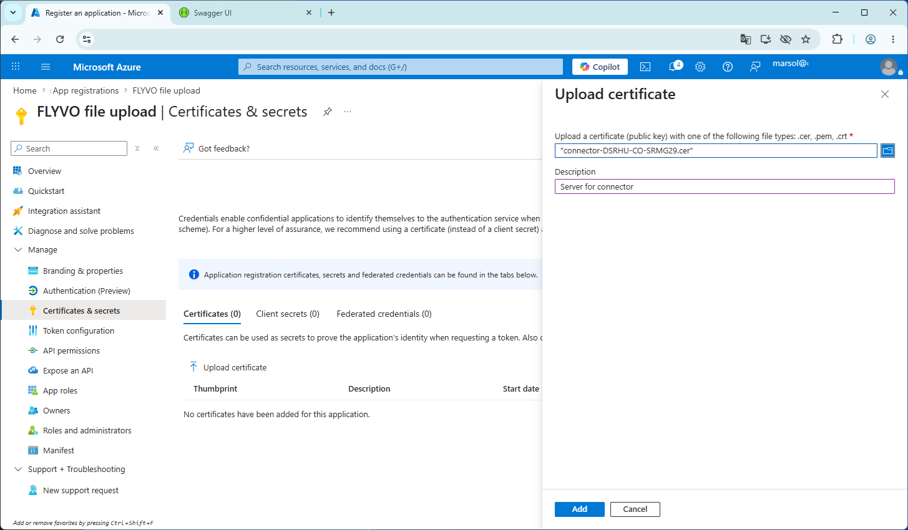

# Authenticating PowerShell

This page describes different ways of authenticating PowerShell to the Fortytwo Universe, for different automations, such as [uploading file data](./connectors/fileupload.md), talking to the [connector API](./connector-api.md), etc.

All scripts use the [EntraIDAccessToken PowerShell module](https://www.powershellgallery.com/packages/EntraIDAccessToken), which means that the only thing required to connect is to complete one of the available ```Add-EntraID*AccessTokenProfile``` cmdlets. This is documented [here](https://github.com/fortytwoservices/powershell-module-entraidaccesstoken), but below are the most common scenarios covered.

## Running in an Azure VM

!!! info "Server must be in a subscription in the same tenant as you want to manage Fortytwo Universe for. If you need cross tenant authentication, use the certificate based approach just like alocal server."

### System assigned



```PowerShell
Add-EntraIDAzureVMMSIAccessTokenProfile -Scope "https://api.fortytwo.io/.scope" -Name Connector
```

### User assigned



```PowerShell
Add-EntraIDAzureVMMSIAccessTokenProfile -Scope "https://api.fortytwo.io/.scope" -Name Connector -UserAssignedIdentityClientId "00000000-0000-0000-0000-000000000000"
```

## Running on a local server

### Azure Arc

```PowerShell
Add-EntraIDAzureArcManagedMSITokenProfile -Resource "https://api.fortytwo.io" -TenantId "00000000-0000-0000-0000-000000000000" -ClientId "00000000-0000-0000-0000-000000000000"
```

### Certificate based authentication

In order to use certificate based authentication, the following steps must be completed:

- On the server you want to run your automation on, run PowerShell as an Administrator and create a new self signed certificate using the PowerShell cmdlet ```New-SelfSignedCertificate```:

```PowerShell
$Certificate = New-SelfSignedCertificate -Subject "connector" -NotAfter (Get-Date).AddYears(100)
[System.Convert]::ToBase64String($Certificate.Export([System.Security.Cryptography.X509Certificates.X509ContentType]::Cert), "InsertLineBreaks") | Set-Content -Path "connector-$($env:COMPUTERNAME).cer"
Write-Host "" "Thumbprint:       $($Certificate.ThumbPrint)" "Certificate file: connector-$($env:COMPUTERNAME).cer" "" -Separator "`n"
```

- Note down the thumbprint and keep the certificate file created available for the next steps
- Go to the Entra ID portal as an **Global Admin**, **Application admin**, **Cloud application admin**
- Create a new **App registration** with a name that suits your naming convention:



- Note down the **Client ID** and **Tenant ID** on the first page you get to after creating the app registration
- Go to **Certificates & secrets**, select **Certificates** and click **Upload certificate**
- Upload the exported .CER file from the PowerShell above



You have now configured authentication, and can authenticate to Fortytwo Universe as follows:

```PowerShell
Add-EntraIDClientCertificateAccessTokenProfile -TenantId "TENANTID" -ClientId "CLIENTID" -Thumbprint "THUMBPRINT" -Scope "https://api.fortytwo.io/.default"
```