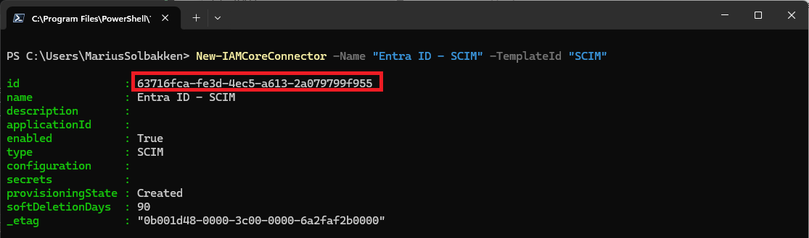
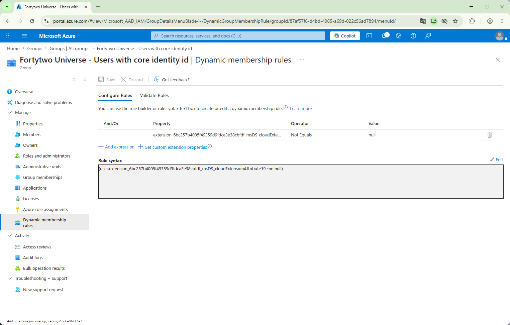
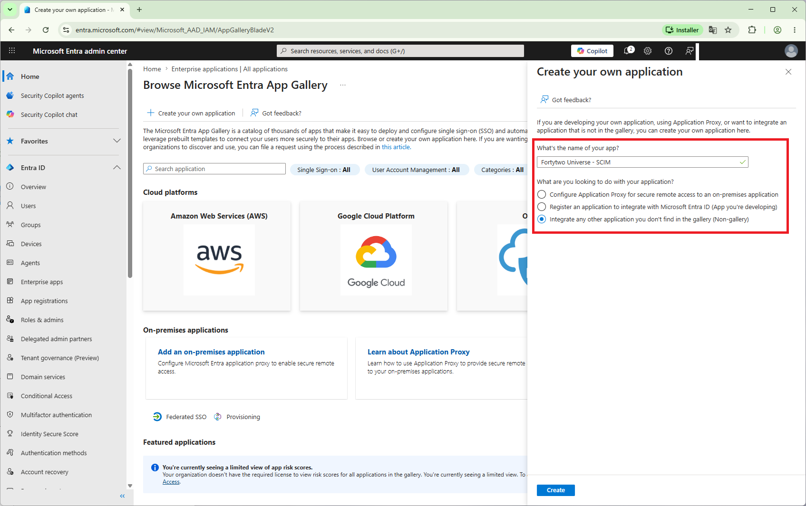
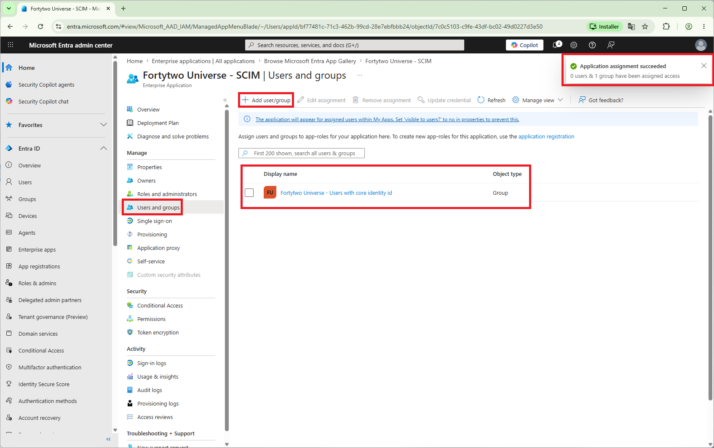
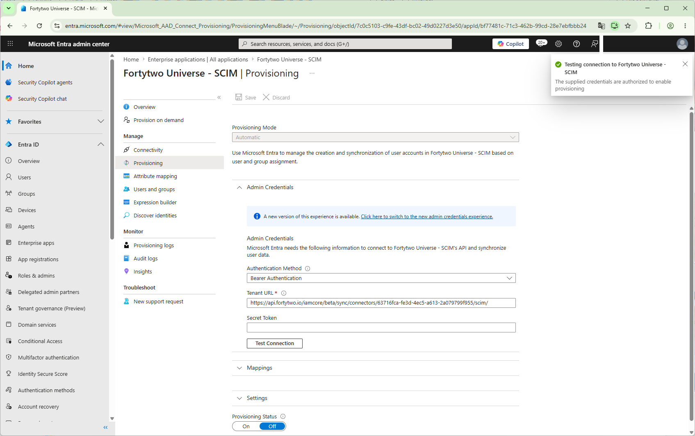
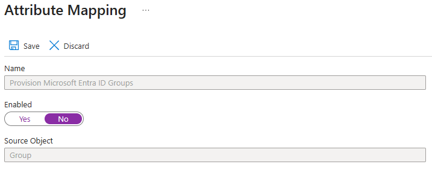
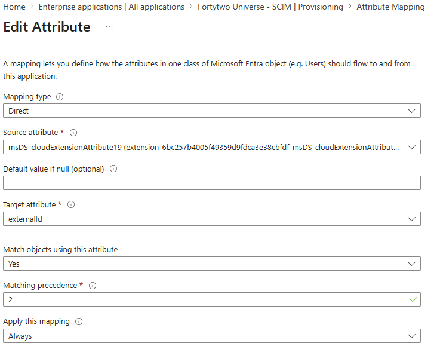
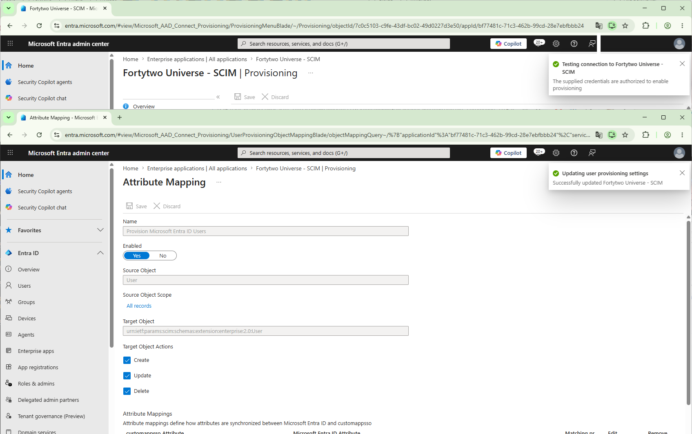
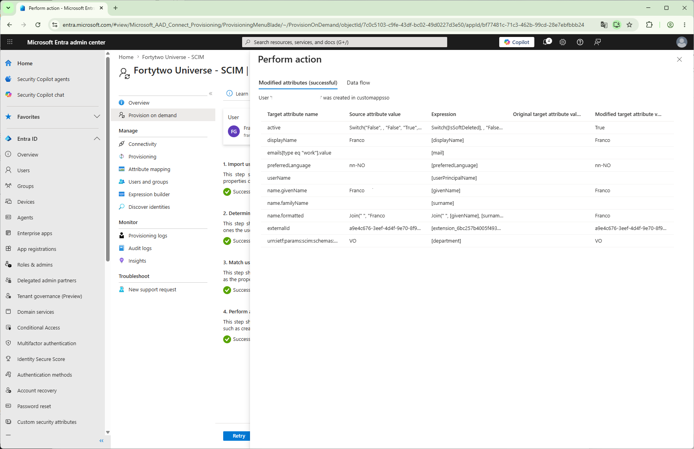
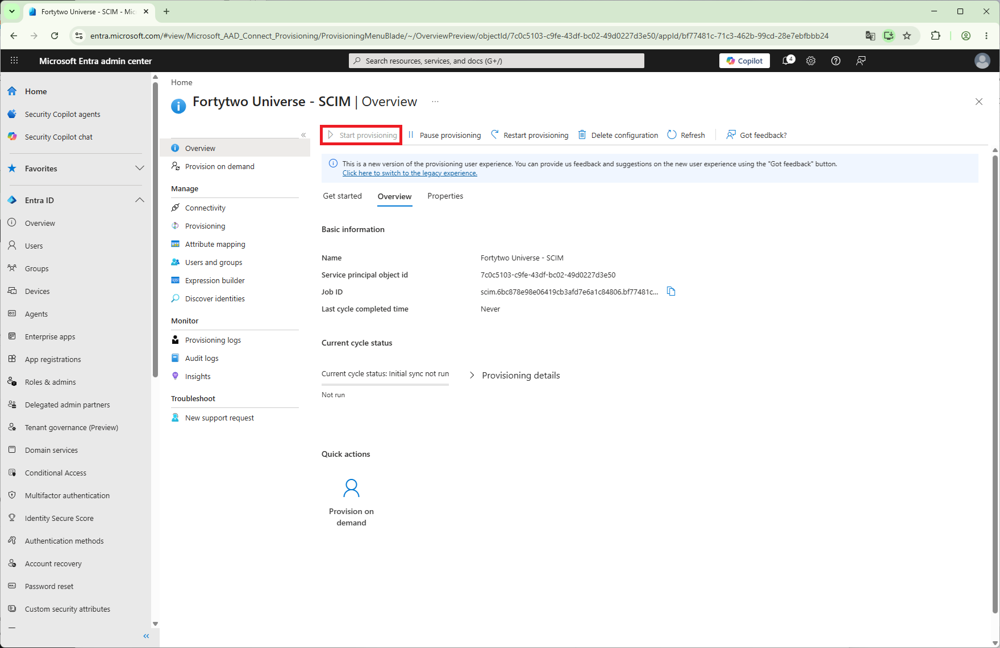

# Entra ID SCIM

In order for users to be able to talk to the Fortytwo Universe, we need to identify them. This is done by matching the ```oid``` claim in the Entra ID access token, to a [CoreIdentity's](../objecttypes/coreidentity.md) attribute ```entraObjectId```. In order to populate this attribute, the most common solution is to configure  [Entra ID outbound SCIM provisioning](http://learn.microsoft.com/en-us/entra/identity/app-provisioning/use-scim-to-provision-users-and-groups), which takes care of populating a connector space with all relevant data from Entra ID.

## Pre-reqs:

- An attribute with the [CoreIdentity's](../objecttypes/coreidentity.md) ```id``` attribute set, either through syncing from AD or directly in Entra ID (when doing cloud only provisioning). When provisioning in AD, we recommend using ```msDs-cloudExtensionAttribute19``` as this attribute.

## Steps

!!! note "If you need the onPremisesSamAccountName attribute, you will need to use the [Entra ID Inbound connector](entraidinbound.md)

### Create connector in IAM Core

!!! note "No user interface available yet"

!!! note "Please follow the [Authenticating PowerShell](../authentication-powershell.md) documentation in order to have a working PowerShell connection"

Create a new connector using the below cmdlet:

```PowerShell
New-IAMCoreConnector -Name "Entra ID - SCIM" -TemplateId "SCIM"
```

Copy the ```id```, which will be used later:



### Scoping group

In order to scope the outbound SCIM provisioning to only the users that have a [CoreIdentity](../objecttypes/coreidentity.md) ```id``` set, we create a criteria group in Entra ID with the following criteria, where the value ```6bc257b4005f49359d9fdca3e38cbfdf``` comes from an extension app created by Entra ID Connect Sync for provisioning additional attributes from AD. See [this documentation](../recommended-hybrid-configuration.md) for our recommended hybrid configuration and how to determine the value of the property.

```
(user.extension_6bc257b4005f49359d9fdca3e38cbfdf_msDS_cloudExtensionAttribute19 -ne null)
```

**Example group:**



### SCIM Application

!!! note "We want to use a multi tenant app, but we can't"
    "We are actively trying to get a multi tenant app registered for this purpose, but as of June 2026 Microsoft is [still not accepting any new registrations](https://learn.microsoft.com/en-us/entra/identity/enterprise-apps/v2-howto-app-gallery-listing) for these types of applications due to their secure future initiative." 

- Go to the [Entra admin center](https://entra.microsoft.com/) and find **Enterprise apps** in the left menu
- Click **+ New application** and **+ Create your own application** 
- Name the application something that makes sense to you, such as **Fortytwo Universe - SCIM** and choose **Integrate any other application you don't find in the gallery (Non-gallery)**.



- After creating the application, go to **Users and groups** and assign the **scoping group** that we created earlier:



- Go to **Provisioning** in the left menu and click **+ New configuration**
- Use the url **https://api.fortytwo.io/iamcore/beta/sync/connectors/&lt;CONNECTORID&gt;/scim/**, replacing &lt;CONNECTORID&gt with the connectorid from the creation of the connector.

**Example value:** https://api.fortytwo.io/iamcore/beta/sync/connectors/bdb7024d-555e-46cc-886f-a7ea847dc059/scim/

- Click **Test connection** to validate the connection



- After testing the connection, save the configuration.
- After saving, find **Mappings** and edit the **Provision Microsoft Entra ID Groups** mapping and **disable** it:



- Edit the mapping **Provision Microsoft Entra ID Users**
- Find the mapping to the **externalId** attribute, and change to being synced from ```msDs-cloudExtensionAttribute19``` and having matching precedence of **2**



- Save



- We can now test a single user, by using the **Provision on demand** feature in the left menu



- After verifying that we can export one user, we can go to the overview and click **Start provisioning**. This takes some time, both to start on the Entra side, and to populate the API.



## Sync rules

```PowerShell
$InboundAttributeFlows = @(
    @{
        '$type'             = "string"
        targetAttributeName = "id"
        joinPriority        = 1
        value               = @{
            '$type'   = "attribute"
            attribute = "nickName"
        }
    }

    @{
        '$type'             = "string"
        targetAttributeName = "entraUserPrincipalName"
        value               = @{
            '$type'   = "attribute"
            attribute = "userName"
        }
    }

    @{
        '$type'             = "string"
        targetAttributeName = "entraObjectId"
        value               = @{
            '$type'   = "externalid"
        }
    }
)

New-IAMCoreSyncRule `
    -Name "Entra ID - User" `
    -ConnectorId "00000000-0000-0000-0000-000000000000" `
    -ConnectorObjectType "user" `
    -CoreObjectType "Identity" `
    -ProvisioningEnabled:$false `
    -Priority 11000 `
    -InboundAttributeFlows $InboundAttributeFlows
```