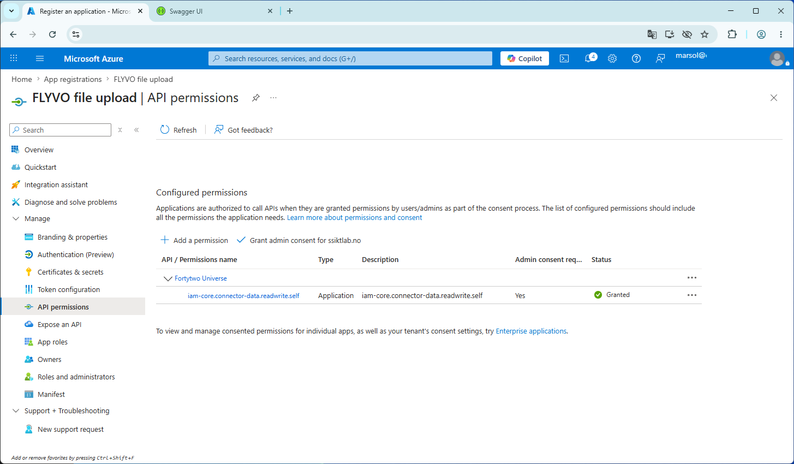

# File upload

Certain first party based connectors is based on uploading files, because the source systems generate files on a schedule rather than having APIs. In order for this to be available, a connector template with ```file upload enabled``` must be used.

The [Fortytwo.IAM.Core.Connector PowerShell module](../connector-powershell-module.md) has support for uploading files, and required Entra ID authentication. Authenticating to the IAM Core connector APIs is done with a service principal, and is documented in the [authentication documentation](../authentication-powershell.md).

After completing the authentication documentation, add permissions as follows:

- On the app registration, find **API permissions** in the left menu and click **+ Add a permission**
- Under **APIs my organization uses**, search for **Fortytwo** and select **Fortytwo Universe** (2808f963-7bba-4e66-9eee-82d0b178f408)
- Select **Application permissions** and choose **iam-core.connector-data.readwrite.self**
- After clicking **Add permission**, click **Grant admin consent** and make sure things look like this:



## Example run.ps1

!!! info The below steps, requires that you have completed the [authentication documentation](../authentication-powershell.md) and the above steps for adding permissions.

Create the following run.ps1 file on your server, and update the placeholders:

```PowerShell
[CmdletBinding()]
Param(
    [Parameter(Mandatory = $false)]
    [ValidateScript({ Test-Path $_ -PathType Leaf })]
    [string] $Path = 'PLACEHOLDER_FILE_TO_UPLOAD',

    [Parameter(Mandatory = $false)]
    [ValidatePattern("^[0-9a-fA-F]{8}-[0-9a-fA-F]{4}-[0-9a-fA-F]{4}-[0-9a-fA-F]{4}-[0-9a-fA-F]{12}$")]
    [string] $ConnectorId = 'PLACEHOLDER_CONNECTOR_ID'
)

#region Use latest version of the Fortytwo.IAM.Core.Connector module
$_available = Get-Module -ListAvailable | Where-Object Name -eq 'Fortytwo.IAM.Core.Connector'
if (!$_available) {
    Install-Module Fortytwo.IAM.Core.Connector -Scope CurrentUser -Force -Confirm:$false -Verbose
}
else {
    $_find = Find-Module Fortytwo.IAM.Core.Connector
    if (!($_available | Where-Object Version -ge $_find.Version)) {
        Update-Module Fortytwo.IAM.Core.Connector -Verbose -Confirm:$false -Force
    }    
}
#endregion

#region Connect the module using an available method (Might need to be updated)
Add-EntraIDClientCertificateAccessTokenProfile -TenantId "PLACEHOLDER_TENANT_ID" -ClientId "PLACEHOLDER_CLIENT_ID" -Thumbprint "PLACEHOLDER_THUMBPRINT" -Scope "https://api.fortytwo.io/.default" -Name Connector
Connect-Connector -ConnectorId $ConnectorId -AccessTokenProfile Connector -Environment development
#endregion

#region Upload file
$Tempfile = New-TemporaryFile 
$Tempfile = $Tempfile.FullName + ".zip"

Write-ConnectorVerbose -Text "$($ENV:COMPUTERNAME): Creating $Tempfile"
try {
    Compress-Archive -Path $Path -DestinationPath $Tempfile
}
catch {
    Write-ConnectorError -Text "$($ENV:COMPUTERNAME): Failure during zip creation: $_" -InnerException $_ -Throw
}

Write-ConnectorVerbose -Text "$($ENV:COMPUTERNAME): Uploading $Tempfile"
try {
    Send-ConnectorFile -Path $Tempfile -Verbose 
    Write-ConnectorVerbose -Text "$($ENV:COMPUTERNAME): Successfully uploaded $Tempfile"
}
catch {
    Write-ConnectorError -Text "$($ENV:COMPUTERNAME): Failure during upload: $_" -InnerException $_ -Throw
}

Remove-Item $Tempfile -Force -Confirm:$false
#endregion
```