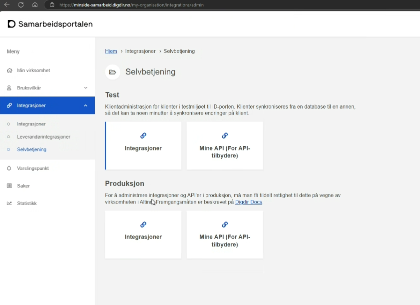
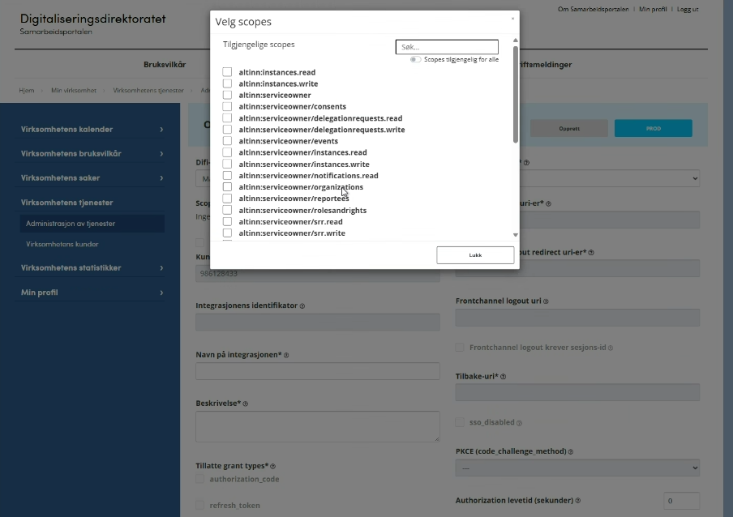
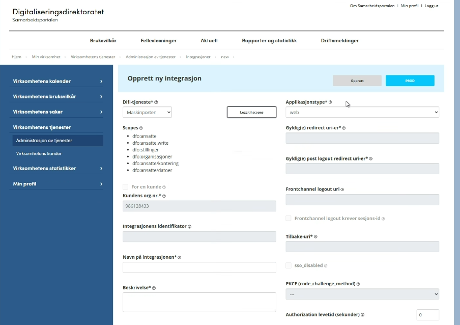
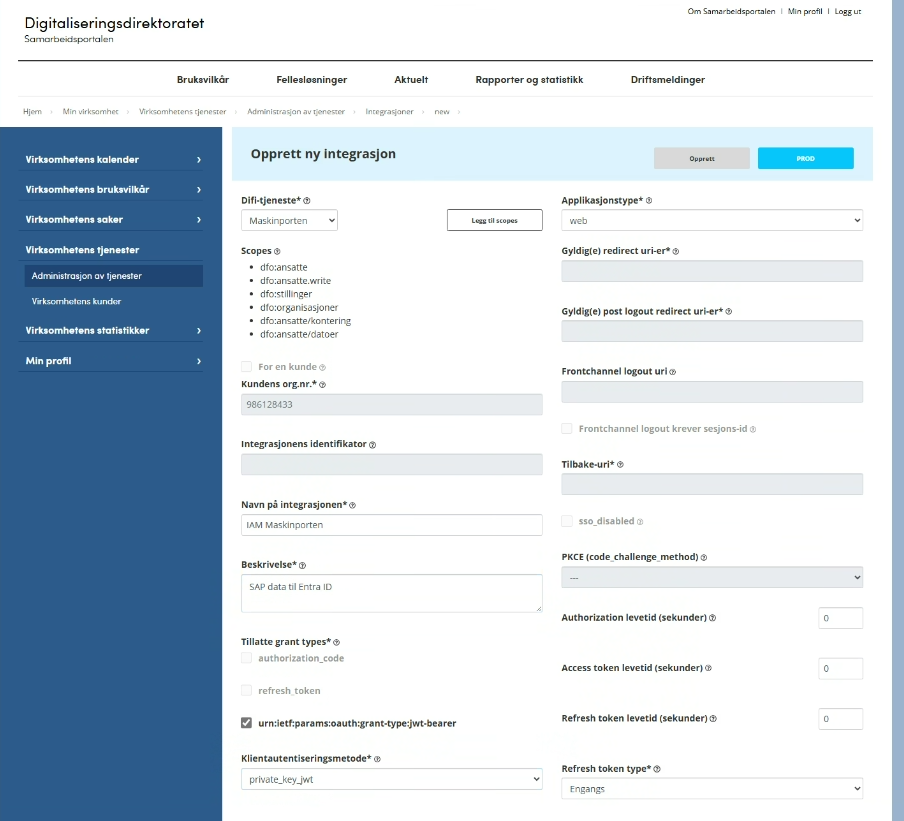
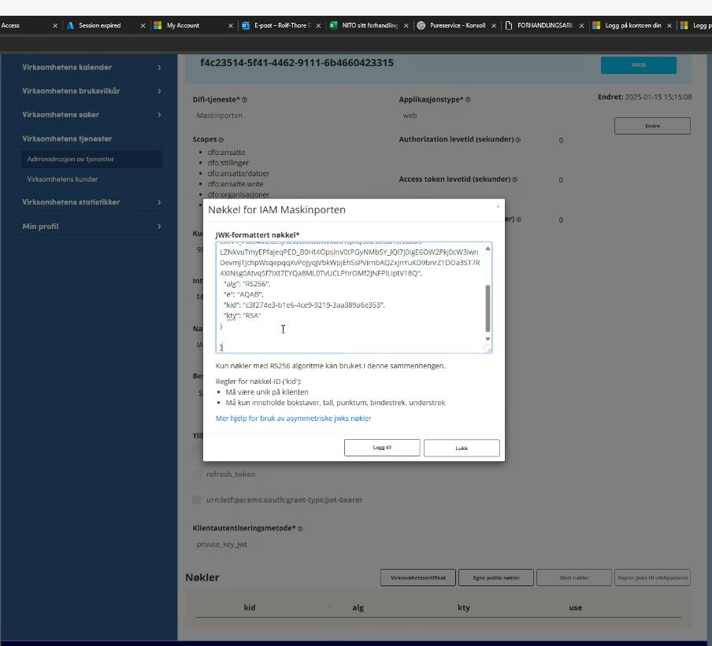
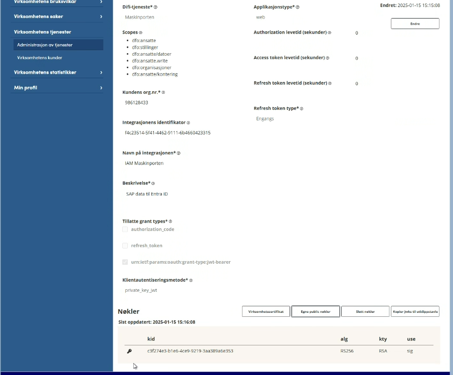

# Maskinporten

!!! note "Not complete yet"

This is not a connector, but is used as authentication by several integrations.

[Maskinporten](https://samarbeid.digdir.no/maskinporten/dette-er-maskinporten/96) is a common OpenID Connect provider in Norwegian public sektor, used for machine to machine authentication to services like Altinn, Helsepersonellregisteret, SAP from DFØ and others. To allow Fortytwo access, you need to register an application in Maskinporten using the below steps.

1. Sign into [Samarbeidsportalen](https://samarbeid.digdir.no/) and find **Integrations ("Integrasjoner")** 

2. On the **New integration ("Ny integrasjon")** experience, select the scopes you need to provide Fortytwo access to. This varies with the connector.

This is an example for accessing DFØ SAP:

3. Use the following information:

| Setting | Value | 
|-|-|
| Application type / Applikasjonstype | Web |
| Allowed grant types / Tillatte grant types | urf:ietf:params:oauth:grant-type:jwt-bearer |
| Client auth method / Klientautentiseringsmetode | private_key_jwt |

4. After adding the application, use **add your own public keys ("Egne public nøkler")**. 

To get your JWKS, submit the below form with your Entra tenant ID, which you can find at [whatismytenantid.com](https://www.whatismytenantid.com/)

<form action="https://prod-22.norwayeast.logic.azure.com:443/workflows/99f74391cd854a02b5446d804f273759/triggers/When_an_HTTP_request_is_received/paths/invoke" method="GET" target="_blank">
    <input type="hidden" name="api-version" value="2016-10-01">
    <input type="hidden" name="sp" value="/triggers/When_an_HTTP_request_is_received/run">
    <input type="hidden" name="sv" value="1.0">
    <input type="hidden" name="sig" value="pRP7v2iwaK10BGBQAyYL2G_xoANzMRbQYc8vTKq9ci0">
    <input type="text" style='border: 1px solid #000000;' name="tenantid" placeholder="Entra tenant ID" required pattern="[0-9a-z]{8}-[0-9a-z]{4}-[0-9a-z]{4}-[0-9a-z]{4}-[0-9a-z]{12}" title="Input a valid guid">
    <input type="submit" value="Get JWKS">
</form>

It should now look something like this:

The **Client ID** of the application must be provided in the connector configuration.

## Maintenance

Maskinporten only accepts certificate validity for 1 year. To ensure availability of the service, we generate a new certificate every 6 months, but continue to use the 'oldest' certificate until it is no longer valid. As a customer, **you need to update the JWKS every 6 months**, by submitting the above form to get the latest certificate(s) and saving them in the Maskinporten user interface.