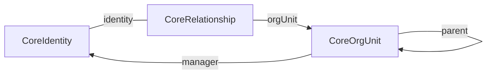
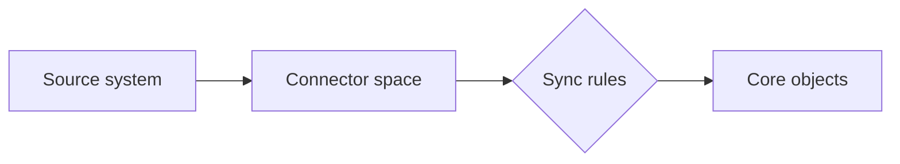

# IAM Core

The IAM Core, is the heart of the Identity Universe, and is what makes most of the revolving services run. The IAM Core is populated by adding data sources, such as HR systems using [connectors](./connectors/index.md), and synchronizing in data using [sync rules](syncrules.md).

In the IAM Core, there are three different types of objects, which is used to model _everything_:

| Object type | Description |
|-|-|
| [CoreIdentity](objecttypes/coreidentity.md) | An identity, such as an employee, student or agent. |
| [CoreRelationship](objecttypes/corerelationship.md) | A relationship between an identity and an org unit. |
| [CoreOrgUnit](objecttypes/coreorgunit.md) | An organizational unit |

Three object types is deliberately few. Rather than modelling "employee", "student", "consultant" and "teacher" as separate things, all of them are identities, and what distinguishes them is the relationships they hold. Someone who is both an employee and a parent of a pupil is one identity with two relationships, not two people.

A relationship — an employment, an enrolment, an engagement — ties an identity to an org unit, and carries the details that belong to that particular connection rather than to the person: the job title, the start and end dates, the employee number. Org units nest to form the organizational tree.

## How data gets in

A [connector](./connectors/index.md) brings data from a source system into its own private area called the connector space, keeping it as close to the original shape as possible. [Sync rules](syncrules.md) then decide which of those objects matter, which core object each one belongs to, and which values flow onto it.

Nothing modifies a core object except a sync rule, which means every value can be traced back to the rule that wrote it.

## Working with the solution

You can work with the [Synchronization admin interface](https://universe.fortytwo.io), the [PowerShell module](./powershell-module.md) or, if you are advanced, [the API](./api.md).

- [Connectors](./connectors/index.md) — bringing source systems in
- [Sync rules](syncrules.md) — turning connector data into core objects
- [Sync rule expressions](syncrule-expressions.md) — the expression reference
- [Core object types](objecttypes/common.md) — the data model in detail
