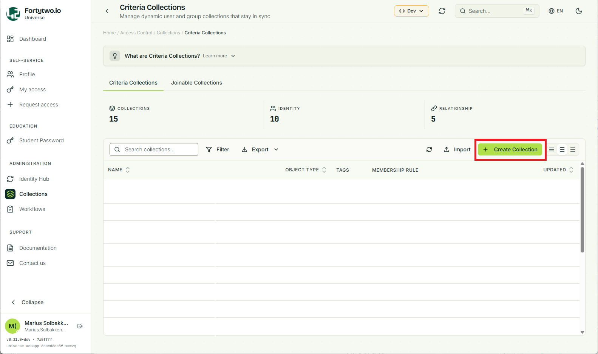
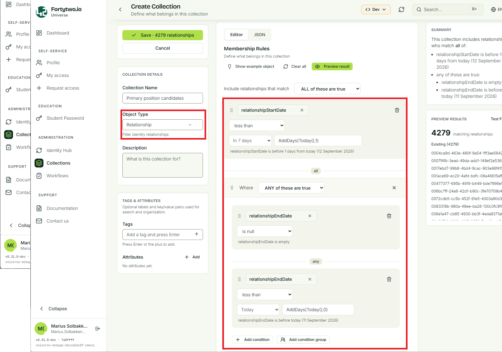
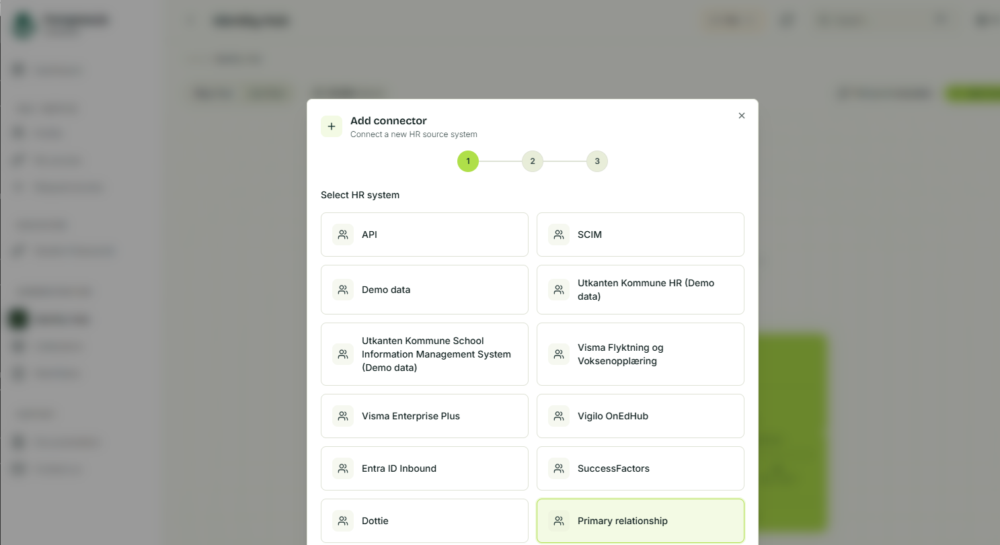
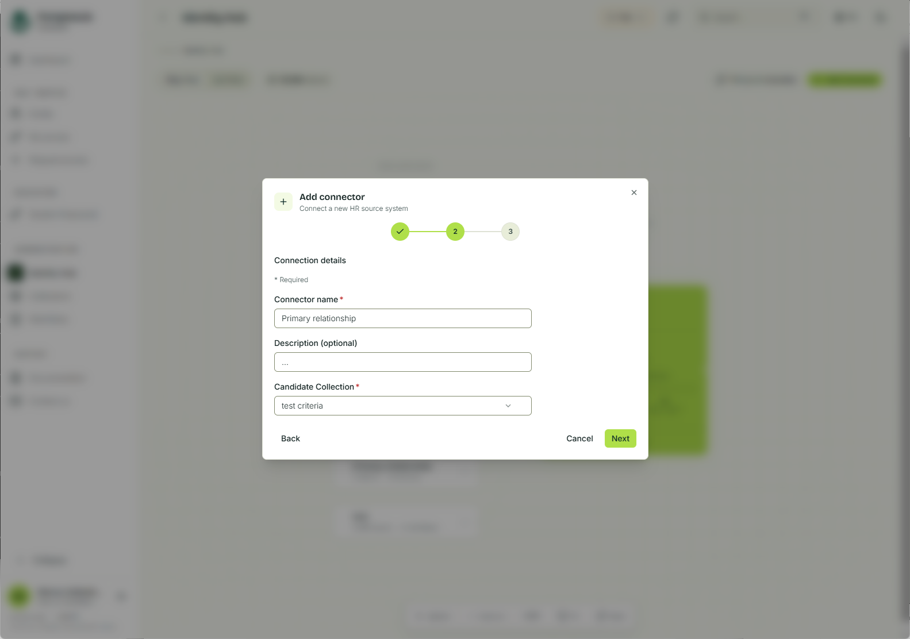
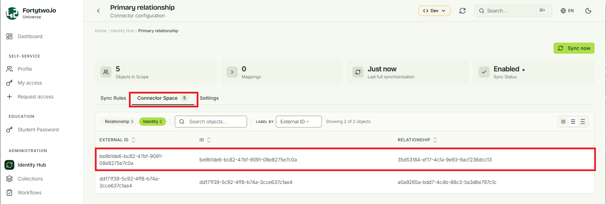

# Primary relationship

The solution allows users to select their own primary relationship. This means that if you model employments as relationships, you can allow your end users to select between their different employments, choosing which is considered the primary. This is useful for populating fields like job title, company name etc. in AD and Entra ID, which again is visible in Teams, Outlook and other services:

To configure this solution, you need a few steps:

**Step 1:** Create a collection of all the candidate relationships, meaning which relationships are considered as possible to actually set as primary
**Step 2:** Create a connector with the ```PrimaryRelationship``` template
**Step 3:** Add two sync rules to the created connector

# Step 1

In this step will be create a collection of all the candidate relationships, meaning which relationships are considered as possible to actually set as primary by the end users. Usually we recommend something like this:

```
relationshipStartDate is on 1 days from today
any of these are true:
    relationshipEndDate is empty
    relationshipEndDate is on today
```

In the [portal](https://universe.fortytwo.io), go to **Collections** in the left menu, and choose **Create collection**:



In the **Collection details** choose to target the **Object Type** of **Relationship**, and create a criteria:



Save the collection.

# Step 2

In this step, we will create a connector for the primary relationship feature. This is needed because information never is owned by IAM Core itself, instead this is split into a separate connector for storage.

In the [portal](https://universe.fortytwo.io), go to **Identity hub** in the left menu, and choose **Add connector**, and select **Primary relationship**:



Give the connector a name and choose the **Candidate Collection** that you just created.



# Step 3

In this last step, we will create sync rules for the connector we just created. This is to synchronize from the connector into the **primaryRelationship** attribute on identities. We need **two sync rules**.

For now, this is only available using PowerShell or the API:

```PowerShell
Connect-IAMCore
$Connector = Get-IAMCoreConnector | ? type -eq "PrimaryRelationship"

New-IAMCoreSyncRule `
    -JoinScope "*" `
    -Name "PrimaryRelationship - Relationship" `
    -ConnectorId $Connector.id `
    -ConnectorObjectType "relationship" `
    -CoreObjectType "relationship" `
    -DisableProvideCoreObjectExistence:$true `
    -ProvisioningEnabled:$false `
    -Priority 54321 `
    -InboundAttributeFlows @(
        @{
            '$type'             = "string"
            targetAttributeName = "id"
            joinPriority        = 1
            value               = @{
                '$type'   = "externalid"
            }
        }
    )

New-IAMCoreSyncRule `
    -JoinScope "*" `
    -Name "PrimaryRelationship - Identity" `
    -ConnectorId $Connector.id `
    -ConnectorObjectType "identity" `
    -CoreObjectType "identity" `
    -DisableProvideCoreObjectExistence:$true `
    -ProvisioningEnabled:$false `
    -Priority 54322 `
    -InboundAttributeFlows @(
        @{
            '$type'             = "string"
            targetAttributeName = "id" # Intentionally not using externalId here, to verify that the internal connector API can handle this case.
            joinPriority        = 1
            value               = @{
                '$type'   = "externalid"
            }
        }

        @{
            '$type'             = "reference"
            targetAttributeName = "primaryRelationship"
            value               = @{
                '$type'             = "asreference"
                objectType          = "relationship"
                referencedAttribute = "id" # Intentionally not using externalId here, to verify that the internal connector API can handle this case.
                input               = @{
                    '$type'   = "attribute"
                    attribute = "relationship"
                }
            }
        }
    )
```

After this is enabled, the users should be able to select their primary relationship, and it should appear in the connector space as guids, where you will see that the external id is the id of the identity and the relationship is the id of the relationship:

