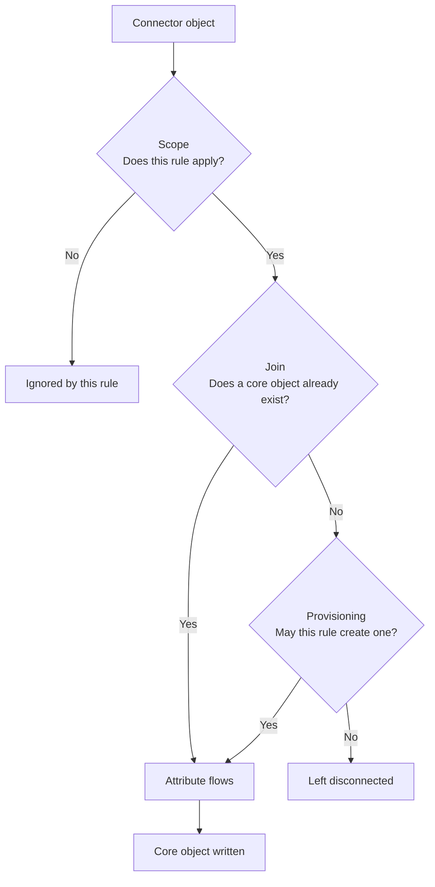

# Sync rules

Sync rules are the bridge between a [connector's](./connectors/index.md) connector space and the [core objects](./objecttypes/common.md) in IAM Core. A connector brings data _in_, but on its own that data does nothing — it just sits in the connector space. It is the sync rules that decide which of those objects matter, which core object each one belongs to, and which attribute values end up on that core object.

Nothing can modify a core object except a sync rule. This is a deliberate design choice: because every value on a core object is written by a named sync rule, you can always answer the question _"where did this value come from?"_.

A sync rule always belongs to exactly one connector, and it always targets exactly one [core object type](./index.md).

## What a sync rule does

Every connector object is put through the same four questions, in order:



1. **Scope** — is this connector object one that the rule cares about at all?
2. **Join** — is there already a core object that this connector object belongs to?
3. **Provisioning** — if there is no such core object, may this rule create one?
4. **Attribute flows** — which values should be written onto the core object?

Sections below cover each of these in turn.

## Anatomy of a sync rule

| Property | Type | Description |
|-|-|-|
| `name` | string | The name of the sync rule. Must be unique within the tenant. |
| `description` | string | Optional free-text documentation of what the rule is for. |
| `connectorId` | guid | The connector this rule reads from. |
| `connectorObjectType` | string | The object type _in the connector space_ that this rule applies to, for example `person`, `position` or `department`. |
| `coreObjectType` | enum | The core object type this rule writes to: `Identity`, `Relationship` or `OrgUnit`. |
| `scope` | expression[] | Boolean expressions that decide whether a connector object is in scope. |
| `inboundAttributeFlows` | flow[] | The attribute flows — what is written where. |
| `joinScope` | string | Partitions the core so that a rule can only join to core objects in the same join scope. Defaults to `default`. |
| `provisioningEnabled` | bool | Whether this rule may create new core objects. When `false` the rule is _join only_. |
| `priority` | int | Decides which rule wins when two rules write the same attribute. **Lower number wins.** Must be unique within the tenant. |
| `disabled` | bool | A disabled rule is skipped during synchronization. A rule must be disabled before it can be deleted. |

## Scope

`scope` is a list of boolean [expressions](./syncrule-expressions.md). **All of them must evaluate to `true`** for the connector object to be in scope — the list is combined with a logical AND.

Before the scope expressions are even evaluated, the object must also match the rule's `connectorId` and `connectorObjectType`. A `person` object is never evaluated by a rule whose `connectorObjectType` is `department`.

The simplest possible scope is "everything of this object type", which is also the default when you create a rule with the PowerShell module:

```json
[ { "$type": "true" } ]
```

A scope that only includes employees whose employment is not marked as historic:

```json
[
  {
    "$type": "not",
    "input": {
      "$type": "stringequals",
      "left": { "$type": "attribute", "attribute": "status" },
      "right": { "$type": "constant", "value": "historic" }
    }
  }
]
```

!!! warning "An empty scope list is never in scope"
    `scope` must contain at least one expression. An empty list means the rule never applies to anything. Use `{ "$type": "true" }` if you want the rule to apply to every object of the type.

!!! tip "Use `or` for alternatives"
    Because the entries in `scope` are ANDed together, alternatives must be expressed inside a single [`or`](./syncrule-expressions.md#or) expression rather than as two separate scope entries.

An expression that cannot be evaluated — for example because the source attribute is missing, or is not a boolean — evaluates to null, and anything that is not exactly `true` puts the object out of scope. A misspelled attribute name therefore shows up as "nothing synchronizes", not as an error.

### Falling out of scope

Scope is re-evaluated on every synchronization. If a connector object that was previously connected to a core object no longer matches any rule for that core object type, it is **disconnected** from the core object. If that was the last connector object connected to it, the core object itself is deleted.

This makes scope a practical way to control the lifecycle of core objects: narrowing a rule's scope removes the objects that no longer match.

## Join

Joining is how IAM Core decides that the `person` record in your HR system and the `user` record in Entra ID are the same human being. Without joins you would get one CoreIdentity per source system.

A **join flow** is any string attribute flow that has a `joinPriority`. It does double duty: it tells the engine _"look for a core object whose `targetAttributeName` equals this value"_, and it also writes that value onto the core object once the join has been made.

```powershell
@{
    '$type'             = "string"
    targetAttributeName = "nin"
    joinPriority        = 1
    value               = @{
        '$type'   = "attribute"
        attribute = "nin"
    }
}
```

Every sync rule must have **at least one** join flow, otherwise the rule is rejected when you save it.

### Join priority

`joinPriority` is a _try-order_, evaluated **ascending — lowest number first**. It is unrelated to the rule-level `priority`.

This lets you express "match on the employee number first, and fall back to the national identity number":

```powershell
@{
    '$type'             = "string"
    targetAttributeName = "anchor1"
    joinPriority        = 1
    value               = @{ '$type' = "attribute"; attribute = "id" }
}
@{
    '$type'             = "string"
    targetAttributeName = "nin"
    joinPriority        = 2
    value               = @{ '$type' = "attribute"; attribute = "nin" }
}
```

If a join flow's expression evaluates to null or an empty string, that flow is skipped and the next one is tried.

### Join scope

`joinScope` partitions the core. A rule can only join to core objects that carry the same `joinScope` value, and a core object created by a rule inherits that rule's join scope. The default is `default`, and most solutions never need anything else.

Use a separate join scope when you deliberately want two populations that must never be joined together even though they might share attribute values — for example pupils and employees who could both appear with the same national identity number, but must remain two separate identities.

#### Joining across every scope

Setting `joinScope` to `*` makes a rule join to core objects in **any** join scope, rather than only its own. This is for connectors that enrich a population they did not create and should not be partitioned away from — an Entra ID connector contributing `entraObjectId` to both pupils and employees, for instance, rather than needing one rule per scope.

!!! warning "A wildcard rule cannot provision"
    A rule with `joinScope` set to `*` must have `provisioningEnabled` set to `false`. Creating one with provisioning enabled is rejected, and so is turning provisioning on for an existing wildcard rule, both with `A sync rule with JoinScope '*' cannot have provisioning enabled`. The reason is that a new core object has to be created in one specific scope, and `*` does not name one. Wildcard rules are therefore always [join only](#provisioning).

### Ambiguous joins

If the join flows match **more than one** core object, the object is not synchronized at all and an error is logged saying that manual intervention is required. This is intentional — silently picking one of two candidates would merge two people.

Resolving an ambiguity usually means correcting the source data, or deleting the duplicate core object.

!!! tip "Joining on `id`"
    The core object's own `id` may be used as a join target, which is how a connector that already knows the IAM Core id (such as the [Entra ID SCIM connector](./connectors/entraidscim.md)) connects directly. `id` may **only** be used as a join flow — you cannot use it as an ordinary target attribute.

## Provisioning

If the join found no existing core object, `provisioningEnabled` decides what happens next:

- **`true`** — a new core object of the rule's `coreObjectType` is created, in the rule's `joinScope`, and the attribute flows are then applied to it.
- **`false`** — nothing is created. The connector object stays disconnected until some other rule provisions a core object it can join to. This is called a **join-only rule**.

Join-only rules are the normal pattern for systems that enrich an identity rather than being the source of it. Your HR connector provisions the CoreIdentity; the Entra ID connector joins to it and contributes `entraObjectId` — it should never create identities of its own.

An existing join always beats provisioning: if a core object was found, no new one is created regardless of this setting.

## Attribute flows

`inboundAttributeFlows` is the list of values the rule writes. Each flow has a type matching the type of the target attribute, a `targetAttributeName`, and a `value` [expression](./syncrule-expressions.md).

| Flow `$type` | Writes to | Extra properties |
|-|-|-|
| `string` | String attributes | `joinPriority` (makes it a join flow) |
| `boolean` | Boolean attributes | |
| `datetime` | Date/time attributes | |
| `reference` | Reference attributes | |
| `multivaluedstring` | Multi-valued string attributes | |

A minimal flow that copies one attribute across unchanged:

```powershell
@{
    '$type'             = "string"
    targetAttributeName = "firstName"
    value               = @{
        '$type'   = "attribute"
        attribute = "names/firstname"
    }
}
```

Note the `names/firstname` path — nested connector data is addressed with `/`.

### Valid target attributes

The target attribute must exist on the core object type, and its type must match the flow type. Saving a rule with an invalid target fails with a validation error.

=== "Identity"

    | Flow type | Valid target attributes |
    |-|-|
    | `string` | `id` (join only), `nin`, `displayName`, `firstName`, `lastName`, `mobile`, `privateMobile`, `email`, `privateEmail`, `countryCode`, `entraObjectId`, `entraUserPrincipalName`, `entraOnPremisesSamAccountName`, `entraOnPremisesDistinguishedName`, `anchor1`–`anchor9`, `custom/*` |
    | `boolean` | `entraOnPremisesSyncEnabled` |
    | `reference` | `primaryRelationship` |

=== "Relationship"

    | Flow type | Valid target attributes |
    |-|-|
    | `string` | `id` (join only), `title`, `employeeId`, `type`, `subType`, `positionCode`, `officeLocation`, `category`, `anchor1`–`anchor9`, `custom/*` |
    | `datetime` | `startDate`, `endDate` |
    | `reference` | `orgUnit`, `identity`, `manager` |
    | `multivaluedstring` | `costCenters` |

=== "OrgUnit"

    | Flow type | Valid target attributes |
    |-|-|
    | `string` | `id` (join only), `displayName`, `type`, `subType`, `email`, `legalIdentifier`, `address`, `postalCode`, `city`, `educationStatus`, `educationSchoolYear`, `educationLanguage`, `educationCourse`, `educationSourcedId`, `externalId`, `anchor1`–`anchor9`, `custom/*` |
    | `datetime` | `educationStartDate`, `educationEndDate` |
    | `reference` | `parent`, `manager`, `deputies` |
    | `multivaluedstring` | `educationGrades`, `educationSubjectCodes`, `educationCodes` |

Any string flow whose target begins with `custom/` is accepted, which is how you store data that has no standard attribute. See [custom string values](./objecttypes/common.md#custom-string-values).

### References

Reference attributes point at another core object. You do not supply the core object id directly — instead you point at another _connector_ object with [`asreference`](./syncrule-expressions.md#asreference), and IAM Core resolves it to whichever core object that connector object is joined to.

```powershell
@{
    '$type'             = "reference"
    targetAttributeName = "orgUnit"
    value               = @{
        '$type'             = "asreference"
        objectType          = "department"
        referencedAttribute = "id"
        input               = @{
            '$type'   = "attribute"
            attribute = "department"
        }
    }
}
```

This reads the `department` attribute from the current object, finds the connector object of type `department` whose `id` matches, and sets the relationship's `orgUnit` to that department's core object.

Reference targets are type-checked: `identity`, `manager` and `deputies` must resolve to an Identity, while `orgUnit` and `parent` must resolve to an OrgUnit.

### nullFlow

Every flow has a `nullFlow` property, `false` by default, controlling what happens when the expression produces no value:

- **`nullFlow: false`** — the attribute is left alone. Use this for optional data, and when several connectors contribute to the same attribute.
- **`nullFlow: true`** — the null is written, clearing the attribute. Use this when the source system is authoritative and an emptied field there should empty the field in IAM Core.

## Priority and attribute ownership

Every value on a core object records which sync rule wrote it. When a rule tries to write an attribute that another rule already owns, `priority` decides the winner:

!!! info "Lower number means higher priority"
    A rule with `priority` 10 overrides a rule with `priority` 100. Priority must be unique within the tenant.

The rules are:

- If nothing owns the attribute yet, the write succeeds.
- If the current value was not written by a sync rule, the write succeeds — sync rules overwrite manual edits.
- If the same rule owns it, the write succeeds.
- Otherwise the write only succeeds if this rule's `priority` is lower than the owning rule's.

Ownership is tracked **per attribute**, not per object, so several rules from several connectors can each own different attributes of the same core object. This is what makes the multi-connector pattern work: HR owns `firstName`, `lastName` and `nin`, while Entra ID owns `entraObjectId` and `entraUserPrincipalName`, and neither can clobber the other.

If a rule stops contributing a value — because it was disabled, deleted, had the flow removed, or the object fell out of scope — the value it owned is removed from the core object on the next synchronization.

## Disabling and deleting

A sync rule must be **disabled first, and then deleted**. Deleting an enabled rule is rejected.

Disabling a rule takes it out of synchronization, which means the attributes it owned are cleared on the next run and objects that only it provisioned are deleted. Disabling is therefore not a no-op — it is a good way to preview the effect of a deletion, since it can be undone.

## Managing sync rules with PowerShell

The [**Fortytwo.IAM.Core.Admin**](./powershell-module.md) module is the most practical way to work with sync rules.

```powershell
Install-Module Fortytwo.IAM.Core.Admin -Scope CurrentUser
Connect-IAMCore
```

| Cmdlet | Purpose |
|-|-|
| `Get-IAMCoreSyncRule` | List all sync rules, or get one by `-Id`. |
| `New-IAMCoreSyncRule` | Create a sync rule. |
| `Set-IAMCoreSyncRule` | Update a sync rule. Only the parameters you supply are changed. |
| `Copy-IAMCoreSyncRule` | Duplicate a rule, optionally onto another connector. |
| `Remove-IAMCoreSyncRule` | Delete a sync rule. Must be disabled first. |
| `Test-IAMCoreSyncRuleExpression` | Evaluate an expression against a real connector object. |

Attribute flows and scope are ordinary PowerShell hashtables. The `$type` key selects the flow or expression type and **must be quoted in single quotes**, otherwise PowerShell tries to expand it as a variable.

!!! tip "Always pass `-Priority` explicitly"
    If you leave it out, `New-IAMCoreSyncRule` picks a random priority for you. Since priority decides which rule wins when two of them write the same attribute, and must be unique within the tenant, it is worth planning the numbering deliberately — for example one band per connector, leaving gaps so rules can be inserted later.

### Creating an OrgUnit rule

```powershell
$InboundAttributeFlows = @(
    @{
        '$type'             = "string"
        targetAttributeName = "type"
        value               = @{
            '$type' = "constant"
            value   = "Company"
        }
    }

    @{
        '$type'             = "string"
        targetAttributeName = "displayName"
        value               = @{
            '$type'   = "attribute"
            attribute = "name"
        }
    }

    @{
        '$type'             = "reference"
        targetAttributeName = "parent"
        value               = @{
            '$type'             = "asreference"
            objectType          = "department"
            referencedAttribute = "id"
            input               = @{
                '$type'   = "attribute"
                attribute = "parent"
            }
        }
    }

    @{
        '$type'             = "string"
        targetAttributeName = "anchor1"
        joinPriority        = 1
        value               = @{
            '$type'   = "attribute"
            attribute = "id"
        }
    }
)

New-IAMCoreSyncRule `
    -Name "HR - Department" `
    -ConnectorId $HRConnector.id `
    -ConnectorObjectType "department" `
    -CoreObjectType "OrgUnit" `
    -ProvisioningEnabled:$true `
    -Priority 103 `
    -InboundAttributeFlows $InboundAttributeFlows
```

### Creating an Identity rule

This one builds `displayName` by concatenating two source attributes, and normalizes a phone number into E.164 with a chain of regular expression replacements.

```powershell
$InboundAttributeFlows = @(
    @{
        '$type'             = "string"
        targetAttributeName = "firstName"
        value               = @{
            '$type'   = "attribute"
            attribute = "names/firstname"
        }
    }

    @{
        '$type'             = "string"
        targetAttributeName = "lastName"
        value               = @{
            '$type'   = "attribute"
            attribute = "names/lastname"
        }
    }

    @{
        '$type'             = "string"
        targetAttributeName = "displayName"
        value               = @{
            '$type' = "join"
            inputs  = @(
                @{
                    '$type'   = "attribute"
                    attribute = "names/firstname"
                },
                @{
                    '$type' = "constant"
                    value   = " "
                },
                @{
                    '$type'   = "attribute"
                    attribute = "names/lastname"
                }
            )
        }
    }

    @{
        '$type'             = "string"
        targetAttributeName = "mobile"
        value               = @{
            '$type'     = "regexreplace"
            pattern     = "^([0-9])"
            replacement = "+47`$1"
            input       = @{
                '$type'     = "regexreplace"
                pattern     = "^00"
                replacement = "+"
                input       = @{
                    '$type'     = "regexreplace"
                    pattern     = "\s"
                    replacement = ""
                    input       = @{
                        '$type'   = "attribute"
                        attribute = "mobile"
                    }
                }
            }
        }
    }

    @{
        '$type'             = "string"
        targetAttributeName = "anchor1"
        joinPriority        = 1
        value               = @{
            '$type'   = "attribute"
            attribute = "id"
        }
    }

    @{
        '$type'             = "string"
        targetAttributeName = "nin"
        joinPriority        = 2
        value               = @{
            '$type'   = "attribute"
            attribute = "nin"
        }
    }
)

New-IAMCoreSyncRule `
    -Name "HR - Person" `
    -ConnectorId $HRConnector.id `
    -ConnectorObjectType "person" `
    -CoreObjectType "Identity" `
    -ProvisioningEnabled:$true `
    -Priority 101 `
    -InboundAttributeFlows $InboundAttributeFlows
```

!!! warning "Escaping `$` in replacements"
    In the example above the replacement is written as ``"+47`$1"``. The backtick stops PowerShell from expanding `$1` as a variable, so the literal `$1` capture-group reference reaches IAM Core.

### Creating a Relationship rule

A relationship ties an identity to an org unit, so it typically has two reference flows and a pair of dates.

```powershell
$InboundAttributeFlows = @(
    @{
        '$type'             = "string"
        targetAttributeName = "type"
        value               = @{
            '$type' = "constant"
            value   = "Employee"
        }
    }

    @{
        '$type'             = "string"
        targetAttributeName = "title"
        value               = @{
            '$type'   = "attribute"
            attribute = "title"
        }
    }

    @{
        '$type'             = "datetime"
        targetAttributeName = "startDate"
        value               = @{
            '$type' = "todatetime"
            input   = @{
                '$type'   = "attribute"
                attribute = "startdate"
            }
        }
    }

    @{
        '$type'             = "datetime"
        targetAttributeName = "endDate"
        value               = @{
            '$type' = "todatetime"
            input   = @{
                '$type'   = "attribute"
                attribute = "enddate"
            }
        }
    }

    @{
        '$type'             = "reference"
        targetAttributeName = "identity"
        value               = @{
            '$type'             = "asreference"
            objectType          = "person"
            referencedAttribute = "id"
            input               = @{
                '$type'   = "attribute"
                attribute = "person"
            }
        }
    }

    @{
        '$type'             = "reference"
        targetAttributeName = "orgUnit"
        value               = @{
            '$type'             = "asreference"
            objectType          = "department"
            referencedAttribute = "id"
            input               = @{
                '$type'   = "attribute"
                attribute = "department"
            }
        }
    }

    @{
        '$type'             = "string"
        targetAttributeName = "anchor1"
        joinPriority        = 1
        value               = @{
            '$type'   = "attribute"
            attribute = "id"
        }
    }
)

New-IAMCoreSyncRule `
    -Name "HR - Position" `
    -ConnectorId $HRConnector.id `
    -ConnectorObjectType "position" `
    -CoreObjectType "Relationship" `
    -ProvisioningEnabled:$true `
    -Priority 102 `
    -InboundAttributeFlows $InboundAttributeFlows
```

### Creating a join-only rule

An Entra ID rule that enriches an identity that HR already provisioned. Note `-ProvisioningEnabled:$false`, and that it joins on the core `id` supplied by the connector.

```powershell
$InboundAttributeFlows = @(
    @{
        '$type'             = "string"
        targetAttributeName = "id"
        joinPriority        = 1
        value               = @{
            '$type'   = "attribute"
            attribute = "fortytwoId"
        }
    }

    @{
        '$type'             = "string"
        targetAttributeName = "entraObjectId"
        value               = @{
            '$type' = "externalid"
        }
    }

    @{
        '$type'             = "string"
        targetAttributeName = "entraUserPrincipalName"
        value               = @{
            '$type'   = "attribute"
            attribute = "userPrincipalName"
        }
    }

    @{
        '$type'             = "string"
        targetAttributeName = "entraOnPremisesSamAccountName"
        value               = @{
            '$type'   = "attribute"
            attribute = "onPremisesSamAccountName"
        }
    }

    @{
        '$type'             = "boolean"
        targetAttributeName = "entraOnPremisesSyncEnabled"
        value               = @{
            '$type'   = "attribute"
            attribute = "onPremisesSyncEnabled"
        }
    }
)

New-IAMCoreSyncRule `
    -Name "Entra ID - User" `
    -ConnectorId $EntraIDConnector.id `
    -ConnectorObjectType "user" `
    -CoreObjectType "Identity" `
    -ProvisioningEnabled:$false `
    -Priority 11 `
    -InboundAttributeFlows $InboundAttributeFlows
```

### Changing the scope of an existing rule

```powershell
Get-IAMCoreSyncRule |
    Where-Object { $_.name -eq "HR - Person" } |
    Set-IAMCoreSyncRule -Scope @(
        @{
            '$type' = "not"
            input   = @{
                '$type' = "stringequals"
                left    = @{
                    '$type'   = "attribute"
                    attribute = "employmentStatus"
                }
                right   = @{
                    '$type' = "constant"
                    value   = "terminated"
                }
            }
        }
    )
```

`Get-IAMCoreSyncRule` returns `scope` and `inboundAttributeFlows` as hashtables, so a rule can be read, modified and piped straight back into `Set-IAMCoreSyncRule`.

### Copying a rule to another connector

Useful when a second source system has the same shape as the first.

```powershell
Get-IAMCoreSyncRule |
    Where-Object { $_.name -eq "HR - Person" } |
    Copy-IAMCoreSyncRule -ConnectorId $SecondHRConnector.id -NameSuffix " (HR2)"
```

### Disabling and removing

```powershell
# Disable a single rule
Get-IAMCoreSyncRule |
    Where-Object { $_.name -eq "HR - Person" } |
    Set-IAMCoreSyncRule -Disabled:$true

# Disable and remove all rules — this deletes core objects, use with care
Get-IAMCoreSyncRule | Set-IAMCoreSyncRule -Disabled:$true
Get-IAMCoreSyncRule | Remove-IAMCoreSyncRule
```

## Testing expressions

Expressions can be evaluated against a real connector object before you commit to them, which is by far the fastest way to get a complicated expression right.

```powershell
$ConnectorObject = Find-IAMCoreConnectorDataObject -ConnectorId $HRConnector.id -ConnectorObjectType "person" |
    Select-Object -First 1

Test-IAMCoreSyncRuleExpression `
    -ConnectorId $HRConnector.id `
    -ConnectorObjectId $ConnectorObject.id `
    -Expression @{
        '$type' = "join"
        inputs  = @(
            @{ '$type' = "attribute"; attribute = "names/lastname" }
            @{ '$type' = "constant";  value     = ", " }
            @{ '$type' = "attribute"; attribute = "names/firstname" }
        )
    }
```

The result carries one field per value type, and only the ones the expression can produce are filled in:

```
stringValue      : Nordmann, Ola
integerValue     :
booleanValue     :
stringMultiValue :
referenceValue   :
dateTimeValue    :
objectValue      :
objectValues     :
```

Some expressions fill several fields at once — [`attribute`](./syncrule-expressions.md#attribute) can act as a string, a multi-valued string and a boolean, so all three are populated where applicable.

## Previewing a single object

To see what a full set of sync rules would do to one connector object, without writing anything:

```powershell
Get-IAMCoreConnectorDataObjectSyncPreview -ConnectorId $HRConnector.id -ConnectorObjectId $ConnectorObject.id
```

The preview returns the core object before and after, plus a log explaining every decision the engine made — which rules were in scope, what was joined, which flows were skipped and why. When the preview looks right, apply it to that single object:

```powershell
Start-IAMCoreConnectorDataObjectSync -ConnectorId $HRConnector.id -ConnectorObjectId $ConnectorObject.id
```

!!! tip "Preview ignores the disabled flag"
    Preview and single-object sync evaluate disabled rules as well, so you can build a rule with `disabled` set, preview it against real data, and only enable it once it behaves.

## API

Sync rules can also be managed directly over [the API](./api.md). All routes are relative to `https://api.fortytwo.io/iamcore/beta`.

| Method | Route | Description |
|-|-|-|
| `GET` | `/sync/syncrules` | List all sync rules |
| `POST` | `/sync/syncrules` | Create a sync rule |
| `GET` | `/sync/syncrules/{syncRuleId}` | Get a single sync rule |
| `PUT` | `/sync/syncrules/{syncRuleId}` | Update a sync rule (send the complete rule) |
| `DELETE` | `/sync/syncrules/{syncRuleId}` | Delete a sync rule (must be disabled) |
| `POST` | `/sync/connectors/{connectorId}/data/{connectorObjectId}/testsyncruleexpression` | Evaluate an expression against a connector object |
| `POST` | `/sync/connectors/{connectorId}/data/{connectorObjectId}/preview` | Preview the sync of one object |
| `POST` | `/sync/connectors/{connectorId}/data/{connectorObjectId}/commit` | Commit the sync of one object |

Reading requires the `iam-core.synchronization-configuration.read.all` role, and writing requires `iam-core.synchronization-configuration.readwrite.all`.

A complete sync rule as JSON:

```json
{
  "name": "HR - Person",
  "description": "Provisions identities from the HR system",
  "connectorId": "0f3c1a90-77b2-4c1f-9f3a-2b0e5d6c8a11",
  "connectorObjectType": "person",
  "coreObjectType": "Identity",
  "joinScope": "default",
  "provisioningEnabled": true,
  "priority": 101,
  "disabled": false,
  "scope": [
    { "$type": "true" }
  ],
  "inboundAttributeFlows": [
    {
      "$type": "string",
      "targetAttributeName": "firstName",
      "nullFlow": false,
      "value": { "$type": "attribute", "attribute": "names/firstname" }
    },
    {
      "$type": "string",
      "targetAttributeName": "anchor1",
      "joinPriority": 1,
      "value": { "$type": "attribute", "attribute": "id" }
    }
  ]
}
```

## Next

- [Sync rule expressions](./syncrule-expressions.md) — the full reference of every expression type
- [Connectors](./connectors/index.md) — where the data comes from
- [Core object types](./objecttypes/common.md) — what you can write to
