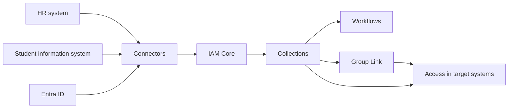

# Identity Universe

Identity Universe is Fortytwo's identity and access management platform. It takes the data your organisation already keeps about its people — in HR systems, student information systems, and elsewhere — builds one consistent picture of who everyone is and what they do, and uses that picture to decide who gets access to what.

Sign in at [universe.fortytwo.io](https://universe.fortytwo.io).

## The parts

| | |
|-|-|
| [**IAM Core**](./iam-core/index.md) | The data foundation. Source systems are brought in through [connectors](./iam-core/connectors/index.md), and [sync rules](./iam-core/syncrules.md) turn that raw data into identities, organizational units and relationships. |
| [**Collections**](./collections/index.md) | Groups of people, either defined by criteria over the core data or joinable on request with an approval flow. Collections are how access is expressed. |
| [**Group Link**](./group-link/index.md) | Keeps a Microsoft Entra ID group's membership aligned with a collection, so applications that read Entra ID groups get their answer from the collection. |
| **Workflows** | Automation that reacts to people joining or leaving a collection, for example by calling a webhook. Configured from the Administration blade. |

## How it fits together

Data flows in one direction. A source system owns its data and pushes it into a connector; sync rules decide what that means in terms of identities and organizational structure; collections group those identities; and access follows from collection membership.

The value of the middle step is that it happens once. Rather than every downstream system needing its own opinion about who counts as an employee, that question is answered in one place and everything else builds on the answer.

## Where to start

- [**Getting started**](./getting-started/index.md) — signing in, consent, and a tour of the pages you will see as a user
- [**IAM administrator**](./getting-started/iam-admins/index.md) — the roles needed to administer Identity Universe, and how to assign them
- [**IAM Core**](./iam-core/index.md) — the data model, connectors and sync rules
- [**Collections**](./collections/index.md) — criteria and joinable collections
- [**Group Link**](./group-link/index.md) — connecting a collection to an Entra ID group, and the API for it

Most things can be done in the web interface, through a PowerShell module, or through the API — see the relevant section for each.
