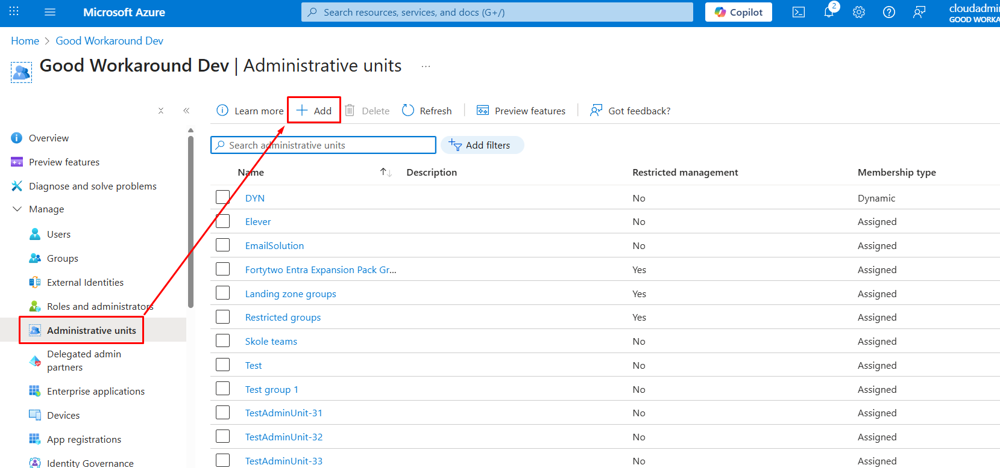
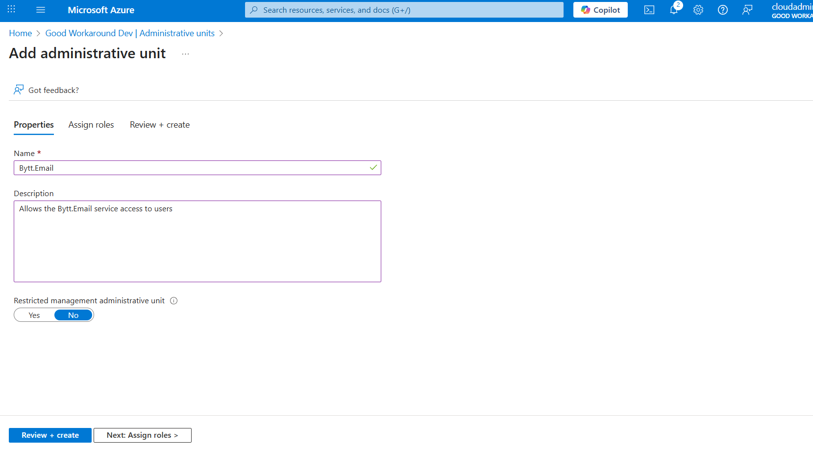
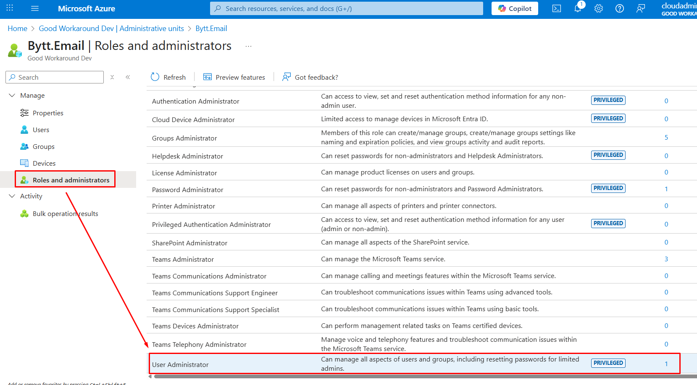

# Administrative unit (AU)

In order to minimize the permissions required by Bytt.Email, we are not requesting permissions like **user.readwrite.all**. This method minimizes the required permissions for Bytt.Email into your tenant. It is only needed if you have cloud only users that should be able to use the Bytt.Email service.

1. Sign into the [Azure Portal](https://portal.azure.com) as a Global Administrator, locate **Entra ID**, find **Administrative units** in the left meny and click **+ Add**.

2. Name the AU something that makes sense in your environment and click **Review + create**

3. Find the AU you created, go to **Roles and administrators** and click on **User Administrator**

4. Add an assignment for the **Bytt.Email** Enterprise application:

5. Finally, on the **properties** of the AU, change the **Memebership type** to **Dynamic User** and define a criteria:

**Example criteria:**

| Who | Criteria |
|-|-|
| All enabled users                                  | (user.accountEnabled -eq true) |
| All enabled users with of different company values | (user.companyName -in ["Company 1", "Company 2"]) |
| All users with a certain UPN suffix                | (user.userPrincipalName -endsWith "@customer.com") |
| All members of group X                             | user.memberof -any (group.objectId -in ['group-x-object-id']) |
| All members in any of group X or Y                 | user.memberof -any (group.objectId -in ['group-x-object-id', 'group-y-object-id']) |

