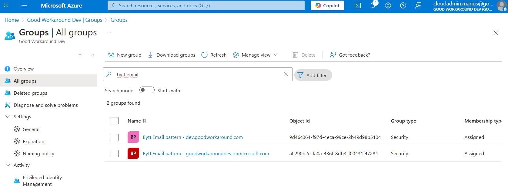

# Automatically configure everything

The following PowerShell can be run as a global administrator: 

```PowerShell
Install-Module Microsoft.Graph.Authentication, Microsoft.Graph.Applications, Microsoft.Graph.Groups, Microsoft.Graph.Identity.SignIns, Microsoft.Graph.Identity.DirectoryManagement, Fortytwo.ByttEmail.Installation -Scope CurrentUser -Force
Import-Module Fortytwo.ByttEmail.Installation

Install-ByttEmail
```

The script will do the following:

- Consent to applications as in [configuration step 1](config-step1.md)
- Create an Entra ID group for email patterns for all domains in the tenant (as per [configuration step 2](config-step2.md))
- Grant the created groups access to Bytt.Email (as per [configuration step 3](config-step3.md))
- Create an administrative unit named **Bytt.email**, with all members of all the email pattern groups as members (as per [configuration step 4](config-step4.md))
- Grant Bytt.Email the user administrator role of the administrative unit

After the script have been completed successfully, there are a few tasks that needs to be completed:

# 1 - Add users to the groups that was created

The script have created a set of groups, all prefixed with **Bytt.Email pattern**:



These have all been configured with a set of default email patterns for these domains, and users need to be members of these groups in order to get the different email patterns. Please see details in [configuration step 2](config-step2.md), on how these groups might be configured. 


The groups are by default created as criteria based groups, with all enabled users with that same upn suffix as members. This might not be what you want, but is suitable for many customers.

# 2 - AD Agent

If you have Active Directory synchronized user, [configure the AD agent](config-step5.md)
