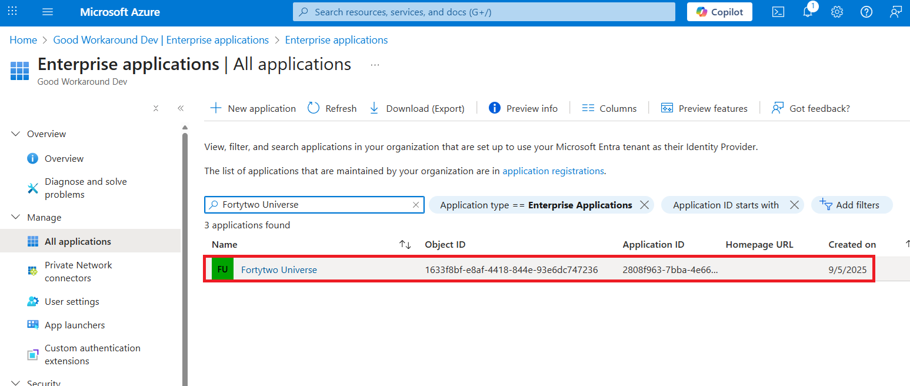
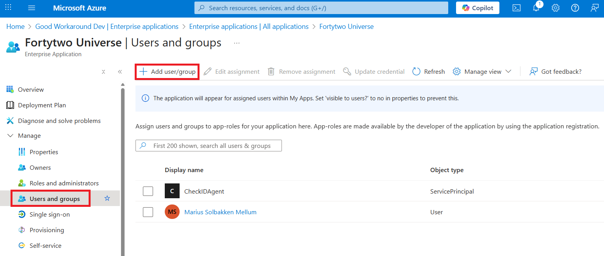
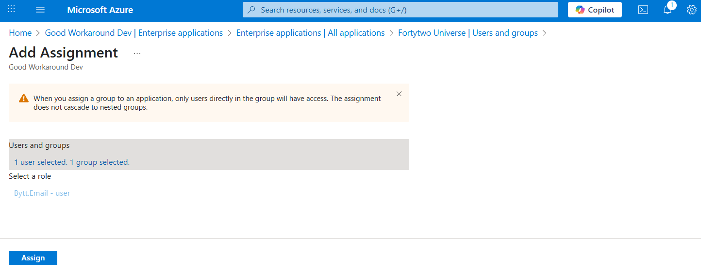

# Step 3 - Grant users access

Now that the email pattern groups have been created, assigning access to the Bytt.Email service is done by locating the **Fortytwo Universe** app under **Enterprise Apps**:

Under **Users and groups**, click **Add user/group**.

Assign any relevant user or group of users. **We recommend assigning the email pattern groups you created in step 2 this access**.

The assignments should now look like this. Notice that if you utilize other Fortytwo services, these role assignments are also managed here.

## Next step

[Go to next step](config-step4.md)