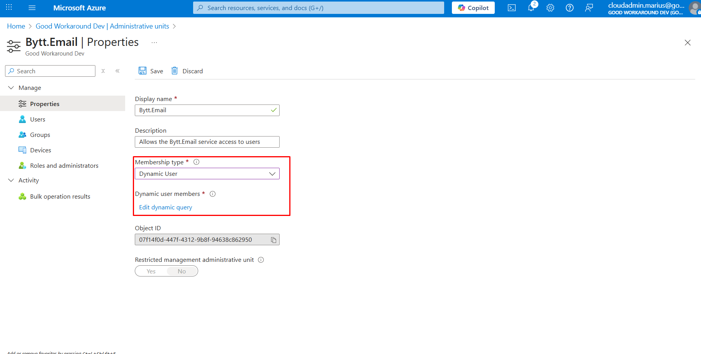

# Step 4 - Configure write permissions / fulfillment

> **Note:** It is possible to test the service without granting write permissions, in that case simply skip this configuration step.

In order to minimize the permissions required by Bytt.Email, we are not requesting permissions like **user.readwrite.all**, which would work, but would grant more access than we need. Instead, the below approach is used, which minimizes the required permissions for Bytt.Email into your tenant. 

1. Sign into the [Azure Portal](https://portal.azure.com) as a Global Administrator, locate **Entra ID**, find **Administrative units** in the left meny and click **+ Add**.


2. Name the AU something that makes sense in your environment and click **Review + create**


3. Find the AU you created, go to **Roles and administrators** and click on **User Administrator**


4. Add an assignment for the **Bytt.Email** Enterprise application:


5. Finally, on the **properties** of the AU, change the **Memebership type** to **Dynamic User** and define a criteria of the users to include:



We recommend using a user memberof query, which includes all the email pattern groups as follows:

```
user.memberof -any (group.objectId -in ['email-pattern-group-objectid-1', 'email-pattern-group-objectid-2'])
```

**Or, you can use other criteria:**

| Who | Criteria |
|-|-|
| All enabled users                                  | (user.accountEnabled -eq true) |
| All enabled users with of different company values | (user.companyName -in ["Company 1", "Company 2"]) |
| All users with a certain UPN suffix                | (user.userPrincipalName -endsWith "@customer.com") |
| All members of group X                             | user.memberof -any (group.objectId -in ['group-x-object-id']) |
| All members in any of group X or Y                 | user.memberof -any (group.objectId -in ['group-x-object-id', 'group-y-object-id']) |

## Next step

[Go to next step](config-step5.md)