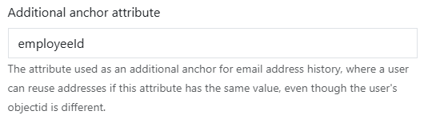

# Email address history

The service has a feature for keeping track of previously used email addresses, that ensures that an email address is not reused withing a configurable number of days.

Let's say John Doe works in Contoso, has the email address john.doe@contoso.com and leaves the company December 31st. Contoso has a policy that deletes John Doe's user account on March 31st. A few months later, in June, a new John Doe starts in Contoso.

If the email address history feature is not enabled, the new John Doe will be able to get john.doe@contoso.com as his email address, because there are no traces of that address being in use anywhere in the Contoso tenant. By configuring the email history feature in the [admin panel](https://bytt.email/admin.html), we can avoid this:


With these settings, the new John Doe will *not* be able to get john.doe@contoso.com when he starts, because the service last say the email address on March 31st, and will not allow any user to reuse this email before 365 days later.

## The same person starts again

Let's say Carrie Porter leaves the company, and we store the email history for 10 years. She had carrie.porter@nwtraders.com, and is rehired after 2 years. Her user account from her first employment was deleted, so she has a new objectid. This means that the address carrie.porter@nwtraders.com is not available to her.

This is where the **Additional anchor attribute** setting comes into play. The attribute can be used as a secondary check, and if the attribute matches a previous entry, they are treated as the same person.



Because Carrie Porter was rehired with the same employeeId, Bytt.Email understands that this is the same **person**, even though the person has a new **user account**. Carrie can therefore get her old address carrie.porter@nwtraders.com back.

## Migrating historical email addresses into Bytt.Email

Let's say you have a list of email addresses that users once have had, and that you want to avoid the reuse of these. Using the endpoint **https://api.fortytwo.io/changeemail/history** found in [swagger](https://api.fortytwo.io/changeemail/swagger/index.html), we can populate old history data using PowerShell:

```PowerShell
Install-Module EntraIDAccessToken -Scope CurrentUser -Force

# Sign in
Add-EntraIDInteractiveUserAccessTokenProfile -ClientId "68bf2f1d-b9e1-4477-8b90-81314861f05f" -Scope "https://api.fortytwo.io/.default"

# Get all history:
$all = Invoke-RestMethod "https://api.fortytwo.io/changeemail/history" -Headers (GH) -Method Get
$all | Format-List

# Create entry with email, anchor and lastseen:
$body = @{
    email  = "example.user1@dev.goodworkaround.com"
    anchor = "698495"
    lastseen = "2024-01-15T10:00:00Z"
} | ConvertTo-Json
Invoke-RestMethod "https://api.fortytwo.io/changeemail/history" -Headers (GH) -Method Post -Body $body -ContentType "application/json"

# Create entry with email only (lastseen will be "now")
$body = @{
    email  = "example.user2@dev.goodworkaround.com"
} | ConvertTo-Json
Invoke-RestMethod "https://api.fortytwo.io/changeemail/history" -Headers (GH) -Method Post -Body $body -ContentType "application/json"
```