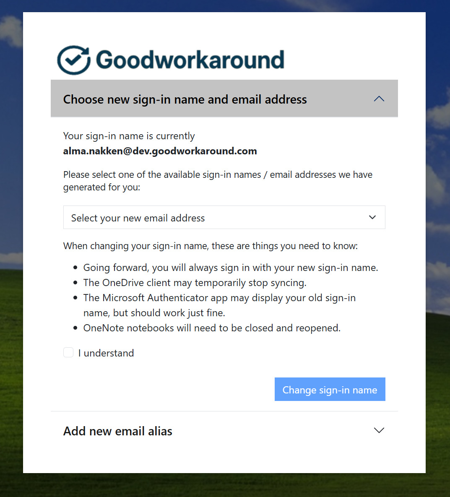
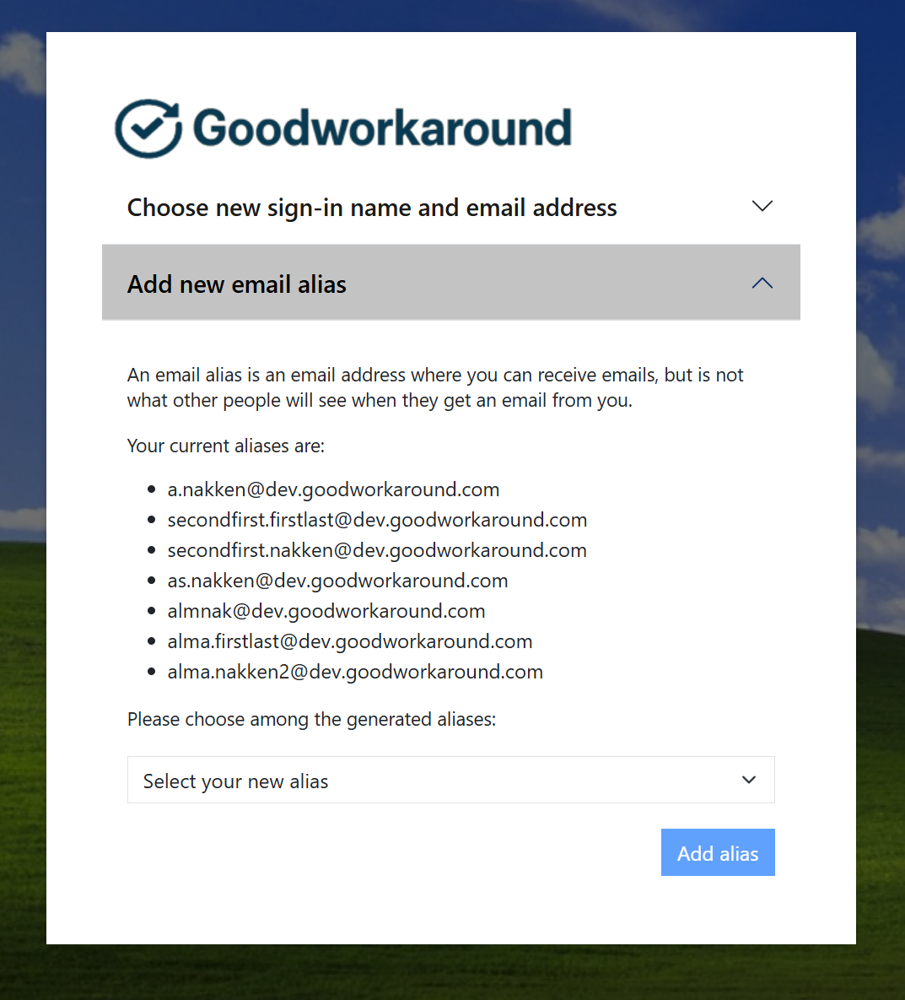

# Bytt.Email

[Bytt.Email](https://bytt.email) is our service for allowing end users to change their own email address and UPN, both in Entra ID and Active Directory.

The portal is branded using the tenant branding you have in Entra ID:

The user can be show option for changing their sign-in name and adding aliases, depending on configuration:

## Start using the service

In order to start using the service, you have two options for installation:

- [Automated configuration using PowerShell](autoconfig.md)
- [Configure everything manually](config-step1.md)

After the service is installed, you can test out the service and create a subscription in Azure Marketplace (Coming soon).