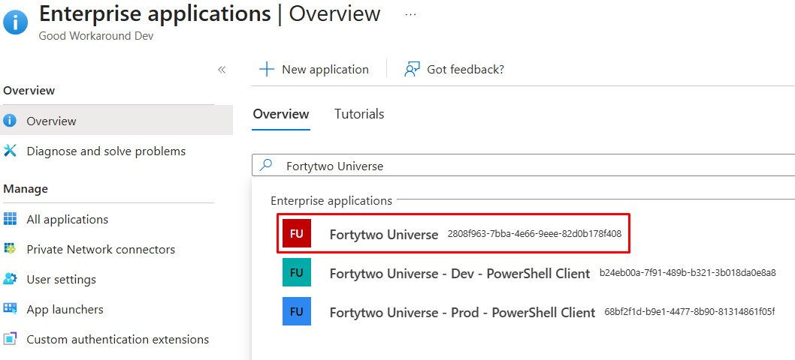
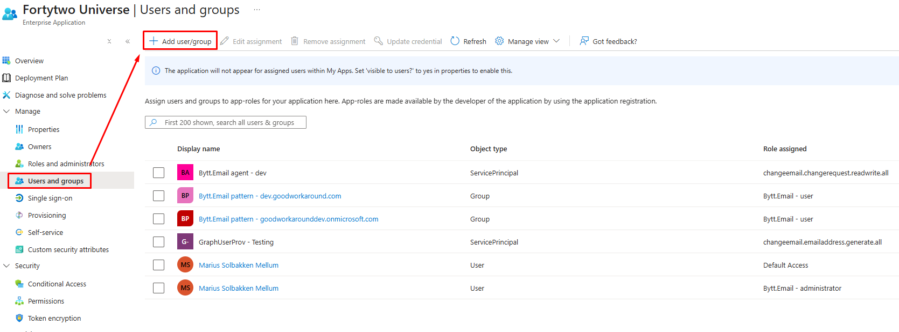

# Roles

The system has two different roles, both available for assignment through the Fortytwo Universe enterprise app.

| Roles | Description |
|-|-|
| Bytt.Email - user | Provides access to the [user self service portal](https://bytt.email) |
| Bytt.Email - administrator | Provides access to some [API endpoints](https://api.fortytwo.io/changeemail/swagger/index.html) and the [Admin panel](https://bytt.email/admin.html) |

## How to assign

Roles are assigned in the [Entra portal](https://entra.microsoft.com/#view/Microsoft_AAD_IAM/StartboardApplicationsMenuBlade/~/AppAppsPreview).

1. Search for **Fortytwo Universe** and find the app with the id starting with **2808f963**

2. Under **Users and groups**, click **Add user/group**

3. Complete the assignment wizard for assigning a role