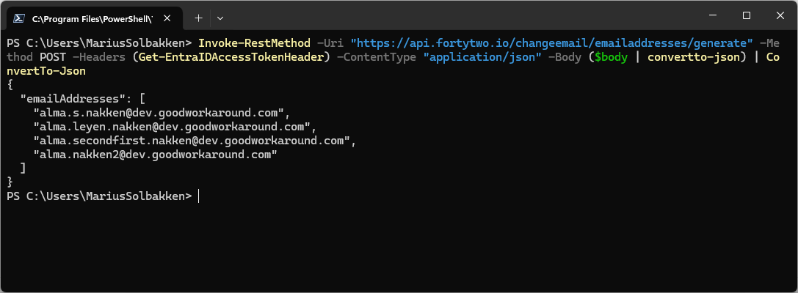

# Testing patterns using the API

In order to test your pattern groups using the Bytt.Email service, you need a user account that is assigned the **Bytt.Email - administrator** role on the **Fortytwo Universe** enterprise application. Please see the [roles documentation](roles.md) for details.

Next, you need to get yourself an access token to access our API. This can be done very easily like this, using PowerShell:

> NOTE: You can also use the even simpler [PowerShell module](./testing-patterns-using-the-powershell-module.md) for this

```PowerShell
Install-Module EntraIDAccessToken -Force -Scope CurrentUser
Add-EntraIDInteractiveUserAccessTokenProfile -Scope "https://api.fortytwo.io/.default" -ClientId "68bf2f1d-b9e1-4477-8b90-81314861f05f"

Write-Host "Has required role: " (Get-EntraIDAccessToken | Get-EntraIDAccessTokenHasRoles -Roles "changeemail-administrator")
```

Now, you can call the API endpoints as follows:

```PowerShell
$body = @{
    userPrincipalName = "marius.solbakken@fortytwo.io"
}
Invoke-RestMethod -Uri "https://api.fortytwo.io/changeemail/emailaddresses/generate" -Method POST -Headers (Get-EntraIDAccessTokenHeader) -ContentType "application/json" -Body ($body | convertto-json)
```



## Example - Get all email addresses a person can get based on their pattern groups

!!! Note
    The API will return a list of email addresses in prioritized order

```PowerShell
$body = @{
    objectId = "ce3d945f-fc56-4b19-9891-665ca05a998d"
}

Invoke-RestMethod `
    -Uri "https://api.fortytwo.io/changeemail/emailaddresses/generate" `
    -Method POST `
    -Headers (Get-EntraIDAccessTokenHeader) `
    -ContentType "application/json" `
    -Body ($body | ConvertTo-Json) |
    ConvertTo-Json
```

Example result:

```JSON
{
  "emailAddresses": [
    "alma.s.nakken@dev.goodworkaround.com",
    "alma.leyen.nakken@dev.goodworkaround.com",
    "alma.secondfirst.nakken@dev.goodworkaround.com",
    "alma.nakken2@dev.goodworkaround.com"
  ]
}
```

## Example - Get all email addresses a person can get, providing a set of groups, useful for testing

!!! Note
    The API will return a list of email addresses in prioritized order

```PowerShell
$body = @{
    objectId = "ce3d945f-fc56-4b19-9891-665ca05a998d"
    groupMemberships = @(
        "8100a9e0-fd2e-4b06-a07a-e585423d6f95"
        "4cb1364b-d153-495e-8bb5-2d7108fd1415"
    )
}

Invoke-RestMethod `
    -Uri "https://api.fortytwo.io/changeemail/emailaddresses/generate" `
    -Method POST `
    -Headers (Get-EntraIDAccessTokenHeader) `
    -ContentType "application/json" `
    -Body ($body | ConvertTo-Json) |
    ConvertTo-Json
```

Example result:

```JSON
{
  "emailAddresses": [
    "alma.s.nakken@dev.goodworkaround.com",
    "alma.leyen.nakken@dev.goodworkaround.com",
    "alma.nakken@goodworkarounddev.onmicrosoft.com",
    "alma.secondfirst.nakken@dev.goodworkaround.com",
    "alma.s.nakken@goodworkarounddev.onmicrosoft.com",
    "alma.leyen.nakken@goodworkarounddev.onmicrosoft.com",
    "alma.secondfirst.nakken@goodworkarounddev.onmicrosoft.com",
    "alma.nakken2@dev.goodworkaround.com",
    "alma.nakken2@goodworkarounddev.onmicrosoft.com"
  ]
}
```

## Example - Generate email address for a new person, that does not yet have a user account

!!! Note
    The API will return a list of email addresses in prioritized order

```PowerShell
$body = @{
    firstname = "Firstname Secondfirstname"
    lastname = "Firstlastname Lastname"
    groupMemberships = @(
        "8100a9e0-fd2e-4b06-a07a-e585423d6f95"
        "4cb1364b-d153-495e-8bb5-2d7108fd1415"
    )
}

Invoke-RestMethod `
    -Uri "https://api.fortytwo.io/changeemail/emailaddresses/generatenewuser" `
    -Method POST `
    -Headers (Get-EntraIDAccessTokenHeader) `
    -ContentType "application/json" `
    -Body ($body | ConvertTo-Json) |
    ConvertTo-Json
```

Example result:

```JSON
{
  "emailAddresses": [
    "firstname.lastname@dev.goodworkaround.com",
    "firstname.s.lastname@dev.goodworkaround.com",
    "firstname.lastname@goodworkarounddev.onmicrosoft.com",
    "firstname.s.lastname@goodworkarounddev.onmicrosoft.com",
    "firstname.firstlastname.lastname@dev.goodworkaround.com",
    "firstname.secondfirstname.lastname@dev.goodworkaround.com",
    "firstname.firstlastname.lastname@goodworkarounddev.onmicrosoft.com",
    "firstname.secondfirstname.lastname@goodworkarounddev.onmicrosoft.com",
    "firstname.lastname2@dev.goodworkaround.com",
    "firstname.lastname2@goodworkarounddev.onmicrosoft.com"
  ]
}
```

## Swagger

The service also has a [swagger published](https://api.fortytwo.io/changeemail/swagger/index.html), if you want to check out other APIs.