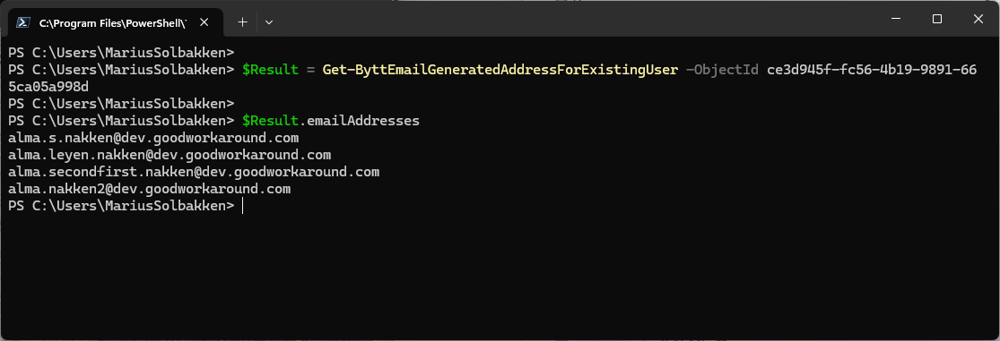
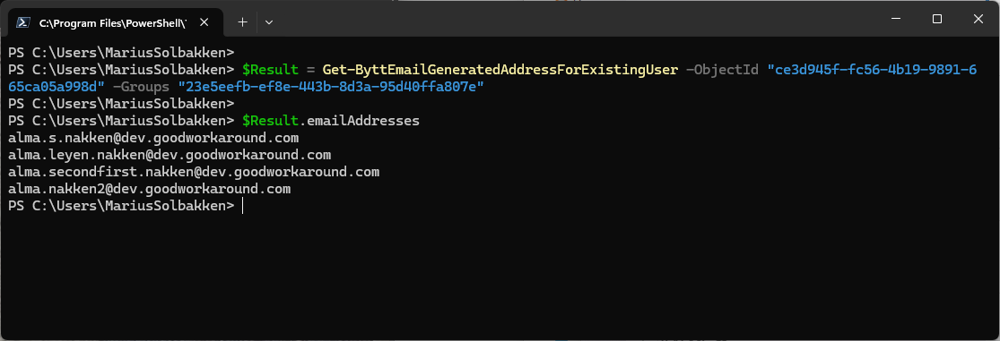

# Testing patterns using the PowerShell Module

In order to test your pattern groups using the Bytt.Email service, you need a user account that is assigned the **Bytt.Email - administrator** role on the **Fortytwo Universe** enterprise application. Please see the [roles documentation](roles.md) for details.

Next, install this [PowerShell module](https://www.powershellgallery.com/packages/Fortytwo.ByttEmail.Client):

```PowerShell
Install-Module -Name Fortytwo.ByttEmail.Client -Force -Scope CurrentUser
Connect-ByttEmail
```

## Example - Get all email addresses a person can get based on their pattern groups

!!! Note
    The API will return a list of email addresses in prioritized order

```PowerShell
$Result = Get-ByttEmailGeneratedAddressForExistingUser -ObjectId "ce3d945f-fc56-4b19-9891-665ca05a998d"

$Result.emailAddresses

$Result = Get-ByttEmailGeneratedAddressForExistingUser -UserPrincipalName "marius.solbakken@fortytwo.io"

$Result.emailAddresses
```

Example result:



## Example - Get all email addresses a person can get, providing a set of groups, useful for testing

!!! Note
    The API will return a list of email addresses in prioritized order

```PowerShell
$Result = Get-ByttEmailGeneratedAddressForExistingUser "marius.solbakken@fortytwo.io" -Groups "23e5eefb-ef8e-443b-8d3a-95d40ffa807e"

$Result.emailAddresses
```

Example result:



## Example - Generate email address for a new person, that does not yet have a user account

!!! Note
    The API will return a list of email addresses in prioritized order

```PowerShell
# One or more email pattern groups must be provided, in order for the service to understand which patterns to apply
$Result = Get-ByttEmailGeneratedAddressForNewUser -FirstName "Erling" -LastName "Braut Haaland" -Anchor 454 -Groups "23e5eefb-ef8e-443b-8d3a-95d40ffa807e"
$result.emailAddresses
```

Example result:


## Documentation

For more documentation on the PowerShell module, see the [Github repository](https://github.com/fortytwoservices/powershell-module-byttemail-client)